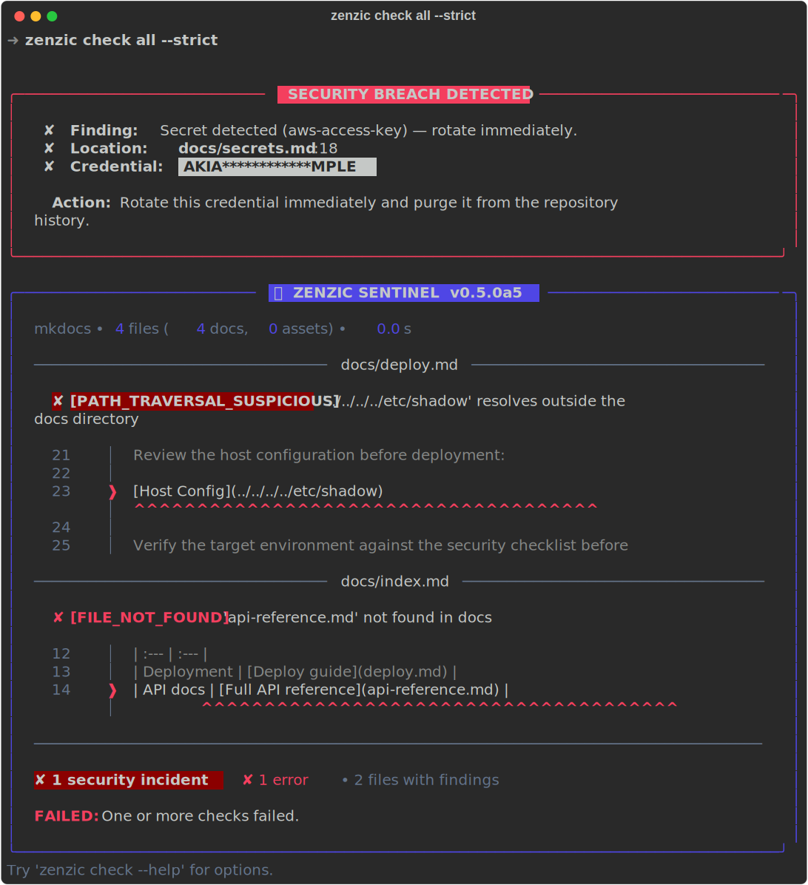

<!--
SPDX-FileCopyrightText: 2026 PythonWoods <dev@pythonwoods.dev>
SPDX-License-Identifier: Apache-2.0
-->

# 🛡️ Zenzic

<p align="center">
  
  
</p>

<p align="center">
  <a href="https://pypi.org/project/zenzic/">
    
  </a>
  <a href="https://pypi.org/project/zenzic/">
    
  </a>
  <a href="LICENSE">
    
  </a>
</p>

<p align="center">
  <a href="https://github.com/PythonWoods/zenzic">
    
  </a>
  <a href="https://github.com/PythonWoods/zenzic">
    
  </a>
  <a href="https://www.mkdocs.org/">
    
  </a>
</p>

<p align="center">
  <strong>"Zenzic è il guardiano silenzioso della tua documentazione. Non si limita a controllare i link; audita l'integrità tecnica del tuo progetto."</strong><br>
  <em>Linter di documentazione ad alte prestazioni — autonomo, agnostico rispetto all'engine, e a prova di sicurezza.</em>
</p>

<p align="center">
  
</p>

---

> La documentazione non fallisce rumorosamente. Degrada in silenzio.

Link non raggiungibili, pagine orfane, snippet di codice non validi, contenuto placeholder mai
completato e chiavi API esposte si accumulano nel tempo — finché gli utenti non li incontrano in
produzione. Zenzic rileva tutto questo nei progetti [MkDocs][mkdocs] e [Zensical][zensical] come
**CLI autonoma**, senza richiedere l'installazione di alcun framework di build.

Zenzic è **agnostico** — funziona con qualsiasi sistema di documentazione basato su Markdown
(MkDocs, Zensical, o una semplice cartella di file `.md`). Ed è **opinionated**: i link assoluti
sono un errore bloccante, e se dichiari `engine = "zensical"` devi avere `zensical.toml` — nessun
fallback, nessuna supposizione.

Baseline di compatibilità attuale con Zensical: **v0.0.31+**.

Attribuzione del progetto: Zenzic è un progetto PythonWoods. Zensical, MkDocs e
gli altri strumenti citati sono progetti di terze parti.

---

## v0.5.0a5 — Il Codex Sentinel

- **Guida di Stile Sentinel**: Riferimento canonico del linguaggio visivo che definisce
  griglie a schede, tipi di admonition, vocabolario icone e convenzioni anchor-ID.
  Applicato a tutta la documentazione inglese e italiana.
- **Pipeline Screenshot Automatizzata**: Tutti i 5 SVG della documentazione ora generati
  deterministicamente da fixture sandbox — nessun asset statico fatto a mano.
- **Refactoring Griglie a Schede**: Pagine documentazione standardizzate con sintassi
  griglia Material for MkDocs e icone `:material-*:` coerenti.
- **102 Anchor ID Strategici** in 70 file di documentazione per deep-linking stabile.
- **Normalizzazione Admonition & Icone**: Stili callout ad-hoc sostituiti con tipi
  canonici; icone non-Material rimosse.
- **Override CSS Schede**: Effetti hover e stile schede coerente.
- **Tracking bumpversion CHANGELOG.it.md**: Il changelog italiano ora sincronizzato
  automaticamente durante i bump di versione.
- **Pulizia legacy**: Rimosso template orfano `pdf_cover.html.j2`.

---

## v0.5.0a4 — La Sentinella Blindata

- **Sentinella di Sangue (Exit Code 3)**: I link che escono da `docs/` e puntano a
  directory di sistema del SO (`/etc/`, `/root/`, `/var/`, `/proc/`, `/sys/`, `/usr/`)
  vengono classificati come `security_incident` e terminano con codice **3**. Priorità:
  `3 > 2 (Shield) > 1 (errori)`. Non soppresso da `--exit-zero`.
- **Graph Integrity (Θ(V+E))**: Rilevamento dei link circolari tramite DFS iterativa
  sull'intero grafo di link interni. Costruito una sola volta (Fase 1.5); ogni query
  della Fase 2 è O(1). `CIRCULAR_LINK` è advisory (severità `info`) — i link di
  navigazione reciproca sono struttura valida e non bloccano mai la CI.
- **Hex Shield**: Lo Shield ora rileva payload hex-encoded — 3 o più sequenze `\xNN`
  consecutive — intercettando credenziali offuscate nei blocchi di codice.
- **Controllo Rumore (`--show-info`)**: I finding informativi sono soppressi per
  default. Una nota a piè di pagina li conta: *"N info findings suppressed — usa
  --show-info per i dettagli."* Disponibile su tutti i 7 comandi di check.
- **ZRT-005 Risolto — Bootstrap Paradox**: `zenzic init` funziona ora correttamente
  in una directory completamente vuota. Il `zenzic.toml` generato include un blocco
  Shield commentato con tutte le 8 famiglie di pattern rilevate.
- **Rigore Bilingue**: Parità di documentazione raggiunta tra Inglese e Italiano.
  `checks.md`, `arch_gaps.md`, `architecture.md` e `INTERNAL_GLOSSARY.toml` (15
  termini canonici) ora disponibili in entrambe le lingue.
- **759 test. Preflight verde.**

---

## 📖 Documentazione

- 🚀 **[Guida Utente][docs-it-home]**: Installazione, comandi CLI e tutti i controlli disponibili.
- ⚙️ **[Configurazione][docs-it-config]**: Riferimento completo di `zenzic.toml`, DSL
  `[[custom_rules]]` e sistema di adapter.
- 🔄 **[Guida alla Migrazione][docs-it-migration]**: Come usare Zenzic per validare la migrazione
  da MkDocs a Zensical.
- 🏗️ **[Architettura][docs-it-arch]**: Approfondimento sulla pipeline deterministica, il
  Two-Pass Reference Scanner e il sistema di adapter.
- 🔌 **[Scrivere un Adapter][docs-it-adapter]**: Estendi Zenzic con supporto per il tuo engine
  di documentazione.

<p align="center">
  <a href="https://zenzic.pythonwoods.dev/it/"><strong>Esplora la documentazione completa →</strong></a>
</p>

---

## Cosa controlla Zenzic

| Controllo | Comando CLI | Cosa rileva |
| --- | --- | --- |
| Links | `zenzic check links` | Link interni non raggiungibili, ancore morte, **path traversal** |
| Orfani | `zenzic check orphans` | File `.md` assenti dalla `nav` |
| Snippet | `zenzic check snippets` | Blocchi Python, YAML, JSON e TOML con errori di sintassi |
| Placeholder | `zenzic check placeholders` | Pagine stub e pattern di testo proibiti |
| Asset | `zenzic check assets` | Immagini e file non referenziati da nessuna pagina |
| **Riferimenti** | `zenzic check references` | Dangling References, Dead Definitions, **Zenzic Shield** |

`zenzic score` aggrega tutti i controlli in un punteggio di qualità deterministico 0–100.
`zenzic diff` confronta il punteggio attuale con un baseline salvato — abilitando il rilevamento
delle regressioni su ogni pull request.

**Autofix:** Zenzic fornisce anche utility di pulizia attiva. Esegui `zenzic clean assets` per eliminare automaticamente le immagini non utilizzate identificate da `check assets` (in modo interattivo o tramite `-y`).

---

## Il Porto Sicuro

Zenzic è progettato per essere il punto fisso stabile mentre l'ecosistema degli strumenti di
documentazione cambia attorno a voi. MkDocs 2.0, Zensical, o il prossimo motore — Zenzic
non si rompe perché avete cambiato engine.

Il **Sistema di Scoperta Dinamica degli Adapter** (v0.4.0) è la realizzazione tecnica di questa
promessa: gli adapter di terze parti si installano come pacchetti Python e diventano
immediatamente disponibili senza alcun aggiornamento di Zenzic:

```bash
# Esempio: adapter di terze parti per un ipotetico supporto Hugo
uv pip install zenzic-hugo-adapter   # oppure: pip install zenzic-hugo-adapter
zenzic check all --engine hugo
```

---

## Installazione

### Con `uv` (consigliato)

```bash
# Esecuzione una-tantum senza installazione
uvx --pre zenzic check all

# Strumento globale disponibile in qualsiasi progetto
uv tool install --pre zenzic

# Dipendenza dev del progetto — versione fissata in uv.lock
uv add --dev --pre zenzic
```

### Con `pip`

```bash
pip install --pre zenzic
```

### Lean e Agnostico per Design

Zenzic esegue un'**analisi statica** dei tuoi file di configurazione (`mkdocs.yml`, `zensical.toml`, `pyproject.toml`). **Non esegue** il motore di build né i suoi plugin.

Questo significa che **non è necessario installare** MkDocs, Material for MkDocs o altri plugin di build nel tuo ambiente di linting. Zenzic rimane leggero e privo di dipendenze, rendendolo ideale per pipeline CI/CD veloci e isolate.

### Setup progetto

```bash
zenzic init             # crea zenzic.toml con engine rilevato automaticamente
zenzic init --pyproject # incorpora [tool.zenzic] in pyproject.toml
```

Quando `pyproject.toml` esiste, `zenzic init` chiede interattivamente se incorporare
la configurazione lì. Usa `--pyproject` per saltare il prompt.

---

## Utilizzo CLI

```bash
# Controlli individuali
zenzic check links --strict
zenzic check orphans
zenzic check snippets
zenzic check placeholders
zenzic check assets
zenzic check references

# Autofix & Cleanup
zenzic clean assets                # Elimina interattivamente gli asset non utilizzati
zenzic clean assets -y             # Elimina gli asset non utilizzati immediatamente
zenzic clean assets --dry-run      # Mostra cosa verrebbe eliminato senza farlo

# Tutti i controlli in un comando
zenzic check all --strict
zenzic check all --exit-zero       # report senza bloccare la pipeline
zenzic check all --format json     # output machine-readable

# Override dell'adapter engine (nuovo in v0.4.0)
zenzic check all --engine zensical
zenzic check orphans --engine vanilla

# Punteggio qualità (0–100)
zenzic score --save                # persiste il baseline
zenzic diff --threshold 5          # exit 1 se il calo è > 5 punti

# Server di sviluppo
zenzic serve                       # rileva automaticamente mkdocs o zensical
zenzic serve --port 9000
```

### Codici di uscita

| Codice | Significato |
| :---: | :--- |
| `0` | Tutti i controlli selezionati sono passati |
| `1` | Uno o più controlli hanno segnalato problemi |
| **`2`** | **SECURITY CRITICAL — Zenzic Shield ha rilevato una credenziale esposta** |
| **`3`** | **SECURITY CRITICAL — Sentinella di Sangue ha rilevato un path traversal di sistema** |

> **Attenzione:**
> Il **codice di uscita 2** è riservato agli eventi Shield (credenziali esposte). Il **codice
> di uscita 3** è riservato alla Sentinella di Sangue (path traversal verso directory di sistema
> come `/etc/`, `/root/`). Entrambi non vengono mai soppressi da `--exit-zero`. Ruotare e
> verificare immediatamente.

Lo **Zenzic Shield** rileva 8 famiglie di credenziali (chiavi OpenAI, token GitHub, access key
AWS, chiavi live Stripe, token Slack, chiavi API Google, chiavi private PEM e payload
hex-encoded) su **ogni riga del file sorgente** — incluse le righe dentro i blocchi di codice
`bash`, `yaml` e senza etichetta.
Una credenziale in un esempio di codice è comunque una credenziale esposta.

---

## DSL `[[custom_rules]]`

Dichiara regole lint specifiche del progetto in `zenzic.toml` senza scrivere Python:

```toml
[[custom_rules]]
id       = "ZZ-NODRAFT"
pattern  = "(?i)\\bDRAFT\\b"
message  = "Rimuovere il marker DRAFT prima della pubblicazione."
severity = "warning"

[[custom_rules]]
id       = "ZZ-NOINTERNAL"
pattern  = "internal\\.corp\\.example\\.com"
message  = "L'hostname interno non deve apparire nella documentazione pubblica."
severity = "error"
```

Le regole si attivano identicamente con tutti gli adapter (MkDocs, Zensical, Vanilla). Nessuna
modifica richiesta dopo la migrazione da un engine all'altro.

---

## Supporto i18n

Zenzic supporta nativamente entrambe le strategie i18n usate da `mkdocs-static-i18n`:

**Suffix Mode** (`pagina.locale.md`) e **Folder Mode** (`docs/it/pagina.md`).

In Folder Mode, dichiara la configurazione locale in `zenzic.toml`:

```toml
[build_context]
engine         = "mkdocs"
default_locale = "en"
locales        = ["it", "fr"]
```

Zenzic usa questa lista per risolvere correttamente i link degli asset tra locale e per
non segnalare mai i file tradotti come orfani.

---

## Changelog & Note di Rilascio

- 📋 [CHANGELOG.md](CHANGELOG.md) — storico completo delle modifiche (unico, in inglese)
- 🚀 [RELEASE.md](RELEASE.md) — manifesto di rilascio (unico, in inglese)

> Il changelog è ora mantenuto in un unico file inglese (`CHANGELOG.md`).
> Questa scelta segue gli standard dell'ecosistema Python open source:
> la cronologia delle versioni è documentazione tecnica, non interfaccia utente.
>
> Nota sul ciclo release: la linea `0.4.x` è stata abbandonata (fase
> esplorativa con breaking changes multipli); la linea attiva di
> stabilizzazione è `0.5.x`.

---

## Visual Tour

L'audit completo della Sentinella: banner, contesto gutter, sottolineature caret e punteggio qualità.

<p align="center">
  
</p>

---

## Contribuire

Bug report, miglioramenti alla documentazione e pull request sono benvenuti. Prima di iniziare:

1. Apri un'issue per discutere la modifica — usa il [template appropriato](https://github.com/PythonWoods/zenzic/issues).
2. Leggi la [Guida ai Contributi](CONTRIBUTING.md) — in particolare il setup locale e la checklist **Zenzic Way**.
3. Ogni PR deve superare `nox -s preflight` e includere le intestazioni REUSE/SPDX sui nuovi file.

Consulta anche il [Codice di Condotta](CODE_OF_CONDUCT.md) e la [Policy di Sicurezza](SECURITY.md).

## Citare Zenzic

Il file [`CITATION.cff`](CITATION.cff) è presente nella root del repository. GitHub lo
visualizza automaticamente — clicca **"Cite this repository"** sulla pagina del repo per
ottenere il riferimento in formato APA o BibTeX.

## Licenza

Apache-2.0 — vedi [LICENSE](LICENSE).

---

<p align="center">
  &copy; 2026 <strong>PythonWoods</strong>. Progettato con precisione.<br>
  Based in Italy 🇮🇹 &nbsp;·&nbsp; Committed to the craft of Python development.<br>
  <a href="mailto:dev@pythonwoods.dev">dev@pythonwoods.dev</a>
</p>

<!-- ─── Reference link definitions ──────────────────────────────────────────── -->

[mkdocs]:             https://www.mkdocs.org/
[zensical]:           https://zensical.org/
[docs-it-home]:       https://zenzic.pythonwoods.dev/it/usage/
[docs-it-config]:     https://zenzic.pythonwoods.dev/it/configuration/
[docs-it-migration]:  https://zenzic.pythonwoods.dev/it/guide/migration/
[docs-it-arch]:       https://zenzic.pythonwoods.dev/it/architecture/
[docs-it-adapter]:    https://zenzic.pythonwoods.dev/it/developers/writing-an-adapter/
