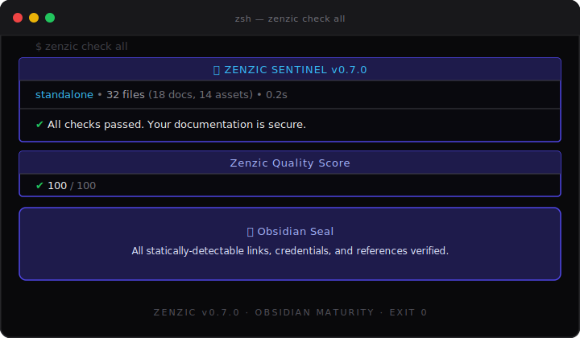

<!--
SPDX-FileCopyrightText: 2026 PythonWoods <dev@pythonwoods.dev>
SPDX-License-Identifier: Apache-2.0
-->

<p align="center">
  
  
</p>

<p align="center">
  <a href="https://pypi.org/project/zenzic/">
    
  </a>
  <a href="https://pypi.org/project/zenzic/">
    
  </a>
  <a href="LICENSE">
    
  </a>
</p>

<p align="center">
  <a href="https://github.com/PythonWoods/zenzic">
    
  </a>
  <a href="https://github.com/PythonWoods/zenzic">
    
  </a>
  <a href="https://docusaurus.io/">
    
  </a>
</p>

<p align="center">
  <em>Zenzic Shield internally audits this repository for credential leaks on every commit.</em>
</p>

<p align="center">
  <strong>The Safe Harbor for your Markdown documentation.</strong><br>
  <em>Engine-agnostic static analysis — standalone, security-hardened, zero configuration needed.</em>
</p>

---

## ⚡ Try it now — Zero Installation

Got a folder of Markdown files? Run an instant security and link audit using [`uv`][uv]:

```bash
uvx zenzic check all ./your-folder
```

Zenzic will identify your engine via its configuration files or default to **Standalone Mode**
for plain Markdown folders — providing immediate protection for links, credentials, and
file integrity.

> **Note:** In Standalone Mode there is no declared navigation contract, so orphan-page
> detection (`Z402`) is disabled. What you get: full link validation (`Z101`/`Z104`),
> credential scanning (`Z201`), path-traversal blocking (`Z202`), and directory-index
> integrity checks (`Z401`).

---

## 🚀 Quick Start

```bash
pip install zenzic
zenzic lab        # Interactive showroom — 9 acts, every engine, zero setup
zenzic check all  # Audit the current directory
```

📖 [Full docs →][docs-home] · 🏅 [Badges][docs-badges] · 🔄 [CI/CD guide][docs-cicd]

---

> 🚀 **CI/CD Ready:** Use the [Official Zenzic Action](https://github.com/PythonWoods/zenzic-action) to run Zenzic in GitHub Actions — findings surface directly in Code Scanning, PR annotations, and the Security tab.
>
> ```yaml
> - uses: PythonWoods/zenzic-action@v1
>   with:
>     format: sarif
>     upload-sarif: "true"
> ```

<p align="center">
  
</p>

---

## 🎯 Why Zenzic?

| Without Zenzic | With Zenzic |
| :--- | :--- |
| ❌ Broken anchors silently 200 OK in Docusaurus v3 | ✅ Mathematical anchor validation via VSM |
| ❌ Leaked API keys in code blocks committed to git | ✅ **The Shield** — 9-family credential scanner, exit 2 |
| ❌ Path traversal `../../../../etc/passwd` in links | ✅ **Blood Sentinel** — non-suppressible exit 3 |
| ❌ Orphan pages unreachable from any nav link | ✅ Semantic orphan detection — not just file-exists |
| ❌ Silent 404s accumulating in Google Search Console | ✅ Directory Index Integrity checks |
| ❌ MkDocs → Zensical migration with unknown breakage | ✅ **Transparent Proxy** — lint both with one command |

---

## 🧩 What Zenzic is NOT

- **Not a site generator.** It audits source; it never builds HTML.
- **Not a build wrapper.** Zero-Trust Execution: no subprocesses, no `mkdocs` or `docusaurus` binaries invoked.
- **Not a spell checker.** Structure and security — not prose.
- **Not an HTTP crawler.** All validation is local and file-based.

---

## 📋 Capability Matrix

| Capability | Command | Detects | Exit |
| :--- | :--- | :--- | :---: |
| Link integrity | `check links` | Broken links, dead anchors | 1 |
| Orphan detection | `check orphans` | Files absent from `nav` — invisible after build | 1 |
| Code snippets | `check snippets` | Syntax errors in Python / YAML / JSON / TOML blocks | 1 |
| Placeholder content | `check placeholders` | Stub pages and forbidden text patterns | 1 |
| Unused assets | `check assets` | Images and files not referenced anywhere | 1 |
| Config asset integrity | `check all` | Favicon and OG image paths declared in engine config confirmed on disk (`Z404`) | 1 |
| **Credential scanning** | `check references` | **9 credential families** — text, URLs, code blocks | **2** |
| **Path traversal** | `check links` | System-path escape attempts | **3** |
| **Enterprise reporting** | `check all --format sarif` | SARIF 2.1.0 output for GitHub Code Scanning — inline PR annotations | 1/2/3 |
| Quality score | `score` | Deterministic 0–100 composite metric | — |
| Regression detection | `diff` | Score drop vs saved baseline — CI-friendly | 1 |

**Autofix:** `zenzic clean assets [-y] [--dry-run]` deletes unused images.

> 🚀 **v0.7.0 "Obsidian Integrity" (Stable)** — Z104 proactive suggestions, Standalone
> Mode truth audit, and Engineering Ledger hardening. See [CHANGELOG.md](CHANGELOG.md).

---

## 🛡️ Security: The Shield & Blood Sentinel

Two security layers are permanently active — neither is suppressible by `--exit-zero`:

**The Shield** scans every line — including fenced code blocks — for credentials. Unicode
normalization defeats obfuscation (HTML entities, comment interleaving, cross-line lookback).
Detected families: AWS, GitHub, GitLab PAT, Stripe, Slack, OpenAI, Google, PEM headers, hex payloads.
**→ Exit 2. Rotate and audit immediately.**

**Blood Sentinel** normalizes every resolved link with `os.path.normpath` and rejects any path
escaping the `docs/` root. Catches `../../../../etc/passwd`-style traversal before any OS syscall.
**→ Exit 3.**

| Exit | Meaning |
| :---: | :--- |
| `0` | All checks passed |
| `1` | Quality issues found |
| **`2`** | **SECURITY — leaked credential detected** |
| **`3`** | **SECURITY — system-path traversal detected** |

> Add `zenzic check references` to your pre-commit hooks to catch leaks before git history.

---

## 🔌 Multi-Engine Support

Zenzic reads config files as plain text — never imports or executes your build framework:

| Engine | Adapter | Highlights |
| :--- | :--- | :--- |
| [Docusaurus v3][docusaurus] | `DocusaurusAdapter` | Versioned docs, `@site/` alias, Ghost Route detection |
| [MkDocs][mkdocs] | `MkDocsAdapter` | i18n suffix + folder modes, `fallback_to_default` |
| [Zensical][zensical] | `ZensicalAdapter` | Transparent Proxy bridges `mkdocs.yml` if `zensical.toml` absent |
| Any folder | `StandaloneAdapter` | File integrity checks only — orphan detection disabled without a nav contract |

Third-party adapters install via the `zenzic.adapters` entry-point group.
See the [Developer Guide][docs-arch] for the adapter API.

---

## ⚙️ Configuration

Zero-config by default. Full priority chain: **CLI flags** > `zenzic.toml` > `[tool.zenzic]` in `pyproject.toml` > built-ins. CLI flags always take precedence over configuration files.

```toml
# zenzic.toml  (all fields optional)
docs_dir                 = "docs"
fail_under               = 80       # exit 1 if score < threshold; 0 = observe only
excluded_dirs            = ["includes", "assets", "overrides"]
excluded_build_artifacts = ["pdf/*.pdf", "dist/*.zip"]
placeholder_patterns     = ["coming soon", "todo", "stub"]

[build_context]
engine         = "mkdocs"   # mkdocs | docusaurus | zensical | standalone
default_locale = "en"
locales        = ["it"]
```

```bash
zenzic init             # Generate zenzic.toml with auto-detected values
zenzic init --pyproject # Embed [tool.zenzic] in pyproject.toml
```

**Custom lint rules** — declare project-specific patterns in `zenzic.toml`, no Python required:

```toml
[[custom_rules]]
id       = "ZZ-NODRAFT"
pattern  = "(?i)\\bDRAFT\\b"
message  = "Remove DRAFT marker before publishing."
severity = "warning"
```

Rules fire identically across all adapters. No changes required after engine migration.

---

## 🔄 CI/CD Integration

### Official GitHub Action (Recommended)

```yaml
permissions:
  contents: read
  security-events: write   # required for Code Scanning upload

steps:
  - uses: actions/checkout@v6

  - name: 🛡️ Zenzic Documentation Quality Gate
    uses: PythonWoods/zenzic-action@v1
    with:
      format: sarif
      upload-sarif: "true"   # findings appear in the Security tab and as PR annotations
```

### Zero-install with `uvx`

```yaml
- name: 🛡️ Zenzic Sentinel
  run: uvx zenzic check all --strict
  # Exit 1 = quality · Exit 2 = leaked credential · Exit 3 = path traversal
  # Exits 2 and 3 are never suppressible.

- name: Regression gate
  run: |
    uvx zenzic score --save    # on main branch
    uvx zenzic diff            # on PR — exit 1 if score drops
```

For badge automation and regression gates, see the [CI/CD guide][docs-cicd].
Full workflow: [`.github/workflows/ci.yml`][ci-workflow]

---

## 📦 Installation

```bash
# Zero-install, one-shot audit (recommended for CI and exploration)
uvx zenzic check all ./docs

# Global CLI tool
uv tool install zenzic

# Pinned dev dependency
uv add --dev zenzic

# pip
pip install zenzic
```

**Portability:** Zenzic rejects absolute internal links (starting with `/`). Relative links
work at any hosting path. External `https://` URLs are never affected.

---

## 🖥️ CLI Reference

```bash
# Checks
zenzic check links [--strict]
zenzic check orphans
zenzic check snippets
zenzic check placeholders
zenzic check assets
zenzic check references [--strict] [--links]
zenzic check all [--strict] [--exit-zero] [--format json] [--engine ENGINE]
zenzic check all [--exclude-dir DIR] [--include-dir DIR]

# Score & diff
zenzic score [--save] [--fail-under N]
zenzic diff  [--threshold N]

# Autofix
zenzic clean assets [-y] [--dry-run]

# Init
zenzic init [--pyproject]

# Interactive showroom
zenzic lab [--act N] [--list]
```

---

## 📟 Visual Tour

<p align="center">
  
</p>

Visit the [documentation portal][docs-home] for interactive screenshots and rich examples.

---

## 🧱 Engineering Ledger

Zenzic is governed by three non-negotiable operational contracts — each
enforce-able by machine, not by convention:

<table>
<tr>
<td width="33%" valign="top">

**Zero Assumptions** — Every adapter runs under `mypy --strict`. No `Any`, no silent coercions.
The type system is a compile-time contract — not a suggestion.

```python
# mypy: strict = true
# Zero untyped defs, zero ignored errors.
```

</td>
<td width="33%" valign="top">

**Subprocess-Free** — `subprocess.Popen` is permanently banned from `src/`. Docusaurus `.ts`
configs are parsed as plain text. Node.js is never invoked.

```python
# ruff: ban = ["subprocess"]
# Deterministic static analysis only.
```

</td>
<td width="33%" valign="top">

**Deterministic Compliance** — Every source file carries an SPDX header. REUSE 3.x is enforced in CI.
No ambiguous licensing — machine-verifiable on every PR.

```toml
# REUSE-IgnoreStart / REUSE-IgnoreEnd
# SPDX-License-Identifier: Apache-2.0
```

</td>
</tr>
</table>

See the [Architecture Guide][docs-arch] for the Two-Pass Reference Pipeline and VSM deep-dive.

---

## 🙋 FAQ

**Why not `grep`?** Grep is blind to structure. Zenzic understands Docusaurus versioning,
MkDocs i18n fallbacks, and Ghost Routes — pages that don't exist as files but are valid URLs.

**Does it run my build engine?** No. 100% subprocess-free. Static analysis on plain text only.

**Can it handle thousands of files?** Yes. Adaptive parallelism for discovery; O(1) VSM lookup
per link; content-addressable cache (`SHA256(content + config + vsm_snapshot)`) skips unchanged files.

**Shield vs Blood Sentinel?** Shield = secrets *inside* content (exit 2). Blood Sentinel =
links pointing to OS system *paths* (exit 3). Both are non-suppressible.

**No `zenzic.toml` needed?** Correct. Zenzic identifies the engine from config files present and applies safe defaults. Run
`zenzic init` at any time to generate a pre-populated config file.

**What is `zenzic lab`?** A 9-act interactive showroom covering every engine and error class.
Run it once before integrating Zenzic into any project.

---

## 🛠️ Development

```bash
uv sync --all-groups
nox -s tests       # pytest + coverage
nox -s lint        # ruff
nox -s typecheck   # mypy --strict
nox -s preflight   # lint + format + typecheck + pytest + reuse
just verify        # preflight + zenzic check all --strict (self-dogfood)
```

See the [Contributing Guide][contributing] for the Zenzic Way checklist and PR conventions.

---

## 🤝 Contributing

1. Open an [issue][issues] to discuss the change.
2. Read the [Contributing Guide][contributing] — Zenzic Way checklist, pure functions, no
   subprocesses, source-first.
3. Every PR must pass `nox -s preflight` and include REUSE/SPDX headers on new files.

See also: [Code of Conduct][coc] · [Security Policy][security]

## 📎 Citing

A [`CITATION.cff`][citation-cff] is present at the root. Click **"Cite this repository"** on
GitHub for APA or BibTeX output.

## 📄 License

Apache-2.0 — see [LICENSE][license].

---

## 📚 The Obsidian Chronicles

Zenzic was born from a technical journey through the fragility of modern documentation
ecosystems. Discover the philosophy, the security siege, and the engineering behind the
Sentinel in the [**Obsidian Engineering Series**](https://dev.to/pythonwoods/series/38629) on Dev.to.

<!-- TODO: HN link — add when blog post /blog/beyond-the-siege-zenzic-v070 is published -->

---

<div align="center">
  <a href="https://zenzic.dev">
    
  </a>
  <p>
    <strong>Engineered with precision by PythonWoods in Italy 🇮🇹</strong><br/>
    <em>"Building the Safe Harbor for technical knowledge."</em>
  </p>
  <p>
    <a href="https://zenzic.dev"><strong>Documentation</strong></a> &middot;
    <a href="https://github.com/PythonWoods"><strong>GitHub</strong></a> &middot;
    <a href="https://zenzic.dev/blog"><strong>Journal</strong></a>
  </p>
</div>

<!-- ─── Reference link definitions ──────────────────────────────────────────── -->

[mkdocs]:            https://www.mkdocs.org/
[docusaurus]:        https://docusaurus.io/
[zensical]:          https://zensical.org/
[uv]:                https://docs.astral.sh/uv/
[docs-home]:         https://zenzic.dev/docs/
[docs-badges]:       https://zenzic.dev/docs/how-to/add-badges/
[docs-cicd]:         https://zenzic.dev/docs/how-to/configure-ci-cd/
[docs-arch]:         https://zenzic.dev/docs/explanation/architecture/
[ci-workflow]:       .github/workflows/ci.yml
[contributing]:      CONTRIBUTING.md
[license]:           LICENSE
[citation-cff]:      CITATION.cff
[coc]:               CODE_OF_CONDUCT.md
[security]:          SECURITY.md
[issues]:            https://github.com/PythonWoods/zenzic/issues
