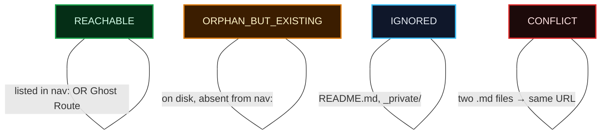
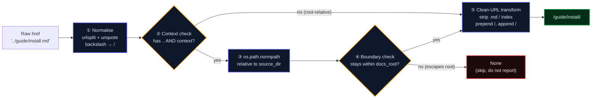

<!-- SPDX-FileCopyrightText: 2026 PythonWoods <dev@pythonwoods.dev> -->
<!-- SPDX-License-Identifier: Apache-2.0 -->

# VSM Engine — Architecture & Resolution Protocol {#vsm-engine}

> *"The VSM does not know where a file is. It knows where a file goes."*

This document describes the Virtual Site Map engine, the `ResolutionContext`
object introduced in v0.5.0a4, and the **Context-Free Anti-Pattern** that led
to ZRT-004. Any developer writing or reviewing VSM-aware rules must read this
page before merging.

---

## 1. What the VSM Is (and Is Not)

The Virtual Site Map (VSM) is a pure in-memory projection of what the build
engine will serve:

```python
VSM = dict[str, Route]   # canonical URL → Route
```

A `Route` contains:

| Field | Type | Meaning |
|-------|------|---------|
| `url` | `str` | Canonical URL, e.g. `/guide/install/` |
| `source` | `str` | Relative source path, e.g. `guide/install.md` |
| `status` | `str` | `REACHABLE` / `ORPHAN_BUT_EXISTING` / `IGNORED` / `CONFLICT` |
| `anchors` | `frozenset[str]` | Heading slugs pre-computed from the source |

The VSM is **not** a filesystem view. `Route.url` is the address a browser
would request, not the address a file system `open()` would accept. A file can
exist on disk (`Path.exists() == True`) and be `IGNORED` in the VSM. A URL can
be `REACHABLE` in the VSM and have no file on disk (Ghost Routes).

**Corollary:** Any code that validates links by calling `Path.exists()` inside
a rule is wrong by definition. The VSM is the oracle; the filesystem is not.

---

## 2. Route Status Reference



| Status | Set by | Link to this status |
|--------|--------|---------------------|
| `REACHABLE` | nav listing, Ghost Route, locale shadow | ✅ Valid |
| `ORPHAN_BUT_EXISTING` | file on disk, absent from nav | ⚠️ Z002 warning |
| `IGNORED` | README not in nav, excluded patterns | ❌ Z001 error |
| `CONFLICT` | two sources → same canonical URL | ❌ Z001 error |

---

## 3. URL Resolution: The Pipeline

Converting a raw Markdown href (`../guide/install.md`) to a canonical URL
(`/guide/install/`) requires three transformations, applied in sequence:



### Step ①: Normalise

Strip query strings and percent-encoding artefacts:

```python
parsed = urlsplit(href)
path = unquote(parsed.path.replace("\\", "/")).rstrip("/")
```

### Step ②–③: Context-Aware Relative Resolution (v0.5.0a4+)

If the href contains `..` segments **and** a `ResolutionContext` is provided,
the path is resolved relative to the source file's directory:

```python
if source_dir is not None and docs_root is not None and ".." in path:
    raw_target = os.path.normpath(str(source_dir) + os.sep + path.replace("/", os.sep))
```

Without context (backwards-compatible path), the `..` segments are carried
forward as-is into the clean-URL transform. This is correct for hrefs that do
*not* traverse upward (`../sibling.md` from `docs/index.md` is unambiguous)
but wrong for hrefs from deeply nested source files (see ZRT-004 below).

### Step ④: Boundary Check

```python
def _to_canonical_url(href: str, source_dir=None, docs_root=None):
    ...
    root_str = str(docs_root)
    if not (raw_target == root_str or raw_target.startswith(root_str + os.sep)):
        return None   # path escapes docs_root — Shield boundary
```

A path that escapes `docs_root` is not a broken link — it is a potential
traversal attack. It returns `None`, which is silently skipped by the caller.
No Z001 finding is emitted. No exception is raised.

### Step ⑤: Clean-URL Transform

```python
def _to_canonical_url(href: str, source_dir=None, docs_root=None):
    ...
    if path.endswith(".md"):
        path = path[:-3]

    parts = [p for p in path.split("/") if p]
    if parts and parts[-1] == "index":
        parts = parts[:-1]

    return "/" + "/".join(parts) + "/"
```

---

## 4. ResolutionContext — The Context Protocol

### Definition

```python
@dataclass(slots=True)
class ResolutionContext:
    """Source-file context for VSM-aware rules.

    Attributes:
        docs_root: Absolute path to the docs/ directory.
        source_file: Absolute path of the Markdown file being checked.
    """
    docs_root: Path
    source_file: Path
```

### Why It Exists

Before v0.5.0a4, `VSMBrokenLinkRule._to_canonical_url()` was a `@staticmethod`.
It received only `href: str`. This is the **Context-Free Anti-Pattern**.

A pure function that converts a relative href to an absolute URL needs to know
two things:

1. **Where does the href start from?** (the source file's directory)
2. **What is the containment boundary?** (the docs root)

A static method cannot have this knowledge. Therefore, it silently produced
wrong results for any file not at the docs root.

### The Context-Free Anti-Pattern

> **Definition:** A method that converts a relative path to an absolute URL
> without receiving information about the origin of that relative path.

Examples of the anti-pattern:

```python
# ❌ ANTI-PATTERN: static method, no origin context
@staticmethod
def _to_canonical_url(href: str) -> str | None:
    path = href.rstrip("/")
    ...  # what directory is href relative to? Unknown.

# ❌ ANTI-PATTERN: module-level function with only the href
def resolve_href(href: str) -> str | None:
    ...  # same problem

# ❌ ANTI-PATTERN: assuming href is relative to docs root
def check_vsm(self, file_path, text, vsm, anchors_cache):
    # file_path is docs/a/b/page.md
    # href is ../sibling.md
    # result is /sibling/, but correct answer is /a/sibling/
    url = self._to_canonical_url(href)
```

The correct pattern:

```python
# ✅ CORRECT: instance method with explicit context
def _to_canonical_url(
    self,
    href: str,
    source_dir: Path | None = None,    # where the href originates
    docs_root: Path | None = None,     # containment boundary
) -> str | None:
    ...
```

### How to Pass Context to check_vsm

The engine passes context when `run_vsm` is called by the coordinator:

```python
# In scan_docs_references() or the plugin:
context = ResolutionContext(
    docs_root=Path(config.docs_dir),
    source_file=md_file,
)
rule_engine.run_vsm(md_file, text, vsm, anchors_cache, context=context)
```

Inside a rule that overrides `check_vsm`:

```python
def check_vsm(
    self,
    file_path: Path,
    text: str,
    vsm: Mapping[str, Route],
    anchors_cache: dict[Path, set[str]],
    context: ResolutionContext | None = None,   # ← always accept
) -> list[Violation]:
    for url, lineno, raw_line in _extract_inline_links_with_lines(text):
        target_url = self._to_canonical_url(
            url,
            source_dir=context.source_file.parent if context else None,
            docs_root=context.docs_root if context else None,
        )
```

### Backwards Compatibility

`context` defaults to `None` in both `BaseRule.check_vsm` and
`AdaptiveRuleEngine.run_vsm`. Existing rules that do not accept the parameter
will receive a `TypeError` wrapped in a `RULE-ENGINE-ERROR` finding — they
will not crash the scan, but they will not benefit from context-aware
resolution either.

**Migration checklist for existing VSM-aware rules:**

1. Add `context: "ResolutionContext | None" = None` to `check_vsm` signature.
2. Pass `source_dir` and `docs_root` from `context` to any url-resolving helper.
3. Add a test case with a `../../`-relative href from a nested file.

---

## 5. Worked Examples

### Example A: Simple relative href (context not needed)

```text
Source:    docs/guide.md
href:      install.md
```

Step ① → `install`
Step ② → no `..`, skip context
Step ⑤ → `/install/`
VSM lookup → `vsm.get("/install/")`

Context makes no difference here. The href is already root-relative-safe.

---

### Example B: Single `..` from a subdirectory (context required)

```text
Source:    docs/api/reference.md
href:      ../guide/index.md
```

**Without context (legacy behaviour):**

Step ① → `../guide/index`
Step ⑤ → `/../guide` → parts `['..', 'guide']` → `/guide/` ← *wrong path arithmetic*

**With `ResolutionContext(docs_root=/docs, source_file=/docs/api/reference.md)`:**

Step ③ → `normpath("/docs/api" + "/../guide/index")` → `/docs/guide/index`
Step ④ → `/docs/guide/index` starts with `/docs/` ✅
Step ⑤ → `relative_to(/docs)` → `guide/index` → strip `index` → `/guide/`
VSM lookup → `vsm.get("/guide/")` ✅ correct

---

### Example C: Traversal escape (blocked at boundary)

```text
Source:    docs/api/reference.md
href:      ../../../../etc/passwd
```

Step ③ → `normpath("/docs/api" + "/../../../../etc/passwd")` → `/etc/passwd`
Step ④ → `/etc/passwd` does **not** start with `/docs/` → return `None`
Caller receives `None` → `continue` → zero findings emitted ← correct

---

### Example D: Ghost Route (reachable without a file) {#example-d-ghost-route-reachable-without-a-file}

```text
href:      /it/
```

Step ① → path `/it`, not a relative href → external check skips it
(Ghost Routes appear in the VSM as `REACHABLE`; the rule validates the URL
string directly against the VSM after the href is converted — if the URL is
already canonical, no conversion is needed.)

---

## 6. VSM-Aware Rule Contract

Every rule that overrides `check_vsm` must satisfy this contract:

| Requirement | Rationale |
|-------------|-----------|
| Accept `context: ResolutionContext \| None = None` | Backwards-compat + context forwarding |
| Do not call `Path.exists()` | VSM is the oracle, filesystem is not |
| Do not mutate `vsm` or `anchors_cache` | Shared across all rules; mutation causes race conditions in parallel mode |
| Return `Violation`, not `RuleFinding` | `run_vsm` converts via `v.as_finding()` |
| Handle `context=None` gracefully | Context may be absent in tests or old callers |

---

## 7. Anti-Pattern Catalogue

The following patterns are **banned** in `core/rules.py` and `core/validator.py`:

| Pattern | Why banned | Alternative |
|---------|-----------|-------------|
| `@staticmethod def _to_canonical_url(href)` | Cannot receive origin context | Instance method with `source_dir`, `docs_root` |
| `Path.exists()` inside `check_vsm` | Violates Zero I/O contract | `vsm.get(url) is not None` |
| `Path.resolve()` inside a rule | Makes I/O call | `os.path.normpath()` (pure string math) |
| `open()` inside a rule | Violates Zero I/O contract | All content in `text` arg |
| `vsm[url]` (direct subscript) | Raises `KeyError` on missing URL | `vsm.get(url)` |

---

## 8. Testing VSM-Aware Rules

### Minimum test matrix

Every `check_vsm` implementation must be tested with:

| Case | Description |
|------|-------------|
| Root-level href | `guide.md` from `docs/index.md` |
| Single `..` with context | `../sibling.md` from `docs/subdir/page.md` |
| Multi-level `..` with context | `../../c/t.md` from `docs/a/b/page.md` |
| Traversal escape | `../../../../etc/passwd` from `docs/api/ref.md` |
| Absent from VSM | link to a URL not in the VSM → Z001 |
| `ORPHAN_BUT_EXISTING` | link to an orphan route → Z002 |
| `context=None` | all assertions must pass with no context |

### Test fixture pattern

```python
def _make_vsm(*urls: str, status: str = "REACHABLE") -> dict[str, Route]:
    return {
        url: Route(url=url, source=f"{url.strip('/')}.md", status=status)
        for url in urls
    }

# Context for a file nested two levels deep
ctx = ResolutionContext(
    docs_root=Path("/docs"),
    source_file=Path("/docs/api/v2/reference.md"),
)

violations = rule.check_vsm(
    Path("/docs/api/v2/reference.md"),
    "[Guide](../../guide/index.md)",
    _make_vsm("/guide/"),
    {},
    ctx,
)
assert violations == []
```

---

*Document status: current as of v0.5.0a4. Update when `ResolutionContext` gains
new fields or the boundary-check logic changes.*
