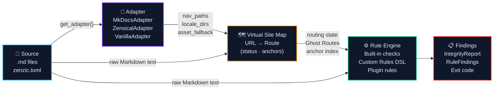
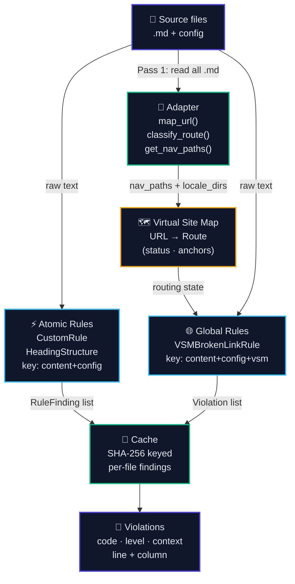
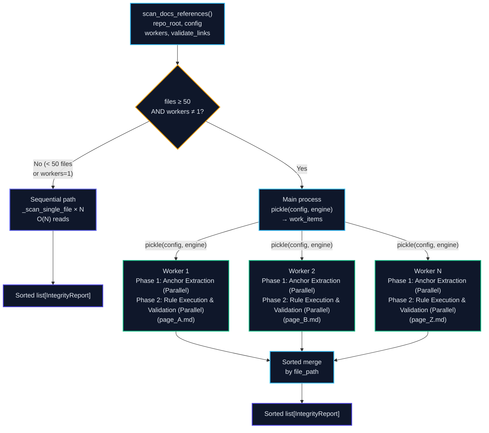
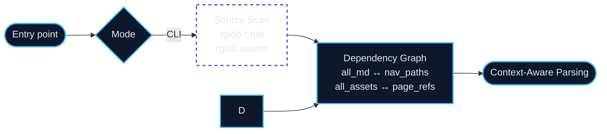
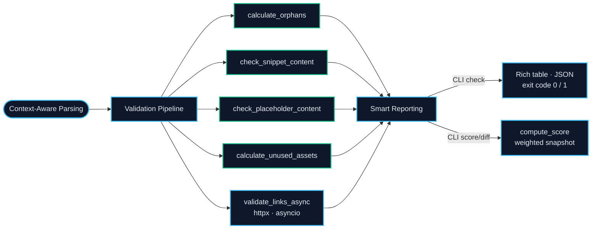
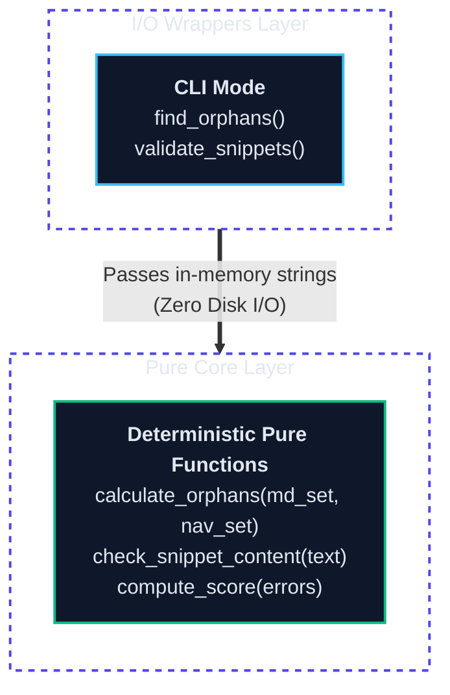
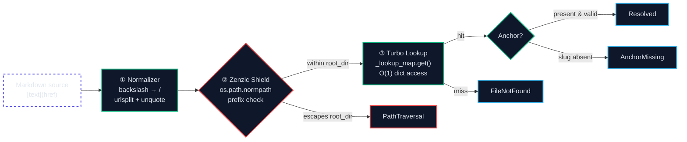
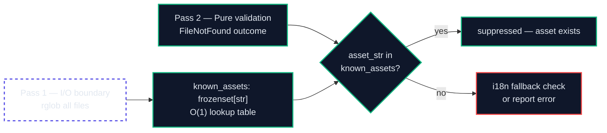

<!-- SPDX-FileCopyrightText: 2026 PythonWoods <dev@pythonwoods.dev> -->
<!-- SPDX-License-Identifier: Apache-2.0 -->

# Architecture

Zenzic is built around an I/O-agnostic core that runs in CLI mode. This page describes the internal data flow, the three-layer design, the state-machine used for Python block extraction, and the link extraction and validation pipeline.

## The three pillars

Every design decision in Zenzic follows three rules. When in doubt about an implementation choice, these are the tie-breakers.

**1. Lint the source with build-aware intelligence.**
Zenzic analyses raw Markdown files under `docs/` and configuration files (`mkdocs.yml`). It never waits for an HTML build. Analysis at the source level is faster, generator-agnostic, and always reproducible. Where a build engine defines resolution semantics (e.g. i18n fallback), Zenzic reads the configuration as plain YAML and emulates the semantics — without importing or executing the engine.

**2. No subprocesses in the core engine.**
The core library is pure Python. It never calls `subprocess.run` to invoke external tools. Link validation — historically delegated to `mkdocs build --strict` — is now implemented natively with a Markdown link extractor and `httpx` for external URLs. This makes Zenzic self-contained and testable without installing any documentation generator.

**3. Pure functions first.**
All validation logic lives in pure functions: no file I/O, no network access, no terminal output. I/O happens only at the edges — in CLI wrappers that read files from disk. Pure functions are trivially testable and can be composed freely.

---

## End-to-end pipeline

Every Zenzic run follows the same four-stage pipeline, regardless of the documentation engine:



**Source** — Zenzic reads raw `.md` files and `zenzic.toml` directly from disk. No HTML build required.

**Adapter** — selected by `build_context.engine` (or `--engine`). It answers engine-specific questions (nav paths, locale directories, asset fallback) without the Core ever importing an engine framework. Third-party adapters install via `pip` and are discovered through the `zenzic.adapters` entry-point group.

**Rule Engine** — applies all active checks to the raw Markdown text: built-in checks (orphans, snippets, placeholders, assets, references), project-specific `[[custom_rules]]` from `zenzic.toml`, and any installed plugin rules (Python classes registered under `zenzic.rules`).

**Findings** — results are aggregated into typed `IntegrityReport` objects (per file) and rendered as Rich terminal output, JSON, or a 0–100 quality score.

---

## Virtual Site Map (VSM)

The VSM is the most important data structure in Zenzic. It is the single source of truth for routing and the foundation of all link validation.



### Terminology: Route vs Path

**Path** — the filesystem location of a source file, relative to `docs/`
(e.g. `guide/index.md`).

**Route** — the canonical URL the build engine will serve for that file
(e.g. `/guide/`). The same source Path can resolve to different Routes under
different engines. The VSM maps every known Path to exactly one Route and
assigns it a status. All link validation and orphan detection operate on
Routes, never on raw Paths — this is what makes Zenzic engine-agnostic.

### Route status values

| Status | Set by | Meaning |
| :--- | :--- | :--- |
| `REACHABLE` | nav listing, locale shadow, Ghost Route | Page will be served and is navigable. |
| `ORPHAN_BUT_EXISTING` | file on disk, absent from nav | File renders but has no nav entry — invisible to users. |
| `IGNORED` | README not in nav, `_private/` dirs | Engine will not serve this file. |
| `CONFLICT` | two files → same URL | Build result undefined; flag as error. |

### Ghost Routes

When `mkdocs.yml` sets `plugins.i18n.reconfigure_material: true`, the Material theme
generates locale entry points (e.g. `it/index.md` → `/it/`) at build time.
These pages never appear in `nav:`.  `MkDocsAdapter.classify_route()` recognises this
flag and marks top-level locale index files `REACHABLE`, preventing false orphan warnings.

Detection is a pure function (`_extract_i18n_reconfigure_material`) — it reads only the
already-parsed `doc_config` dict and returns a boolean.

### Content-addressable cache

Zenzic avoids re-linting unchanged files using a content-addressable cache keyed on
SHA-256 digests.  Timestamps are never consulted — the cache is correct in CI environments
where `git clone` resets `mtime`.

```text
Atomic rule cache key:  SHA256(content) + SHA256(config)
Global rule cache key:  SHA256(content) + SHA256(config) + SHA256(vsm_snapshot)
```

When any file changes, the VSM snapshot changes.  All global-rule cache entries that
included that snapshot hash are automatically invalidated — without a file-to-file
dependency graph.  Atomic-rule entries for unchanged files remain valid.

The `CacheManager` is pure in-memory during the run.  `load()` and `save()` are the only
I/O operations, called at process start and end respectively by the CLI layer.

---

## Hybrid Adaptive Engine (v0.5.0a1)

`scan_docs_references` is the single unified entry point for all scan modes.
There is no longer a separate "parallel" function — the engine **adapts
automatically** based on repository size.



### Sequential path

Used when `workers=1` (the default) or when the repository has fewer than 50
files.  Zero process-spawn overhead.  Supports external URL validation in a
single O(N) pass.

### Parallel path

Activated when `workers != 1` and the file count is at or above
`ADAPTIVE_PARALLEL_THRESHOLD` (50).  Each file is dispatched to an independent
worker process via `ProcessPoolExecutor`.

Each worker follows two explicit internal phases:

1. **Phase 1: Anchor Extraction (Parallel)** — build the per-file anchor index.
2. **Phase 2: Rule Execution & Validation (Parallel)** — run reference checks,
   Shield, and rule evaluation on the same file-local context.

The main process only performs deterministic merge and final reporting.

**Shared-nothing architecture:** `config` and the `AdaptiveRuleEngine`
(including all registered rules) are serialised by `pickle` before being sent
to each worker.  Every worker operates on an independent copy — no shared
memory, no locks, no race conditions.

**Immutability contract:** workers must not mutate `config`.  Rules that write
to mutable global state (e.g. a class-level counter) violate the Pure Functions
Pillar.  In parallel mode, each worker holds an independent copy of that state
— mutations are local and discarded, producing results that diverge silently
from sequential mode.

**Eager pickle validation:** `AdaptiveRuleEngine` calls `pickle.dumps()` on
every rule at construction time.  A non-serialisable rule raises
`PluginContractError` immediately, before any file is scanned.

**Determinism guarantee:** results are sorted by `file_path` after collection
regardless of worker scheduling order.

---



### Phase 2: Validation Pipeline



---

Zenzic is designed around a single principle: **separate I/O from logic**. Every check is implemented as a pure function that operates on in-memory data. The CLI is a thin wrapper that supplies that data.

---

## Three-layer architecture



---

## I/O-agnostic core

The core functions in `zenzic.core.scanner` and `zenzic.core.validator` take strings and sets as input and return typed results. They never open a file, walk a directory, or make a subprocess call.

```python
# Pure — no filesystem access
def calculate_orphans(all_md: set[str], nav_paths: set[str]) -> list[str]:
    return sorted(all_md - nav_paths)

def check_snippet_content(
    text: str, file_path: Path | str, config: ZenzicConfig | None = None
) -> list[SnippetError]:
    # compiles Python code blocks in `text` — no disk I/O
    ...

def check_placeholder_content(
    text: str, file_path: Path | str, config: ZenzicConfig | None = None
) -> list[PlaceholderFinding]:
    # checks word count and pattern matches in `text` — no disk I/O
    ...
```

This design has three practical consequences:

1. **Pure functions are trivially testable.** No mocking of the filesystem required. Pass a string, assert on the result.

---

## CLI wrappers

The CLI wrappers (`find_orphans`, `validate_snippets`, `find_placeholders`, `find_unused_assets`) own all filesystem interaction:

```python
# CLI wrapper — reads disk, then delegates to pure core
def validate_snippets(repo_root: Path, config: ZenzicConfig | None = None) -> list[SnippetError]:
    docs_root = repo_root / config.docs_dir
    errors: list[SnippetError] = []
    for md_file in sorted(docs_root.rglob("*.md")):
        content = md_file.read_text(encoding="utf-8")
        errors.extend(check_snippet_content(content, rel_path, config))  # pure call
    return errors
```

The public API of these wrappers is unchanged — existing integrations that call `find_orphans()` or `validate_snippets()` directly continue to work.

## State-machine parsing and superfences false positives

Regex-based fenced code block extraction is fragile. The naive pattern
`` ```(?:python|py).*?\n(.*?)``` `` with `re.DOTALL` cannot distinguish between
a real opening fence on its own line and a triple-backtick that appears inside
an inline code span (e.g., `` ` ```python ` `` in prose text). When the pattern
matches such an inline span as an opening fence, the non-greedy `.*?` expands
until the next real closing fence — potentially consuming hundreds of lines of
unrelated content as a "snippet". Any em-dash, non-ASCII character, or valid
prose inside that span is then passed to `compile()`, producing a spurious
`SyntaxError`.

Zenzic avoids this with a **deterministic line-by-line state machine** in
`_extract_python_blocks`:

```python
for lineno, line in enumerate(text.splitlines(), start=1):
    stripped = line.strip()
    if not in_block:
        if stripped.startswith("```"):
            info = stripped[3:].strip()
            lang = info.split()[0].lower() if info else ""
            if lang in ("python", "py"):
                in_block = True          # enter block only on a real fence line
                fence_line_no = lineno
    else:
        if stripped.startswith("```") and not stripped.lstrip("`"):
            blocks.append(("\n".join(block_lines), fence_line_no))
            in_block = False             # close on a line that is ONLY backticks
        else:
            block_lines.append(line)
```

Key properties:

- **Opening fence must be the entire stripped line content** starting with `` ``` ``.
  An inline code span like `` ` ```python ` `` is surrounded by single backticks
  and therefore `stripped` starts with a single `` ` ``, not three — it never
  triggers `in_block = True`.
- **Closing fence is only backticks** (`stripped.lstrip("`") == ""`). A prose
  line that happens to contain triple backticks in the middle cannot close the
  block prematurely.
- **No regex backtracking.** Each line is processed in O(1); the entire file is
  O(n) in the number of lines regardless of nesting depth or superfences usage.

This means Zenzic correctly handles `pymdownx.superfences` documents where
Mermaid, PlantUML, or other custom fences appear between Python blocks — none
of them produce false positives.

---

## Link extraction and validation pipeline

`validate_links_async` in `zenzic.core.validator` operates in three passes. Pass 1 reads all `.md` files into memory and pre-computes anchor sets from ATX headings. Pass 2 walks the in-memory content, extracts links, and classifies them as internal or external. Pass 3 — only when `--strict` is requested — pings external URLs concurrently via `httpx`.

### Portability Enforcement Layer

Before any path resolution occurs, every extracted URL passes through the
**Portability Enforcement Layer** — a single check that runs before
`InMemoryPathResolver` is consulted.

```text
extracted url
    │
    ▼
┌─────────────────────────────────────┐
│  Portability Enforcement Layer      │
│                                     │
│  url.startswith("/") ?              │
│    YES → AbsolutePathError + stop   │  ← blocked here
│    NO  → continue                   │
└─────────────────┬───────────────────┘
                  │
                  ▼
         InMemoryPathResolver
```

**Why absolute paths are rejected.** A link to `/assets/logo.png` presupposes
the site is served from the domain root. When documentation is hosted in a
subdirectory (e.g. `https://example.com/docs/`), the browser resolves
`/assets/logo.png` to `https://example.com/assets/logo.png` — a 404. Relative
paths (`../assets/logo.png`) are resolved by the browser relative to the page
URL and survive any hosting path change without modification.

The error message includes an explicit fix hint:

```text
about/brand-kit.md:52: '/assets/brand-kit.zip' uses an absolute path —
use a relative path (e.g. '../' or './') instead; absolute paths break
portability when the site is hosted in a subdirectory
```

External URLs (`https://...`) are classified before this layer and are not
affected.

---

### Suffix-Aware i18n

Zenzic detects locale suffixes natively from file names — no build-engine
plugin is required. A file named `guide.it.md` is identified as an Italian
translation of `guide.md` by parsing the stem: `guide.it` → stem `guide`,
suffix locale `it`.

**Why Suffix Mode, not Folder Mode.** In Folder Mode (`docs/it/guide.md`),
translated files are nested one directory level deeper than originals. A
relative link `../assets/logo.png` that resolves correctly from `docs/guide.md`
becomes invalid from `docs/it/guide.md` (requires `../../assets/logo.png`).
This depth mismatch is invisible at authoring time but produces 404s in the
built site. In Suffix Mode, `docs/guide.md` and `docs/guide.it.md` are in the
same directory — all relative paths are symmetric between translations.

```text
Folder Mode (fragile)          Suffix Mode (deterministic)
─────────────────────          ───────────────────────────
docs/
  guide.md          ← depth 1  docs/
  it/                             guide.md       ← depth 1
    guide.md        ← depth 2     guide.it.md    ← depth 1 (same)
    assets/         ← depth 2     assets/        ← depth 1 (shared)

Link from guide.md:  ../assets/   Link: ../assets/   (same in both files ✓)
Link from it/guide.md: ../../assets/
```

When `mkdocs.yml` declares `fallback_to_default: true`, Zenzic additionally
suppresses `FileNotFound` errors for untranslated pages by checking whether
the default-locale counterpart exists — independently of whether a build-engine
plugin is installed.

**Base-link strategy (recommended).** Links inside translated files (`guide.it.md`)
should point to the base source file (`index.md`), not to the translated sibling
(`index.it.md`). The build engine decides at render time whether to serve the
translated version or fall back to the default locale. Hard-coding `index.it.md`
creates a rigid link that breaks if the translation is removed. Zenzic validates the
base file exists, guaranteeing navigation-graph integrity regardless of which locales
are built.

---

## Adapter Pipeline

The Adapter Pipeline is the architectural boundary between the **engine-agnostic Core** and
any build engine. It was introduced in v0.4.0 to eliminate the last fragments of
engine-specific knowledge from `scanner.py` and `validator.py`.

### Motivation: silent 404s from path ambiguity

Before the Adapter Pipeline, engine-specific logic was scattered: locale directory detection
lived in `scanner.py`, i18n fallback resolution lived in `validator.py`, and nav parsing was
duplicated across both. Every engine addition required touching multiple files, and every
new locale strategy risked introducing silent misbehaviour — files silently excluded from
orphan checks, assets silently resolved to the wrong path.

The core problem is **path ambiguity**: `docs/it/index.md` is a locale mirror of
`docs/index.md` in folder-mode i18n but a regular page in a flat repo. The same path means
two different things depending on the engine. Resolving this without engine-specific knowledge
in the Core requires a clean interface.

### Design

```text
zenzic.toml
    │
    ▼
get_adapter(context, docs_root, repo_root)
    │
    ├─ engine = "zensical"  →  ZensicalAdapter   (reads zensical.toml, pure TOML)
    ├─ engine = "mkdocs"    →  MkDocsAdapter      (reads mkdocs.yml, permissive YAML)
    └─ no config, no locale →  VanillaAdapter     (all no-ops, returns [] for orphans)
    │
    ▼
BaseAdapter interface
    │
    ├─ is_locale_dir(part)              → bool
    ├─ resolve_asset(missing, root)     → Path | None
    ├─ is_shadow_of_nav_page(rel, nav)  → bool
    ├─ get_nav_paths()                  → frozenset[str]
    └─ get_ignored_patterns()           → set[str]
    │
    ▼
Scanner / Validator  (engine-agnostic)
```

`get_adapter` is the only public entry point. It loads all config files internally — callers
pass the build context and paths, never raw config dicts.

`scanner.py` imports neither `yaml` nor `tomllib`. `validator.py` imports `yaml` for one
specific function: `check_nav_contract()`, which validates `extra.alternate` links against
the virtual site map and must read `mkdocs.yml` directly. All other validation logic in
`validator.py` is engine-agnostic. The `yaml` and `tomllib` imports for adapter construction
live exclusively in `zenzic.core.adapter`.

### Native Enforcement

When `engine = "zensical"` is declared in `zenzic.toml`, Zenzic enforces that `zensical.toml`
exists in the repository root before constructing the adapter:

```python
if context.engine == "zensical":
    if find_zensical_config(repo_root) is None:
        raise ConfigurationError(
            "engine 'zensical' declared in zenzic.toml but zensical.toml is missing"
        )
```

There is no fallback to `mkdocs.yml`. This is intentional: a project that declares itself
Zensical but ships only a `mkdocs.yml` is in an ambiguous state. Ambiguity is the source of
silent 404s. The enforcement rule is: **engine identity must be provable from the config files
present on disk**. If it cannot be proved, fail loudly and early.

### VanillaAdapter and zero-config repos

When no engine config file is found and no locales are declared, `get_adapter` returns a
`VanillaAdapter`. All five methods are no-ops. `find_orphans` returns `[]` immediately —
without a nav, there is no reference set to compare against. Zenzic operates as a plain
Markdown linter: snippet checks, placeholder checks, and link checks run normally; orphan
detection is skipped.

This means Zenzic works out of the box on bare Markdown repos and any other Markdown-based
system — without producing false positives from an absent nav.

---

### Package layout (`zenzic.core.adapters`)

The adapter logic lives in the `zenzic.core.adapters` package. Each file has a single
responsibility:

| Module | Contents |
| :--- | :--- |
| `_base.py` | `BaseAdapter` — `@runtime_checkable` Protocol |
| `_mkdocs.py` | `MkDocsAdapter` + all YAML utilities (`_PermissiveYamlLoader`, `find_config_file`, `_extract_i18n_*`, `_collect_nav_paths`) |
| `_zensical.py` | `ZensicalAdapter` + TOML utilities (`find_zensical_config`, `_load_zensical_config`) |
| `_vanilla.py` | `VanillaAdapter` |
| `_factory.py` | `get_adapter()` |
| `__init__.py` | Re-exports the full public API |

`zenzic.core.adapter` (singular) is a backwards-compatible shim that re-exports all symbols
from the package. All existing imports continue to work without modification.

---

### Two-phase extraction process

Link extraction faces the same parsing ambiguity as Python block extraction: links that appear inside code examples must not be treated as real targets. `extract_links()` addresses this with a two-phase process that ensures the link regex only ever runs on "safe" text.

**Phase 1 — Isolation.** Before the link regex runs, all code contexts are identified and excluded:

- *Fenced code blocks* (`` ``` `` and `~~~`): tracked with the same line-by-line state machine used for Python block extraction. Any line inside a fenced block is skipped entirely.
- *Inline code spans* (backtick-delimited): replaced character-for-character with spaces via `re.sub`. This preserves column positions while making link patterns inside code spans invisible to the regex.

```python
for line in text.splitlines():
    stripped = line.strip()

    # Phase 1a — fenced block tracking
    if not in_block:
        if stripped.startswith("```") or stripped.startswith("~~~"):
            in_block = True
            continue
    else:
        if stripped.startswith("```") or stripped.startswith("~~~"):
            in_block = False
        continue   # always skip lines inside a fenced block

    # Phase 1b — inline code blanking
    clean = re.sub(r"`[^`]+`", lambda m: " " * len(m.group()), line)
```

**Phase 2 — Extraction.** The link regex runs only on `clean` — the sanitised line with all code contexts removed:

```python
for m in _MARKDOWN_LINK_RE.finditer(clean):
    ...
```

Any link pattern inside a code span becomes a run of spaces in Phase 1b and is never matched in Phase 2. The design goal for the two-phase pipeline is:

$$\text{Parsing Accuracy} = 1 - \frac{\text{False Positives (Code Blocks)}}{\text{Total Links Extracted}}$$

### What the regex captures

In the current release, `_MARKDOWN_LINK_RE` targets **inline links and images** — the most common link form in MkDocs documentation:

```python
_MARKDOWN_LINK_RE = re.compile(r"!?\[[^\[\]]*\]\(([^)]+)\)")
```

This covers `[text](url)`, ``, and links with optional titles such as `[text](url "title")`. Autolinks (`<url>`) are not extracted — they are out of scope for internal link validation.

**Reference-style links** (`[text][id]`) are fully supported. `_build_ref_map()` extracts all reference definitions from the file content before validation begins; `extract_ref_links()` then resolves each `[text][id]` usage against that map. Both functions are pure (no I/O). The resolved URL is fed into the same `InMemoryPathResolver` pipeline as inline links, including i18n fallback.

After a match, the raw content inside the parentheses is stripped of any trailing title:

```python
url = re.sub(r"""\s+["'].*$""", "", raw).strip()
```

### Internal link resolution — `InMemoryPathResolver`

As of v0.3.0, internal link resolution is fully delegated to
`InMemoryPathResolver` — the pure, engine-agnostic resolver introduced in
Sprint 3.  The validator instantiates it **once** after Pass 1 completes,
then calls `resolver.resolve(source_file, href)` for every internal link.
All path arithmetic, normalisation, and security checks live inside the
resolver; `validate_links_async` is a pure I/O orchestrator.

#### Data Journey: from a raw href to a `ResolveOutcome`

The resolver transforms a raw, potentially hostile href into a deterministic
outcome in three stages — without ever touching the filesystem.



**Concrete example.** Consider `[Docs](\\guide/../setup%20env#Step-1)`,
authored on Windows with a backslash path separator and a percent-encoded
space in the directory name:

| Stage | Operation | Result |
|---|---|---|
| Raw input | extracted from Markdown | `\\guide/../setup%20env#Step-1` |
| ① Normalizer | `replace("\\", "/")` + `unquote()` | path `/guide/../setup env`, fragment `Step-1` |
| ② Shield | `normpath("/docs/guide/../setup env")` | `/docs/setup env` — within `/docs` ✅ |
| ③ Lookup | `_lookup_map.get("/docs/setup env")` | `Path("/docs/setup env.md")` |
| Output | `Resolved` | `Resolved(target=Path("/docs/setup env.md"))` |

---

#### Zenzic Shield — path traversal protection

The Shield blocks directory traversal attacks before any lookup, without
interrogating the filesystem. It operates at **stage ②**.

!!! example "Attack vs Defence"
    **Attack:** `[Secret](../../../../etc/passwd)`

    A naive resolver would follow the `..` chain and reach `/etc/passwd`.
    Zenzic does not.

    1. `os.path.normpath("/docs/../../../../etc/passwd")` → `/etc/passwd`
       Pure C string arithmetic — no `stat()`, no kernel call.
    2. `"/etc/passwd".startswith("/docs/")` → `False`
    3. → `PathTraversal(raw_href="../../../../etc/passwd")`

    **Zero I/O. Zero disk access. Result in < 1 μs.**

The Shield is undefeatable by any combination of `..`, `.`,
percent-encoding (`%2e%2e`), or backslash (`..\\..`): all of these are
normalised into a canonical absolute path by `os.path.normpath` before the
single prefix comparison runs.

**Why not `pathlib.Path.relative_to()`?**
The original implementation used `Path.relative_to()`, which decomposes both
paths into segment lists and allocates intermediate objects — $O(n)$ in
segment count.  The pre-computed `_root_prefix` string check is $O(1)$ and
allocation-free.  At scale this difference is `164 ms` vs `11.5 ms` for 5 000
links — a **14× speedup** with no change in security guarantees.

---

#### IO Purity contract

`InMemoryPathResolver` is a **pure engine**. It accepts exactly three inputs
at construction time and performs no I/O afterwards:

```python
resolver = InMemoryPathResolver(
    root_dir=Path("/docs"),       # containment boundary for the Shield
    md_contents=md_contents,     # all .md files, read once by the I/O layer
    anchors_cache=anchors_cache, # pre-computed heading slugs per file
)
# Every call to resolve() is pure: same inputs → same output, always.
outcome = resolver.resolve(source_file, href)
```

Every new feature added to the resolver **must** operate exclusively on
these three maps. The contract is enforced by `tests/test_resolver.py`,
which builds all fixtures in-memory with zero disk access.

!!! warning "Contributor rule: keep the resolver allocation-free"
    `InMemoryPathResolver.resolve()` is optimised for **430 000+
    resolutions per second**. Any change to the hot path must preserve these
    three invariants:

    **1. No new `pathlib.Path` objects inside `resolve()`.**
    Use `self._root_str`, `self._root_prefix`, and `target_str` (plain `str`)
    for all comparisons.  `Path` construction has measurable overhead at scale.

    **2. No syscalls of any kind.**
    `os.path.exists()`, `Path.is_file()`, `stat()` — all forbidden inside the
    resolver.  The resolver must stay pure even on a read-only filesystem.

    **3. Instantiate once, outside the file loop.**
    The `_lookup_map` is built in `__init__`. Re-instantiating per file
    regenerates the map $N$ times and degrades throughput back to $O(N^2)$.

For non-Markdown assets (PDFs, images), the `md_contents` lookup returns
`FileNotFound`. `validate_links_async` handles this using the `known_assets`
frozenset — a pre-built O(1) lookup table constructed in Pass 1. No filesystem
call is ever made in Pass 2. See [Build-Aware Intelligence](#build-aware-intelligence) below.

### Async external validation

When `--strict` is requested, `_check_external_links()` validates all collected external URLs concurrently:

- **Deduplication first.** Each unique URL is pinged exactly once, regardless of how many pages reference it. Results are mapped back to every `(file_label, lineno)` pair, so all occurrences are reported in one pass.
- **Bounded concurrency.** An `asyncio.Semaphore(20)` caps simultaneous outbound connections to avoid exhausting OS file descriptors and triggering rate-limits on target servers.
- **Graceful degradation.** HTTP 401, 403, and 429 responses are treated as "alive" — the server is responding but restricting access. This prevents false positives from GitHub, StackOverflow, and other sites that reject unauthenticated HEAD requests.
- **HEAD with GET fallback.** Servers that return 405 (Method Not Allowed) for HEAD are retried with GET.

---

## Build-Aware Intelligence

Zenzic extends the link validation pipeline with two capabilities:
zero-I/O asset validation and i18n-aware fallback resolution. Both are implemented
as **pure layers on top of the existing `InMemoryPathResolver`** — the resolver
itself is unchanged, and the capabilities compose without coupling.

### Zero-I/O asset validation — `known_assets`

Previously, non-Markdown asset links were validated by calling `Path.exists()` per link in Pass 2 — a syscall in the hot path. This produced non-deterministic results in CI environments where disk state differs between runs.

The fix: Pass 1 now builds `known_assets`, a `frozenset[str]` of normalised absolute path strings for every non-`.md` file under `docs/`:

```python
known_assets: frozenset[str] = frozenset(
    str(p.resolve()) for p in docs_root.rglob("*") if p.is_file() and p.suffix != ".md"
)
```

Pass 2 uses O(1) set membership — `asset_str in known_assets` — with zero disk I/O:



**Invariant:** `Path.exists()` is never called during Pass 2. All asset resolution uses the pre-built frozenset. This is enforced by `tests/test_validator.py::TestAssetPreMap::test_no_path_exists_call_in_pass2`.

### Build-time artifact suppression — `excluded_build_artifacts`

Some assets (PDFs generated by `to-pdf`, ZIPs assembled in CI) exist only after the build completes. Declaring their glob patterns in `zenzic.toml` suppresses errors for those paths at lint time:

```toml
excluded_build_artifacts = ["pdf/*.pdf", "dist/*.zip"]
```

The check runs only when `asset_str not in known_assets` — i.e., after the fast path has already confirmed the file does not exist on disk. Suppression uses `fnmatch` (pure string matching, no I/O).

### i18n Adapter — `I18nFallbackConfig`

Zenzic reads build-engine configuration files **as plain YAML** and extracts locale-resolution semantics from them. It never imports or executes the build engine. This is **protocol compatibility**, not framework coupling.

The adapter is a single `NamedTuple` that encodes the fallback contract:

```python
class I18nFallbackConfig(NamedTuple):
    enabled: bool           # is fallback_to_default: true?
    default_locale: str     # e.g. "en"
    locale_dirs: frozenset[str]  # e.g. frozenset({"it", "de"})
```

`_extract_i18n_fallback_config(doc_config)` reads this from the parsed YAML dict. If `mkdocs.yml` is absent or the i18n plugin is not configured, it returns `_I18N_FALLBACK_DISABLED` — a singleton with `enabled=False`. The rest of the pipeline is unaffected.

**Engine agnosticism is the default.** A project with no engine config is served by
`VanillaAdapter` out of the box — no adapter needed, no configuration required. An adapter
is only necessary when a specific engine introduces conventions that require specialised
knowledge: locale directory layouts (i18n), nav contract formats, engine-specific Markdown
dialects, or native plugin semantics.

**Adding an adapter for a new build engine** — if and when the engine's conventions require
it — needs only:

1. A new class implementing the `BaseAdapter` protocol (five methods).
2. A branch in `get_adapter()` to select it.
3. No changes to `InMemoryPathResolver`, `validate_links_async`, `scanner.py`, or any test fixture.

### i18n fallback resolution — `_should_suppress_via_i18n_fallback`

When `InMemoryPathResolver` returns `FileNotFound` for a path inside a locale subdirectory, and `fallback_config.enabled` is `True`, Zenzic re-attempts resolution from the equivalent position in the default locale tree:

```text
Source:  docs/it/guide.md  →  link: api.md
Resolve: docs/it/api.md    →  FileNotFound

Fallback:
  1. Is source_file inside a locale_dir? (docs/it/ → "it" ∈ locale_dirs) ✓
  2. Is the missing target inside the same locale tree? (docs/it/api.md starts with docs/it/) ✓
  3. Strip locale prefix: docs/it/api.md → docs/api.md
  4. Re-resolve docs/api.md via InMemoryPathResolver: Resolved ✓
  5. Suppress the FileNotFound — the build will serve the default-locale version.
```

If the target is absent from both the locale tree and the default locale, the error is reported regardless of fallback settings.

**Case sensitivity:** All path lookups are case-sensitive. `docs/assets/Logo.png` ≠ `docs/assets/logo.png`. This matches the behaviour of Linux web servers and prevents silent serving of wrong assets.

---

---

## Two-Pass Reference Pipeline (v0.2.0)

### From stateless to document-aware

Zenzic v0.1 was a **stateless** linter: each line was evaluated independently, without any memory of what came before or after it. This was sufficient for inline links — `[text](url)` — because the URL is self-contained.

Reference-style links break this assumption:

```markdown
See [the guide][guide-link].          <!-- usage: needs a map to resolve "guide-link" -->

[guide-link]: https://example.com     <!-- definition: appears later in the file -->
```

A stateless scanner reading top-to-bottom would flag `[guide-link]` as a **Dangling Reference** before ever reaching its definition. The Two-Pass Pipeline exists to eliminate this class of **false positives entirely**.

| Capability | v0.1 — Stateless | v0.2 — Document-Aware |
|---|---|---|
| Architecture | Single-pass, line-by-line | Three-phase pipeline |
| Reference links | Not supported | `ReferenceMap`, first-wins, case-insensitive |
| Forward references | ❌ False Dangling Reference errors | ✅ Resolved (Pass 2 runs after full harvest) |
| Security | — | Zenzic Shield: OpenAI / GitHub / AWS → Exit 2 |
| URL deduplication | One check per link occurrence | One check per unique URL across all files |
| Memory model | `.read()` per file | Generators — constant RAM per line |
| Accessibility | — | `WARNING` on images without alt text |
| Quality metric | — | Reference Integrity = used ÷ defined × 100 |

---

### The lifecycle of a reference link

A reference link travels through four stages before Zenzic can validate it.

```text
┌─────────────────────────────────────────────────────────────────────┐
│                         SOURCE FILE (disk)                          │
│  Line  5:  See [the guide][guide-link].                             │
│  Line 42:  [guide-link]: https://example.com                        │
└───────────────────────────┬─────────────────────────────────────────┘
                            │  _iter_content_lines() — generator,
                            │  streams one line at a time, skips
                            │  fenced code blocks
                            ▼
┌─────────────────────────────────────────────────────────────────────┐
│                    PASS 1 — HARVESTING & SHIELD                     │
│                                                                     │
│  RE_REF_DEF matches line 42 ──► ReferenceMap.add_definition()      │
│    key  = "guide-link"  (normalised: .lower().strip())              │
│    value = ("https://example.com", line_no=42)      ← metadata     │
│                                                                     │
│  Shield scans the URL immediately:                                  │
│    scan_url_for_secrets("https://example.com", ...) → no match      │
│    → yield (42, "DEF", ("guide-link", "https://example.com"))       │
│                                                                     │
│  RE_IMAGE_INLINE matches any `` on any line:                  │
│    alt_text empty? → yield (n, "MISSING_ALT", url)   ← WARNING     │
│    alt_text filled? → yield (n, "IMG", (alt, url))                  │
└───────────────────────────┬─────────────────────────────────────────┘
                            │  After generator is exhausted,
                            │  ReferenceMap is COMPLETE
                            ▼
┌─────────────────────────────────────────────────────────────────────┐
│                   PASS 2 — CROSS-CHECK & RESOLUTION                 │
│                                                                     │
│  RE_REF_LINK matches line 5 ──► ReferenceMap.resolve("guide-link") │
│    found  → mark "guide-link" as used; no finding                   │
│    absent → ReferenceFinding(issue="DANGLING")  ← Dangling Reference│
└───────────────────────────┬─────────────────────────────────────────┘
                            │  ref_map.used_ids is now populated
                            ▼
┌─────────────────────────────────────────────────────────────────────┐
│                   PASS 3 — CLEANUP & METRICS                        │
│                                                                     │
│  integrity_score = len(used_ids) / len(definitions) × 100          │
│                                                                     │
│  orphan_definitions = definitions.keys() − used_ids                │
│    → ReferenceFinding(issue="DEAD_DEF")  ← Dead Definition        │
│                                                                     │
│  duplicate_ids → ReferenceFinding(issue="duplicate-def",            │
│                                   is_warning=True)                  │
└─────────────────────────────────────────────────────────────────────┘
```

---

### Why the two-pass design is the only correct solution

Consider a document where a definition appears after all its usages — a natural writing pattern when the author places footnote-style references at the bottom of the page:

```markdown
## Overview
Read [the spec][spec] and [the guide][guide].

## Getting started
Follow [the guide][guide] for installation.

[spec]:  https://spec.example.com    <!-- line 40 -->
[guide]: https://guide.example.com   <!-- line 41 -->
```

A single-pass scanner processes line 2 before line 40. At line 2, neither `spec` nor `guide` are defined yet — so both would be reported as Dangling References. This is a **false positive**: the definitions are present and correct, just later in the file.

The Two-Pass Pipeline prevents this by design:

1. **Pass 1** reads the entire file and builds the `ReferenceMap` before any resolution is attempted. At the end of Pass 1, every definition in the document is registered, regardless of its position.
2. **Pass 2** then resolves each usage against a *complete* map. Line 2 is processed with full knowledge of lines 40 and 41.

This is the same separation-of-concerns that a compiler uses: the linker resolves forward references only after all object files have been scanned.

!!! warning "Do not merge the passes"
    It can be tempting to resolve links on the fly during Pass 1 to save a second file read. **Do not do this.** The forward reference problem is not a corner case — it is a common, idiomatic Markdown pattern. Merging the passes reintroduces exactly the bug the pipeline was designed to eliminate.

---

### Generator-based streaming

Zenzic never calls `.read()` or `.readlines()` on documentation files. Both methods load the entire file into memory before processing begins — a problem when documentation repositories contain Markdown files exceeding several megabytes.

Instead, every pass uses `_iter_content_lines()`, a generator that reads one line at a time:

```python
def _iter_content_lines(file_path: Path) -> Generator[tuple[int, str], None, None]:
    in_block = False
    with file_path.open(encoding="utf-8") as fh:
        for lineno, line in enumerate(fh, start=1):   # one line at a time
            stripped = line.strip()
            if not in_block:
                if stripped.startswith("```") or stripped.startswith("~~~"):
                    in_block = True
                    continue
            else:
                if stripped.startswith("```") or stripped.startswith("~~~"):
                    in_block = False
                continue  # skip all lines inside fenced blocks
            yield lineno, line
```

Peak memory consumption is proportional to the size of the `ReferenceMap` (a dictionary of IDs and URLs), not the size of the file. A 100 MB Markdown file with 500 reference definitions uses the same memory as a 10 KB file with 500 definitions.

---

### `ReferenceMap` state management between passes

The `ReferenceMap` is the central data structure of the pipeline. It is created fresh for each file — there is no shared state between documents at the map level.

```python
@dataclass
class ReferenceMap:
    definitions: Dict[str, Tuple[str, int]]  # normalised_id → (url, line_no)
    used_ids:    Set[str]                    # populated during Pass 2
    duplicate_ids: Set[str]                  # populated during Pass 1
```

**Between Pass 1 and Pass 2**, `definitions` is complete and `used_ids` is empty. Pass 2 fills `used_ids` by calling `resolve()` for every link it encounters. After Pass 2, the difference `definitions.keys() − used_ids` is the set of **Dead Definitions** (code: `issue="DEAD_DEF"`).

**Key invariants enforced by the map:**

- **Case-insensitive keys.** `[Guide]`, `[GUIDE]`, and `[guide]` all resolve to the same entry. Normalisation (`lower().strip()`) happens inside `add_definition()` and `resolve()`, not in the caller. The scanner passes raw strings; the map is responsible for its own consistency.
- **First-wins (CommonMark §4.7).** When the same ID is defined more than once, the first definition in document order is kept. Subsequent definitions are ignored and recorded in `duplicate_ids` for warning purposes. This matches the behaviour of every CommonMark-compliant renderer.
- **Line-number metadata.** Each definition stores its source line alongside the URL: `(url, line_no)`. This metadata is used in Pass 3 to produce error messages that point directly to the problematic line rather than reporting an abstract ID.

---

### Zenzic Shield — security as a firewall, not a filter

The Shield runs **inside Pass 1**, not after it. Every URL extracted from a reference definition is scanned for known credential patterns before the definition is yielded:

```text
# Inside ReferenceScanner.harvest() — Pass 1
if accepted:
    yield (lineno, "DEF", (norm_id, url))

    for finding in scan_url_for_secrets(url, self.file_path, lineno):
        yield (lineno, "SECRET", finding)    # ← emitted immediately
```

Patterns are pre-compiled at import time using exact-length quantifiers — not greedy wildcards — to eliminate backtracking on long lines:

| Credential type | Pattern | Quantifier |
|---|---|---|
| OpenAI API key | `sk-[a-zA-Z0-9]{48}` | `{48}` — exact, O(1) |
| GitHub token | `gh[pousr]_[a-zA-Z0-9]{36}` | `{36}` — exact, O(1) |
| AWS access key | `AKIA[0-9A-Z]{16}` | `{16}` — exact, O(1) |

When the CLI receives a `SECRET` event it exits immediately with **code 2** — before Pass 2, before any HTTP ping, before any further analysis. A file that leaks credentials is not analysed further: there is no useful integrity score to compute for a document that must be fixed before it can be published.

```text
SECRET found in Pass 1
        │
        ▼
   EXIT CODE 2         ← build aborted
   Pass 2: SKIPPED     ← no HTTP pings issued
   Pass 3: SKIPPED     ← no integrity score computed
```

This behaviour is intentional. Performing link validation against a URL that contains a leaked API key would authenticate a real request using that key — a security incident, not a diagnostic.

---

### Global URL deduplication via `LinkValidator`

When `--links` is passed to `zenzic check references`, external URLs are validated with a single async pass. The `LinkValidator` class acts as the sole gatekeeper for HTTP traffic across the entire documentation tree.

```python
validator = LinkValidator()

# After Pass 1 for every file in docs/:
for scanner in all_scanners:
    if scanner_report.is_secure:                      # Shield check
        validator.register_from_map(scanner.ref_map, scanner.file_path)

# One async call — each unique URL pinged exactly once:
errors = validator.validate()
```

**Deduplication happens at registration time**, not inside the HTTP layer. If 50 files all define a reference to `https://docs.python.org`, `validator.unique_url_count` is 1, and exactly one HEAD request is issued.

```text
docs/a.md  →  [python]: https://docs.python.org  ─┐
docs/b.md  →  [py]:     https://docs.python.org  ─┤── LinkValidator
docs/c.md  →  [ref]:    https://docs.python.org  ─┘   ↓
                                                    1 HTTP HEAD
```

The async engine underneath (`_check_external_links`) enforces a semaphore cap of 20 simultaneous connections, falls back from HEAD to GET on 405 responses, and treats HTTP 401 / 403 / 429 as "alive" to prevent false positives from access-restricted servers.

---

### Accessibility: the gentle nudge

When Zenzic finds an image without alt text — `` or an HTML `` tag missing an `alt` attribute — it emits a `MISSING_ALT` event during Pass 1 and records a finding with `is_warning=True`.

This is a **warning, not an error**. It will not cause `zenzic check references` to exit with a non-zero code unless `--strict` is passed. The intent is to encourage better documentation progressively — not to block deploys for teams that are actively migrating to accessible content.

```text
  ⚠  [missing-alt]  guide.md:15 — Image 'architecture.png' has no alt text.
```

Under `--strict`, all warnings become errors and the exit code is 1. Teams that want to enforce accessibility as a hard gate can add `--strict` to their CI configuration; teams that prefer a softer approach can let Zenzic guide them without blocking their workflow.

---

### Data flow summary (v0.2.0)

```text
disk ──► _iter_content_lines(file)              ← generator, one line at a time
              │
              ▼
         ReferenceScanner.harvest()             ← Pass 1
              ├── RE_REF_DEF match
              │     ├── ReferenceMap.add_definition(id, url, lineno)
              │     └── scan_url_for_secrets(url) ──► SECRET event → Exit 2
              └── RE_IMAGE_INLINE match
                    └── alt_text empty? → MISSING_ALT warning
              │
              │   [ref_map.definitions complete]
              ▼
         ReferenceScanner.cross_check()         ← Pass 2
              └── RE_REF_LINK match
                    ├── ReferenceMap.resolve(id) → success → used_ids.add(id)
                    └── not found → DANGLING error
              │
              │   [ref_map.used_ids complete]
              ▼
         ReferenceScanner.get_integrity_report() ← Pass 3
              ├── integrity_score = |used_ids| / |definitions| × 100
              ├── orphan_definitions → DEAD_DEF warnings
              └── duplicate_ids → duplicate-def warnings
              │
              ▼  (optional, --links flag)
         LinkValidator.register_from_map()       ← global dedup
              └── LinkValidator.validate()       ← one ping per unique URL
                    └── _check_external_links()  ← semaphore(20) · httpx
```

---

## Testing plugins and adapters

Zenzic ships test utilities that let you exercise your adapter or custom rule plugin in isolation,
without building a real documentation project on disk.

### `RepoBuilder` — in-memory doc tree

`RepoBuilder` creates a temporary directory tree with the exact layout Zenzic expects:

```python
from pathlib import Path
from zenzic.testing import RepoBuilder

def test_my_adapter_discovers_nav(tmp_path):
    repo = RepoBuilder(tmp_path)
    repo.mkdocs_yml(nav=[
        {"Home": "index.md"},
        {"Guide": "guide.md"},
    ])
    repo.page("index.md", "# Home\nWelcome.")
    repo.page("guide.md", "# Guide\nContents.")

    from my_package.adapter import MyAdapter
    from zenzic.models.config import BuildContext

    ctx = BuildContext(engine="myengine", default_locale="en", locales=[])
    adapter = MyAdapter.from_repo(ctx, tmp_path / "docs", tmp_path)

    assert set(adapter.nav_paths()) == {"index.md", "guide.md"}
```

### `assert_no_findings` — zero-finding assertion

Use `assert_no_findings` to assert that a check produces no findings against a controlled
document tree:

```python
from zenzic.testing import assert_no_findings, RepoBuilder
from zenzic.core.checks.orphans import check_orphans

def test_no_orphans_when_all_pages_in_nav(tmp_path):
    repo = RepoBuilder(tmp_path)
    repo.mkdocs_yml(nav=[{"Home": "index.md"}])
    repo.page("index.md", "# Home")

    assert_no_findings(check_orphans, repo_root=tmp_path)
```

### Protocol compliance checklist

Every adapter must satisfy the `BaseAdapter` protocol. The quickest way to verify this is to run
Zenzic's built-in protocol checker against your adapter class:

```python
from zenzic.testing import assert_protocol_compliance
from my_package.adapter import MyAdapter

def test_protocol_compliance():
    assert_protocol_compliance(MyAdapter)
```

This test verifies:

- All required methods are present (`nav_paths`, `locale_dirs`, `asset_fallback`,
  `has_engine_config`)
- Return types are correct (`nav_paths` → `list[str]`, `has_engine_config` → `bool`)
- `from_repo` classmethod is present and callable

See [Writing an Adapter](developers/writing-an-adapter.md) for the complete adapter protocol.

---

## API Reference

For the full auto-generated API documentation see the dedicated [API Reference][api-reference] page.

<!-- ─── Reference link definitions ──────────────────────────────────────────── -->

[api-reference]: reference/api.md
