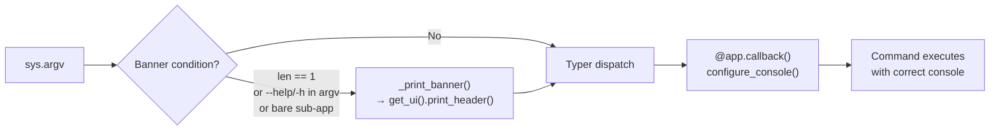

<!-- SPDX-FileCopyrightText: 2026 PythonWoods <dev@pythonwoods.dev> -->
<!-- SPDX-License-Identifier: Apache-2.0 -->

# Architecture

This page describes the internal design of Zenzic for contributors and advanced users who need to understand how the tool works under the hood. For configuration and usage, see the [Configuration Reference](../reference/configuration-reference) and [Checks Reference](../reference/checks).

## Integrity Beyond Code {#integrity-beyond-code}

Zenzic extends static-analysis determinism to its build infrastructure.

The same engineering rule applies at repository level: if execution context is
not deterministic, analysis results are not trustworthy. For this reason,
CI/CD controls are treated as part of the architecture contract, not as
operational afterthoughts.

| Control | Architectural role |
| :--- | :--- |
| SHA-pinned GitHub Actions | Prevents mutable tag drift and locks workflow behavior to reviewed commits |
| Frozen lockfile sync (`uv.lock`) | Ensures deterministic dependency graph during CI and release builds |
| Build provenance attestations | Provides verifiable origin metadata for distributed artifacts |
| Dependabot for actions | Automates SHA refresh while preserving immutable pinning model |

This is the infrastructure-layer equivalent of static analysis: constrain
execution inputs, preserve reproducibility, and make security evidence
auditable for contributors and downstream users.

---

## Three-Phase Pipeline {#three-phase-pipeline}

The core analysis engine operates as a **Three-Phase Pipeline** over the documentation file set. Each phase has a distinct responsibility and runs in deterministic order.

<div className="zz-figure">
  <!-- [Image: light/dark themed diagram] -->
</div>

### Pass 1 -- Harvest and Credential Scan {#pass-1}

Pass 1 reads every `.md` and `.md` file under `docs/` and performs three coordinated operations:

| Stream | What it reads | Purpose |
| :--- | :--- | :--- |
| **Credential scanner stream** | Every line including frontmatter and fenced code blocks | Detect leaked credentials |
| **Content stream** | Lines outside fenced blocks (frontmatter skipped) | Harvest reference definitions, detect images |
| **Reference URL secret scan** | URLs harvested from reference definitions | Re-scan normalized URLs for embedded credentials |

The credential scanner stream uses raw `enumerate()` -- no line is ever invisible to the credential scanner. The content stream uses a fenced-block-aware state machine that skips lines inside ` ``` ` or `~~~` fences, preventing false-positive reference definitions from code examples.

During Pass 1, the `ReferenceScanner` populates a `ReferenceMap` per file.

Harvest events include:

| Event | Data | Meaning |
| :--- | :--- | :--- |
| `DEF` | `(norm_id, url)` | Reference definition accepted |
| `DUPLICATE_DEF` | `(norm_id, url)` | Duplicate ID (first wins per CommonMark 4.7) |
| `IMG` | `(alt_text, url)` | Image with alt text found |
| `MISSING_ALT` | `url` | Image without alt text |
| `SECRET` | `SecurityFinding` | Credential detected by credential scanner |

If any `SECRET` event is yielded, the file is flagged as compromised and excluded from insecure output paths, while Pass 2 analysis still executes for structural consistency.

### Pass 2 -- Cross-Check and Link Validation {#pass-2}

Pass 2 resolves reference-style links (`[text][id]`) against the populated `ReferenceMap`. This pass re-reads the content stream to find all reference link usages and shortcut references. Each usage is resolved against the definitions collected in Pass 1. Undefined IDs produce `DANGLING_REF` findings.

### Pass 3 -- Integrity Report {#pass-3}

Pass 3 computes the per-file integrity score and consolidates all findings:

The report includes:

- **Dangling references** (errors) from Pass 2
- **Dead definitions** (warnings) -- defined but never referenced
- **Duplicate definitions** (warnings) -- same ID defined twice
- **Security findings** from Pass 1
- **Rule findings** from the Adaptive Rule Engine (if configured)

### Link Validation Pipeline {#link-validation}

The link validator (`validate_links_async`) operates independently with its own multi-pass structure:

**Pass 1** -- Read all `.md`/`.md` files into memory, extract inline links and reference links, compute heading anchor slugs per file. Construct the `InMemoryPathResolver` once from the complete file map.

**Pass 1.5** -- Build the link adjacency graph and run iterative DFS cycle detection. The cycle registry is a `frozenset[str]` -- O(1) membership checks in Pass 2. Total complexity: Theta(V+E).

**Pass 2** -- Validate each link against the resolver, VSM, and cycle registry. Internal links are resolved entirely in memory (no disk I/O). External links are collected for Pass 3.

**Pass 3** (strict mode only) -- Concurrent HTTP HEAD validation of external URLs via `httpx`. Up to 20 simultaneous connections. Each unique URL is pinged exactly once regardless of how many files reference it.

---

## Credential Scanner

The Zenzic credential scanner is a credential detection engine integrated into Pass 1. It operates as middleware: every line passes through the credential scanner before any other parser sees it.

<div className="zz-figure zz-figure--centered">
  <!-- [Image: light/dark themed diagram] -->
</div>

### Pre-scan Normalizer {#normalizer}

The normalizer applies multiple normalization passes before regex matching to detect obfuscated credentials — covering Unicode format characters, HTML character references, comment interleaving, backtick spans, concat operators, and table pipes. Both the raw and normalized forms are scanned; if the same secret type is detected in both forms, only one finding is emitted.

### IO Middleware: `safe_read_line` {#safe-read-line}

For metadata extraction (frontmatter parsing for slugs, tags, draft status), every line passes through `safe_read_line()`. If a secret is detected, a `CredentialViolation` exception is raised immediately -- the line is never returned to the caller, preventing the secret from entering any parser.

---

## Enterprise-Grade Security Foundations {#enterprise-security}

This section documents the security hardening features. These properties are verified by the test suite and enforced by the `_validate_docs_root` guard and the `safe_read_line` I/O fence.

### F2-1 — Anti-ReDoS Line Truncation {#f2-1-antiredos}

The credential scanner applies a hard **1 MiB per-line limit** before any regex engine to prevent ReDoS vulnerabilities (F2-1 hardening). Lines exceeding this limit are silently truncated — a credential that begins within the first 1 MiB will still be detected; only content beyond the cap is invisible to the scanner.

### F4-1 — Anti-Jailbreak Path Validation {#f4-1-antijailbreak}

The `_validate_docs_root()` function in `cli/_shared.py` elevates the **path traversal guard** (Exit Code 3) from a link-time check to a **pre-scan filesystem barrier**.

**Threat model:** A malicious or misconfigured `.zenzic.toml` containing `docs_dir = "../../etc"` would cause Zenzic to scan OS system directories, potentially leaking sensitive file contents through credential detection findings or exposing the directory structure in error messages.

**Mitigation:** `resolve()` expands all symlinks and `..` components before the comparison, so `docs_dir = "repo/../../../etc"` is caught unconditionally. The check runs before any I/O phase and cannot be bypassed by CLI flags.

**Exit Code 3 is never suppressed** by `--exit-zero` or `exit_zero = true`. If a jailbreak attempt is detected, the process terminates immediately after printing the path traversal guard diagnostic.

| Scenario | `docs_dir` value | Outcome |
| :--- | :--- | :--- |
| Normal project | `"docs"` | Resolves inside repo root → allowed |
| Repo root as docs | `"."` | Resolves to repo root → allowed |
| Parent escape | `"../../etc"` | Resolves outside repo root → **Exit 3** |
| Symlink escape | `"docs-link"` (symlink to `/tmp`) | `resolve()` expands → **Exit 3** |

---

## Adapter Protocol {#adapter-protocol}

Zenzic is engine-agnostic. It works with MkDocs, Zensical, or no documentation engine at all. This is achieved through the **Adapter Protocol** — an Abstract Base Class (`ABC`) that defines the contract between the core pipeline and engine-specific path resolution.

### `BaseAdapter` {#base-adapter}

Every adapter must extend `BaseAdapter`. Key methods:

| Method | Description |
| :--- | :--- |
| `has_engine_config()` | Guard: returns `True` when the adapter found an engine configuration file. When `False`, nav-dependent checks are skipped. |
| `get_route_info()` | Metadata-Driven Routing API. Returns all routing metadata in a single call: canonical URL, route status, optional slug, route base path, and proxy flag. |
| `get_nav_paths()` | Returns the set of `.md` paths declared in the site navigation. |
| `get_ignored_patterns()` | fnmatch patterns the adapter treats as ignored (e.g. `README.md` for some engines). |
| `is_locale_dir(name)` | Determines whether a directory is a locale tree. |
| `resolve_asset(path, docs_root)` | Resolves an asset with i18n fallback. |
| `resolve_anchor(file, anchor, cache, docs_root)` | Resolves an anchor with i18n fallback. |
| `provides_index(directory_path)` | **Discovery-phase I/O hook.** Returns `True` when the engine will generate a landing page for this directory. The only protocol method that may perform disk I/O (`Path.exists()`). |

### `RouteMetadata` {#route-metadata}

The unified routing metadata returned by `get_route_info()`:

```python
@dataclass(slots=True)
class RouteMetadata:
    canonical_url: str        # URL path the engine serves (e.g. "/guide/install/")
    status: RouteStatus       # REACHABLE, ORPHAN_BUT_EXISTING, IGNORED, CONFLICT
    slug: str | None = None   # Frontmatter slug override
    route_base_path: str = "/" # URL prefix from docs plugin preset
    is_proxy: bool = False    # True for build-generated routes with no source file
    version: str | None = None # Optional version label (for future versioning support)
```

---

## Virtual Site Map (VSM) {#vsm}

The Virtual Site Map is Zenzic's **single source of truth for routing**. It is a pure-data structure (a mapping of `canonical_url` string to `Route` objects) constructed by the `VSMBuilder` by combining adapter knowledge with filesystem discovery.

<div className="zz-figure">
  <!-- [Image: light/dark themed diagram] -->
</div>

### Versioning & Multi-Doc Support {#vsm-versioning}

Zenzic, the VSM is **version-aware**. For adapters that support multi-version documentation, the VSM builder:

1. **Identifies version boundaries** via the adapter's extended root discovery.
2. **Tags routes** with their respective version label in `RouteMetadata`.
3. **Resolves cross-links** within the same version context first, preventing version-skew in link validation.

Versioned routes are often treated as **Ghost Routes** — they are marked `REACHABLE` even if they do not appear in the primary navigation file, as the build engine is assumed to manage version-specific sidebars automatically.

### Offline Mode & Flat URL Resolution {#vsm-offline}

The `--offline` flag triggers a global architectural shift in how the VSM resolves URLs. When active:

1. **`offline_mode`** is set to `True` in the `BuildContext`.
2. **Adapters force `use_directory_urls = False`**, overriding any engine-specific configuration. Adapters switch to **flat URL resolution** (e.g., `guide/install.md` → `/guide/install.html`) instead of directory-style slugs.

This ensures that Zenzic remains a **Structural Custodian** for documentation distributed on filesystems where directory-index resolution (e.g., `/page/` → `/page/index.html`) is unavailable.

### Built-in Adapters {#built-in-adapters}

| Adapter | Engine | Config file | Features |
| :--- | :--- | :--- | :--- |
| `MkDocsAdapter` | `mkdocs` | `mkdocs.yml` | Full nav resolution, i18n folder/suffix mode, locale fallback |
| `ZensicalAdapter` | `zensical` | `zensical.toml` | Native TOML-based config, reads `mkdocs.yml` natively |
| `StandaloneAdapter` | `standalone` | (none) | Engine-agnostic adapter for plain Markdown projects; orphan check skipped |

### Protocol Sovereignty {#protocol-sovereignty}

**Rule R21 (D080):** the Core (`validator.py`, `scanner.py`) must never hardcode engine
names as conditions for validation logic. Engine-specific behaviour is declared in the
adapter and queried by the Core via protocol methods.

The canonical pattern is `get_link_scheme_bypasses() -> frozenset[str]`. If an engine
uses a non-standard URI scheme for internal links, its adapter returns that scheme name
and the validator exempts matching URLs from the Z105 absolute-path check:

| Adapter | `get_link_scheme_bypasses()` | Reason |
| :--- | :--- | :--- |
| `MkDocsAdapter` | `frozenset()` | No engine-specific bypass required |
| `ZensicalAdapter` | `frozenset()` | No engine-specific bypass required |
| `StandaloneAdapter` | `frozenset()` | No engine-specific bypass required |

**Architectural invariant:** adding a new engine adapter that needs a link-scheme bypass
requires zero changes to `validator.py`. Implement `get_link_scheme_bypasses()` in the
adapter alone — the Core queries it at runtime.

### Cross-Engine Validation Parity {#cross-engine-parity}

Zenzic's Core is a pure algorithm — it has no knowledge of which engine produced the
docs it is inspecting. The four primary check categories fire identically for the same
content regardless of the active adapter:

| Category | Rule | Engine dependency |
| :--- | :--- | :--- |
| Secret detection | Z201 | None — raw frontmatter scan |
| Absolute path links | Z105 | Adapter-declared bypass schemes only |
| Short content | Z502 | None — word count after frontmatter strip |
| Missing directory index | Z401 | `adapter.provides_index()` — uniform across engines |

The `examples/matrix/` directory in this repository contains the living proof: identical
adversarial-validation vectors produce identical findings across `standalone`, `mkdocs`, and
`zensical` engines. The integrity-baseline fixtures produce an identical Zenzic Audit Badge on all
three. Zero asymmetries.

### Link Resolution and Slug Mapping {#link-resolution}

Adapters that support frontmatter `slug` overrides map slugs into the Virtual Site Map for **reachability** validation: a page with `slug: /quick-start` at URL `/docs/quick-start` is correctly marked `REACHABLE` even though its file path is `docs/guides/getting-started.md`.

However, Zenzic's **link integrity** validation (broken links, absolute paths) resolves relative paths from the *filesystem* location, not the slug URL. This means a heavy divergence between slug and file path can cause a page's relative links to resolve differently in Zenzic (file-based) vs the build engine (URL-based).

**Architectural invariant:** keep the filesystem hierarchy aligned with the intended URL hierarchy. If a file is moved to a new directory, let the URL follow naturally rather than using `slug` to pin the old URL. This ensures `../` links resolve identically in both the integrity engine and the static-site generator.

### Alias Mapping in `InMemoryPathResolver` {#alias-mapping}

The `InMemoryPathResolver` is not a simple file-lookup table. It implements an **Alias Mapping** layer that translates virtual path prefixes into physical filesystem paths before any link validation takes place.

The resolver is initialised once during Pass 1 with a complete in-memory file map. At initialisation it also registers all known alias prefixes for the active adapter. Supported aliases:

| Alias prefix | Resolves to | Engine |
| :--- | :--- | :--- |

**Key property:** alias resolution happens entirely in memory. No disk I/O is performed; the resolver consults only the file index built during Pass 1. This preserves the Zero-I/O hot-path invariant (Core Law 1).

### Engine Factory {#engine-factory}

Third-party adapters register via `pyproject.toml` — see the [Adapter implementation guide](../developers/how-to/implement-adapter.md).

### `has_engine_config` Guard {#has-engine-config-guard}

When an adapter is instantiated but finds no engine config file (e.g. `MkDocsAdapter` with no `mkdocs.yml`), the factory falls back to `StandaloneAdapter`. This ensures nav-dependent checks are skipped cleanly rather than producing false positives.

---

## Layered Exclusion Manager Internals {#exclusion-manager-internals}

The `LayeredExclusionManager` is constructed once per CLI invocation and passed through the entire pipeline. It encapsulates all four exclusion levels in pre-compiled form.

### Construction {#exclusion-construction}

The manager is constructed once per CLI invocation and encapsulates all four exclusion levels. If `respect_vcs_ignore` is `true`, `.gitignore` files are parsed at construction time and merged into a single unified `VCSIgnoreParser`.

### VCS Ignore Parser {#vcs-parser}

The `VCSIgnoreParser` implements the full gitignore specification, including negation (`!`), path anchoring, and glob wildcards.

### `should_exclude_dir` {#should-exclude-dir}

Called by `walk_files()` for each directory during `os.walk()`. Returns `True` to prune the directory from the walk -- the directory and all its descendants are never entered.

### `should_exclude_file` {#should-exclude-file}

Performs full 5-layer evaluation including path-component checks against all exclusion layers.

---

## Sovereign Root Protocol {#sovereign-root}

Every CLI command that interacts with the filesystem accepts an optional `PATH` argument.
When provided, Zenzic applies the **Sovereign Root Protocol**: configuration and scanning
follow the target, not the caller's current working directory.

### The Problem: Context Hijacking

Without this protocol, running `zenzic check links ../other-project` from inside `project-A`
would load `project-A`'s `.zenzic.toml`, use `project-A`'s engine adapter, and apply
`project-A`'s exclusion rules — to `other-project`'s documentation. This is **Context
Hijacking**: the caller's environment silently overrides the target's.

### The Solution: Three-Step Sovereignty

The protocol resolves config and scope from the target path (not from `cwd`): it finds the target's `.zenzic.toml`, calibrates `docs_root` to the target directory or file, and applies the Sandbox Guard to anchor the path traversal check at the target — not the caller's location.

### `init` Special Case

`zenzic init <path>` is a special case: it **creates** a project rather than auditing one.
The given path becomes the `repo_root` directly, and the directory is created
(`mkdir -p`) if it does not exist. Engine auto-detection runs on the (possibly empty)
target directory. The caller's CWD is never written to.

The path resolution contract means the caller's CWD is always clean — no side effects on the invoking directory.

### Invariants

| Invariant | Guarantee |
| :--- | :--- |
| Config isolation | Target's `.zenzic.toml` is loaded; caller's config is never consulted |
| Sandbox guard | Path traversal guard scan scope is anchored at `docs_root`, not `cwd` |
| No CWD mutation | `init` writes to the target; caller's working directory is untouched |
| Hint display | Banner shows the resolved target path for operator confidence |

---

## Exit Codes {#exit-codes}

Zenzic uses a structured exit code contract:

| Code | Name | Meaning | Suppressed by `--exit-zero`? |
| :---: | :--- | :--- | :---: |
| **0** | Clean | No issues found, or `--exit-zero` active | N/A |
| **1** | Findings | Documentation quality issues detected | Yes |
| **2** | Credential Scanner | Leaked credential detected by Zenzic credential scanner | **No** |
| **3** | Path Traversal Guard | Path traversal to OS system directory detected | **No** |

### Exit Code 0 -- Clean

All checks passed. No errors, no warnings (or `--exit-zero` is active and only non-security findings were found).

### Exit Code 1 -- Findings

Documentation quality issues were detected: broken links, orphan pages, invalid snippets, placeholder pages, unused assets, dangling references, or dead definitions (in strict mode).

Can be suppressed by `exit_zero = true` in config or `--exit-zero` on the CLI.

### Exit Code 2 -- Credential Scanner

A leaked credential was detected by the Zenzic credential scanner. This exit code is **never** suppressed by `--exit-zero` or `exit_zero = true`. The credential must be rotated immediately.

### Exit Code 3 -- Path Traversal Guard {#exit-code-3}

A documentation link resolves to an OS system path (`/etc/`, `/root/`, `/var/`, `/proc/`, `/sys/`, `/usr/`). This is classified as `PATH_TRAVERSAL_SUSPICIOUS` -- a security incident that indicates a potential template injection, compromised toolchain, or infrastructure disclosure.

Exit code 3 has the **highest priority**. If both credential scanner and path traversal guard findings exist in the same run, exit code 3 wins.

The path traversal guard also fires when `docs_dir` itself resolves outside the repository root (F4-1 jailbreak protection).

---

## DFA Guarantee — The RE2 Engine {#dfa-guarantee}

Zenzic uses exclusively a **DFA (Deterministic Finite Automaton)** engine for all
user-supplied regex patterns. This is a hard architectural constraint, not a configuration
option.

### What this means

Every pattern declared in `[[custom_rules]]` inside `.zenzic.toml` is compiled at load time
by the [RE2 library](https://github.com/google/re2) (via `google-re2`). RE2 implements a
true DFA: it processes the input string in a single left-to-right pass, with no backtracking.

This guarantees that every regex validation runs in time linear in the length of the input:

$$O(n)$$

where $n$ is the length of the line being scanned. The time complexity is bounded regardless
of the pattern structure. ReDoS (Regular Expression Denial of Service) is **mathematically
impossible** under this engine.

### What RE2 rejects

RE2 rejects patterns that require NFA backtracking. If a `[[custom_rules]]` pattern uses any
of these constructs, Zenzic raises a `PluginContractError` at startup — before any file is
scanned:

| Construct | Example | Reason |
| :--- | :--- | :--- |
| Backreferences | `(\w+)\1` | Requires memory of a previous capture — non-regular |
| Positive lookahead | `foo(?=bar)` | Requires speculative forward scanning |
| Negative lookahead | `foo(?!bar)` | Requires speculative forward scanning |
| Lookbehind | `(?<=foo)bar` | Requires backward scanning |

### What RE2 accepts

RE2 is a superset of standard POSIX ERE syntax. Patterns like these compile and run correctly:

| Feature | Example |
| :--- | :--- |
| Literal text | `internal\.corp\.example\.com` |
| Alternation | `TEST\|DEMO\|EXAMPLE` |
| Repetition | `[0-9]{3}-[0-9]{4}` |
| Inline flags | `(?i)\bTEST\b` (case-insensitive), `(?m)^example` (multiline) |
| Named groups | `(?P<code>Z\d{3})` |
| Classic "dangerous" quantifiers | `(a+)+` — safe under RE2, runs in O(n) |

### The DFA Purity Contract

Every `[[custom_rules]]` pattern is compiled with RE2 at load time. A pattern either compiles — and is therefore $O(n)$ safe — or it does not, and the startup fails with an actionable `PluginContractError` message. There is no runtime canary, no SIGALRM timer, and no platform-specific divergence.

---

## Algorithmic Complexity {#algorithmic-complexity}

Zenzic's architecture separates computational intents by applying well-defined algorithmic bounds to each domain:

- **Topology (Knowledge Graph)**: Link validation runs an iterative DFS on the Virtual Site Map adjacency graph. Using an adjacency-list representation, traversal complexity is $\Theta(V+E)$, where $V$ represents pages/assets and $E$ represents links. Cycle registries are stored as hash sets, providing average $O(1)$ lookups during subsequent validation passes.

- **Semantic Scanning**: Credential scanning and custom rules use the `google-re2` linear-time regex engine instead of Python's standard `re` module. This ensures $O(N)$ evaluation without catastrophic backtracking, eliminating ReDoS vulnerabilities based on exponential backtracking behavior.

- **I/O Discovery**: File ingestion operates in $O(N)$ complexity relative to the total volume of processed data. Wall-time can be reduced through parallel process pools when processing large file sets, without changing the underlying computational complexity.

---

## Hybrid Adaptive Engine {#adaptive-engine}

The scan engine automatically selects sequential or parallel execution based on the number of files:

| Condition | Mode | Behaviour |
| :--- | :--- | :--- |
| `workers = 1` (default) or file count < 50 | Sequential | Zero process-spawn overhead. Full O(N) I/O. |
| `workers != 1` and file count >= 50 | Parallel | `ProcessPoolExecutor` with per-file distribution |

The threshold (50 files) is a conservative heuristic: below it, process-spawn overhead exceeds the parallelism benefit. Results are always sorted by `file_path` regardless of execution mode.

---

## Sovereign CLI — No Integrations Layer {#sovereign-cli}

Zenzic operates as a standalone CLI with adapter-driven external analysis.
Build engines are never extended at runtime by Zenzic components.

**Why:** An embedded engine hook couples Zenzic's release cycle to an external build tool API.
It also prevents a single, uniform enforcement surface across engines. The CLI pipeline provides full
credential scanner and path traversal hardening for every adapter. A Sovereign CLI decouples quality
gating from build tooling and makes every enforcement point engine-agnostic.

Run Zenzic in CI as an external quality gate via `zenzic check all --strict` in a workflow step. This produces identical enforcement with the full VSM, credential scanner (ZRT-006/007), and path traversal guard active — without any runtime integration inside the build engine.

> See [CI/CD Integration](../how-to/configure-ci-cd.md) for workflow examples.

### Extension Pattern {#extension-pattern}

External tools that need to invoke Zenzic checks programmatically can use the public Python API directly (`zenzic.core.scanner`, `zenzic.models.config`). All intelligence lives in `zenzic.core`. The CLI is a thin dispatch layer over the same functions — there is no hidden logic that requires the subprocess path.

---

## CLI Layer {#cli-layer}

The CLI is structured as a **package** (`src/zenzic/cli/`), not a monolithic module. This separation enforces single-responsibility at the module level and makes the visual output pipeline auditable as a first-class concern.

### Package layout {#cli-package-layout}

```text

src/zenzic/cli/
├── __init__.py       # Public re-export surface for main.py — no logic
├── _shared.py        # Visual State Guardian: console singleton, _ui singleton, utilities
├── _check.py         # check_app sub-app + 7 check commands
├── _clean.py         # clean_app sub-app + clean assets
├── _config_explain.py # explain command + config introspection surface
├── _governance.py    # config_app sub-app + governance profile commands
├── _guard.py         # guard_app sub-app + secret-guard scan/init commands
├── _inspect.py       # inspect_app sub-app + capabilities command
├── _lab.py           # lab command — interactive example showcase
├── _metadata.py      # SSOT for top-level command metadata and help panels
└── _standalone.py    # score, diff, init commands

```

### UI State Manager {#ui-state-manager}

`_shared.py` is the **sole owner of all console and UI state**. It exposes two dynamic getters:

| Getter | Returns |
| :--- | :--- |
| `get_console()` | The current `rich.console.Console` singleton |
| `get_ui()` | The current `ZenzicUI` singleton (wraps the console) |

`configure_console()` — called by the `--no-color` / `--force-color` Typer callback in `main.py` — **replaces** both singletons atomically. Because every command calls `get_ui()` / `get_console()` at invocation time rather than import time, they always receive the instance that reflects the user's color flags.

**Invariant:** `force_terminal` on the module-level `Console` is always `None` (auto-detect via `sys.stdout.isatty()`). Passing `force_terminal=False` silently disables color even in interactive terminals — this is a latent bug pattern the architecture explicitly guards against.

### Startup banner flow {#cli-banner-flow}



The banner always writes to **stdout** (the shared `_shared.console`) so it uses the same color-detection stream as the subsequent command output. The Typer callback runs *after* the banner, which is acceptable — the module-level console already uses `force_terminal=None` (auto-detect) at startup.

`_SUBAPPS_WITH_MENU` in `cli_main()` covers sub-apps that use `no_args_is_help=True`: invoking `zenzic check`, `zenzic clean`, or `zenzic inspect` with no further arguments shows the Typer help page; the banner is prepended by the explicit bare-invocation check.

### Extension points {#cli-extension-points}

| Goal | Action |
| :--- | :--- |
| Add a command to an existing sub-app | Add `@check_app.command()` (or other app) in the relevant `_*.py` — no changes to `__init__.py` or `main.py` |
| Add a new top-level sub-app | Create `_myfeature.py`, export from `__init__.py`, register in `main.py`, add to `_SUBAPPS_WITH_MENU` if `no_args_is_help=True` |
| Add a shared utility | Add to `_shared.py` and import via `from . import _shared` — never instantiate `Console` or `ZenzicUI` locally |

### Visual identity — `zenzic.core.ui` {#core-ui}

`ZenzicPalette`, `ZenzicUI`, `make_banner`, `emoji`, and `SUPPORTS_COLOR` live in
`src/zenzic/core/ui.py`. The core layer owns the visual identity so `ZenzicReporter` (which
is also in `core/`) can import them without looking upward. The CLI layer imports from
`zenzic.core.ui` directly. The compatibility layer at `src/zenzic/ui.py` re-exports everything
for any third-party code that was already importing from the old path.

---

## zenzic-doc — Living Test Bench {#living-test-bench}

The Zenzic documentation site (`zenzic-doc`) is not a passive artifact — it is an active
participant in the quality pipeline. Every commit runs `zenzic check all --strict` against
itself before it can be pushed (Sovereign Parity, ZRT-010).

Beyond the standard Zenzic audit, `zenzic-doc` enforces a second invariant unique to its
role as documentation for an integrity engine: every Zxxx finding code present in `docs/` must have a
registered entry in `src/zenzic/core/codes.py` in the Core package — and vice versa. This
bidirectional parity is enforced by the `verify-codes-parity` Nox session via
**Sovereign Resolution (Fail-Closed)**:

- **Author environment**: `ZENZIC_CORE_PATH` set → `uv run --project <path>` against local source.
- **Core path not found**: the session fails closed; PyPI fallback is prohibited.

Running `just verify` in `zenzic-doc` executes the full lifecycle-gate flow with one entry-point. Contributors must provide
a local checkout path for Zenzic Core (`ZENZIC_CORE_PATH`, `./_zenzic_core`, or `../zenzic`).

---

## The 4-Lifecycle-Gates Standard {#4-gates-standard}

Every repository in the Zenzic ecosystem enforces quality at four progressive checkpoints:

| Gate | Trigger | Tool | What it catches |
| :--- | :--- | :--- | :--- |
| **Gate 1 — IDE** | Real-time, on save | Editor extensions (Pylance, ESLint) | Type errors, syntax issues |
| **Gate 2 — Pre-commit** | `git commit` | `pre-commit` hooks | Lint, credentials, formatting, REUSE |
| **Gate 3 — Pre-push** | `git push` | `just verify` (via `pre-commit -t pre-push`) | Full validation suite identical to CI |
| **Gate 4 — Remote CI** | Pull Request / push | GitHub Actions | Identical `just verify` on a clean Ubuntu runner |

Gates 3 and 4 execute the **same command** (`just verify`) — local and remote are never
allowed to drift. This is the Sovereign Parity principle (ZRT-010).

> For operational setup (installing hooks, workflow YAML), see the
> [CI/CD Integration guide](../how-to/configure-ci-cd#doc-code-parity).

---

## Choosing the Right Model {#choosing}

| Scenario | Recommended approach |
| :--- | :--- |
| CI pipeline for any engine | `zenzic check all` — add a step, no plugin needed |
| Pre-commit credential gate | `zenzic check references` — registers as a pre-commit hook |
| Custom engine not yet supported | **Write an Adapter** — ship as a separate package, register via `zenzic.adapters` entry-point |
| Migrate from MkDocs to Zensical | Use `zenzic check all` with `engine = "mkdocs"` on the source, `engine = "zensical"` on the target |

> See [CI/CD Integration](../how-to/configure-ci-cd.md) for step-by-step workflows corresponding to each scenario.

---

## Brand Integrity {#brand-integrity}

The Exclusion Zone model extends beyond structural correctness. A codebase or documentation suite that contains stale brand identifiers carries a different kind of debt: **narrative debt**. A page that still refers to a codename contradicts the contract it is trying to document.

Zenzic addresses this through the [`[governance]`](../reference/configuration-reference.md) configuration block and the [Z601 BRAND_OBSOLESCENCE](../reference/finding-codes.md#z601) finding. Format-aware, per-line suppression is available for intentional historical references using the appropriate comment syntax for the file type (`.md` vs. `.md`).
