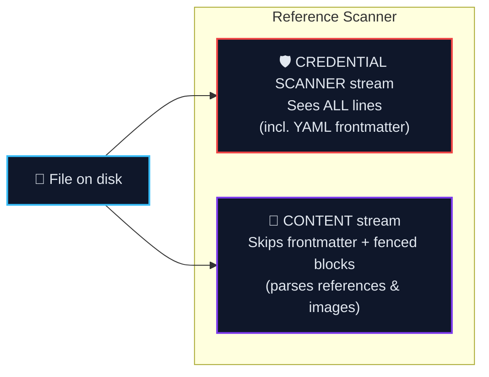

<!-- SPDX-FileCopyrightText: 2026 PythonWoods <dev@pythonwoods.dev> -->
<!-- SPDX-License-Identifier: Apache-2.0 -->

# Core Mechanics

Zenzic's validation engine relies on several fundamental architectures to guarantee deterministic, zero-false-positive results without executing a full site build.

## The Virtual Site Map (VSM) {#vsm}

When Zenzic validates your links, it does not simply check whether a target file exists on disk. Instead, it builds a **Virtual Site Map (VSM)** — a pure in-memory projection of what your build engine will actually serve to readers.

The VSM maps every canonical URL to a **Route** entry:

| Field | Meaning |
| :--- | :--- |
| `url` | The URL a browser would request, e.g. `/guide/install/` |
| `source` | The source file that produces this URL, e.g. `guide/install.md` |
| `status` | Whether the page is reachable, orphaned, ignored, or in conflict |
| `anchors` | Heading anchors pre-computed from the source file |

Each route carries a status that tells Zenzic how to treat links pointing to it:

| Status | Meaning | Link result |
| :--- | :--- | :--- |
| `REACHABLE` | Page is listed in navigation or is a locale route | Valid |
| `ORPHAN_BUT_EXISTING` | File exists on disk but is not in site navigation | Z103 error |
| `IGNORED` | Excluded by configuration (e.g. README files, private directories) | Z101 error |
| `CONFLICT` | Two source files produce the same canonical URL | Z101 error |

**Why this matters:** A file can exist on your filesystem and still be `IGNORED` in the VSM. A URL can be `REACHABLE` in the VSM without having a corresponding file on disk (for example, locale index routes). The VSM is the authority — Zenzic checks reachability, not just file existence.

This design means that `zenzic check links` catches problems that a naive file-existence check would miss: pages removed from navigation, conflicting routes, and orphaned content that readers cannot discover through normal browsing.

## The credential scanner Architecture

The Zenzic credential scanner uses a **dual-stream architecture** to ensure that no part of a file escapes credential scanning.

When the Reference Scanner processes a file, it creates two independent streams:

The two streams have opposite filtering rules by design. The Content stream must skip YAML frontmatter to avoid parsing metadata like `author: Jane Doe` as a broken reference definition. The credential scanner stream must see frontmatter because a key like `aws_key: AKIA...` hiding in YAML metadata is a real secret that must be caught. The streams never share a data source — merging them would create a blind spot.

**Pre-Scan Normalizer and Polyglot Extractor.** Before running detection patterns, the credential scanner normalises each line to defeat obfuscation. Inline code backticks are unwrapped, concatenation operators are removed, and table pipe characters are collapsed. Additionally, the **Polyglot Extractor** deeply parses both Markdown and native HTML (`<a>`, `` tags). This ensures raw HTML links and images undergo the exact same **Uniform Resolver Pipeline (URP)** validations as standard Markdown syntax, closing the "HTML Shadow Zone" and applying strict rules like `Z205 FORBIDDEN_SCHEME` uniformly.

**ReDoS Protection.** Custom regex patterns declared in `[[custom_rules]]` are compiled through RE2 compatibility gates at load time. Unsupported constructs (for example backreferences or lookarounds) are rejected before any scan begins. Separately, the parallel worker watchdog still emits `Z902: RULE_TIMEOUT` if a worker stalls at runtime because of a systemic hang (for example I/O or coordinator starvation) rather than a regex backtracking canary.

## Circular Links as Knowledge Graphs

Documentation is a **Knowledge Graph** — a densely interconnected network where cross-linking between pages is expected and desirable. If a Tutorial links a Reference page for technical details, it is natural and beneficial for that Reference page to link back to the Tutorial as a working example. Circular link patterns are therefore structural data points, not defects.

Cycle detection is computed once with iterative DFS during resolver construction (Pass 1.5, Θ(V+E)). Every Pass 2 membership lookup against the cycle registry is O(1).

**Why the engine computes cycles at all.** The DFS traversal is a mechanical requirement of the Virtual Site Map builder: without identifying cycles, the recursive graph walk would loop infinitely. Detection is necessary to make the resolver terminate — it is not triggered by a quality concern.

## Three-Pass Reference Pipeline

To ensure accurate link validation that supports out-of-order reference definitions, Zenzic executes a strict Three-Pass Pipeline:

| Pass | Name | What happens |
| :---: | :--- | :--- |
| 1 | **Harvest** | Streams every line; records `[id]: url` definitions; runs the credential scanner on every URL and line |
| 2 | **Cross-Check** | Resolves every `[text][id]` usage against the complete `ReferenceMap`; flags unresolvable IDs |
| 3 | **Integrity Report** | Computes per-file integrity score; appends Dead Definition and alt-text warnings |

Pass 2 always runs after Pass 1 harvest completion. Security findings from Pass 1 affect exit semantics (exit code 2) but do not skip Pass 2 cross-check.

## Global Usage Tracker

To enforce configuration hygiene and zero-debt governance, the core execution engine maintains a `GlobalUsageTracker` attached directly to the `ZenzicConfig` model.

When `.zenzic.toml` parses global exclusion configurations (e.g., `directory_policies`, `excluded_file_patterns`), the tracker registers every declared pattern. As the URP processes findings across the filesystem, the tracker marks which patterns were successfully utilized to suppress at least one finding. During the final teardown phase, the engine performs a diff against the tracker; any configuration pattern that remains untouched is flagged via `Z118 (STALE_GLOBAL_SUPPRESSION)`, guaranteeing your config file accurately mirrors the true technical debt of the repository.
