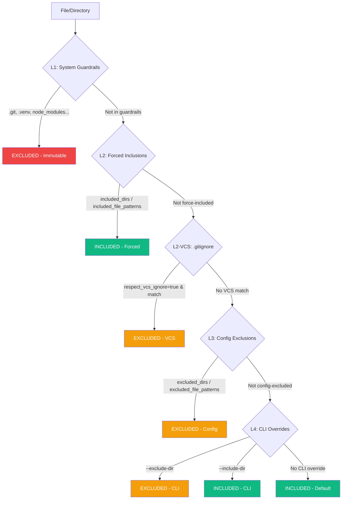

<!-- SPDX-FileCopyrightText: 2026 PythonWoods <dev@pythonwoods.dev> -->
<!-- SPDX-License-Identifier: Apache-2.0 -->

# Discovery & Exclusion

Every Zenzic check -- links, orphans, snippets, placeholders, assets, references -- operates on the same set of files. This guarantee is enforced by a **single entry point** for file discovery and a **4-level exclusion hierarchy** that determines which files and directories are included or excluded from scanning.

---

## The Authority of Root {#root-authority}

Before Zenzic can discover, exclude, or scan a single file, it must answer one question:
**where does this project begin?**

Zenzic is a workspace-scoped tool. It does not analyse arbitrary directories; it analyses
**defined projects**. To establish the project boundary, Zenzic performs an **upward traversal**
from the target path, searching for a recognised root marker.

### Root Markers {#root-markers}

Two markers are authorised (first match wins):

| Marker | Description |
| :--- | :--- |
| `.git/` | Universal VCS marker — present in any Git-tracked repository |
| `.zenzic.toml` | Zenzic's own configuration file — the explicit governance contract |

Both are intentionally engine-neutral: `mkdocs.yml`, `zensical.toml`, and similar
build-engine files are not root markers. The Core must remain independent of any specific
documentation framework.

### Why a Root Marker is Mandatory {#why-mandatory}

Without a root marker (VCS or configuration), Zenzic cannot establish the project's **Sovereignty Perimeter**. This is required for four independent reasons:

- **Resolve relative paths** — every finding is expressed as a path relative to the root. Without a fixed anchor, file locations are ambiguous and non-reproducible across machines.
- **Map the workspace into the VSM** — Zenzic always builds a Virtual Site Map, regardless of adapter. In engine mode (MkDocs, Zensical), the VSM includes ghost routes, slug transformations, and virtual pages. In Standalone Mode, the VSM is a 1:1 projection of the filesystem. In both cases, the root defines the zero-point for canonicalising every internal reference — so that `index.md` at the root is unambiguously distinct from `index.md` in a subdirectory.
- **Apply `directory_policies`** — governance contracts match paths via glob patterns relative to the workspace root. Without a defined root, exemption rules are non-deterministic and cannot be applied consistently.
- **Prevent Massive Indexing** — without an explicit boundary, the engine could accidentally scan the entire host filesystem, producing incoherent results and risking information leakage.

The absence of a root marker produces this error:

```text
ERROR: Could not locate repo root: no .git directory or .zenzic.toml found in any
ancestor of /path/to/target. Run Zenzic from inside the repository.
```

This is not a configuration error. It is a **safety guarantee**: the Quality Gate halts
an out-of-bounds scan before it begins.

### Resolution Options {#root-resolution}

Zenzic resolves the repository root by walking up from the current working directory until it finds a root marker (`.zenzic.toml` or `.git/`). Three conditions satisfy this requirement:

- **Zenzic project:** a `.zenzic.toml` file in the target directory root (created by `zenzic init`).
- **Git repository:** a `.git/` directory anywhere in the ancestor tree.
- **Nested invocation:** running from inside an existing project that already contains either marker.

If none of these conditions are met, Zenzic rejects the invocation with an explicit error.

> See [Getting Started](../how-to/install.md) for the `zenzic init` setup workflow.

---

## Single Entry Point: `iter_markdown_sources` {#iter-markdown-sources}

All modules that need to iterate over documentation source files must call `iter_markdown_sources`. Direct calls to `Path.rglob()`, `os.walk()`, or `Path.iterdir()` from scanner, validator, or credential scanner are prohibited by design. This function:

1. Walks the `docs_root` directory using `os.walk()` with **in-place directory pruning** (excluded subtrees are never entered).
2. Yields only `.md` and `.md` files, in deterministic sorted order.
3. Skips symbolic links.
4. Delegates all exclusion decisions to the `LayeredExclusionManager`.

The benefit is architectural: when a directory is excluded, it is excluded everywhere -- scanner, validator, credential scanner, and orphan-checker all see the exact same file set. There is no risk of one module "forgetting" to apply an exclusion rule.

The function takes three arguments:

1. `docs_root` -- absolute path to the documentation root.
2. `config` -- loaded Zenzic configuration (provides `excluded_dirs`).
3. `exclusion_manager` -- the `LayeredExclusionManager` used for the full 4-level evaluation.

---

## Layered Exclusion Hierarchy {#layered-exclusion}

Zenzic uses a 4-level exclusion model. Each level has a distinct role and a defined precedence. The hierarchy is evaluated top-to-bottom; the **first matching rule wins**.

### The Four Levels {#four-levels}



| Level | Name | Source | Mutable? |
| :---: | :--- | :--- | :---: |
| **L1** | System Guardrails | Hardcoded in `SYSTEM_EXCLUDED_DIRS` | No |
| **L2** | Forced Inclusions + VCS | `included_dirs`, `included_file_patterns`, `.gitignore` | Yes (config) |
| **L3** | Config Exclusions | `excluded_dirs`, `excluded_file_patterns` in `.zenzic.toml` or `[tool.zenzic]` in `pyproject.toml` | Yes (config) |
| **L4** | CLI Overrides | `--exclude-dir`, `--include-dir` flags | Yes (per-run) |

### L1 -- System Guardrails {#l1-system-guardrails}

System Guardrails are **immutable**. They are always excluded regardless of any configuration, CLI flag, or forced inclusion. They protect Zenzic from scanning directories that should never contain documentation source files:

```text
.git          .github       .venv         node_modules
.nox          .tox          .pytest_cache .mypy_cache
.ruff_cache   __pycache__   .cache
.hypothesis   .temp
```

System Guardrails cannot be removed or overridden. They are merged into `excluded_dirs` unconditionally during config initialization. Even `included_dirs` cannot override them -- this is the sole exception to the forced-inclusion rule.

### L2 — Forced Inclusions + VCS {#l2-forced-inclusions-vcs}

Forced inclusions take precedence over all exclusion layers except L1. They serve two purposes:

**Config-level forced inclusions** (`included_dirs`, `included_file_patterns`) re-include files or directories that would otherwise be excluded by VCS patterns or config exclusions. A typical use case is build-generated API documentation listed in `.gitignore` but requiring linting.

**VCS exclusion** (`.gitignore` patterns) is activated by setting `respect_vcs_ignore = true`. When active, Zenzic reads `.gitignore` files from both the repository root and the docs directory. Files matching VCS ignore patterns are excluded — but forced inclusions override VCS exclusions.

### L3 — Config Exclusions {#l3-config-exclusions}

Config-level exclusions from `.zenzic.toml` or `pyproject.toml`:

- `excluded_dirs` — directory names inside `docs/` to skip
- `excluded_file_patterns` — filename glob patterns to skip

These are additive to L1 but subordinate to L2 forced inclusions.

### L4 — CLI Overrides {#l4-cli-overrides}

Per-run overrides via `--exclude-dir` and `--include-dir` flags extend or narrow the scan scope for a single invocation without modifying the persistent configuration. CLI `--include-dir` cannot override System Guardrails — attempting to include `.git` or `.venv` via CLI is silently ignored.

> For field-level syntax and examples, see [Configuration Reference](../reference/configuration-reference.md).

---

## `respect_vcs_ignore` — VCS Exclusion Semantics {#respect-vcs-ignore}

`respect_vcs_ignore` controls whether Zenzic applies `.gitignore` patterns as an additional exclusion layer. Its default is `false`, implementing the **Zero-Config surprise principle**: the scan perimeter is exactly the filesystem as visible to the developer, with no implicit hidden exclusions.

When enabled, Zenzic loads `.gitignore` patterns from two locations: the repository root and the docs directory (if a separate `.gitignore` exists there). The VCS ignore parser implements the full gitignore specification, including negation (`!`), path anchoring, and glob wildcards.

Forced inclusions (`included_dirs`, `included_file_patterns`) always override VCS exclusions. This is what makes it safe to enable `respect_vcs_ignore` in projects where build-generated documentation is in `.gitignore` but still requires linting.

---

## Exclusion Zone Philosophy {#privacy-gate}

The Layered Exclusion model implements the **Exclusion Zone** principle: Zenzic creates a protected scanning environment where the file set is deterministic, reproducible, and fully controlled by the project maintainer.

The philosophy has three tenets:

1. **Determinism** -- Given the same config and filesystem state, `iter_markdown_sources` yields the exact same files in the exact same order. No randomness, no race conditions, no environment-dependent behaviour.

2. **Safety by default** -- System Guardrails prevent Zenzic from scanning VCS internals, virtual environments, or build caches. These directories could contain thousands of files irrelevant to documentation quality.

3. **Explicit override** -- Every inclusion and exclusion is traceable to a specific configuration line or CLI flag. There are no hidden heuristics or "smart" detection that could surprise a user.

The Privacy Gate (Exclusion Zone) defines a strict boundary where Zenzic's scanners are intentionally inhibited to protect sensitive metadata or intentional security-testing patterns.

---

## Performance Notes {#performance}

- **Directory pruning** is applied during `os.walk()`, not after. Excluded subtrees (e.g. `node_modules/` with thousands of files) are never entered.
- For non-Markdown files, `walk_files()` uses the same `os.walk()` engine with in-place pruning. Unlike `Path.rglob("*")`, it never enters excluded trees.
- File patterns are **pre-compiled** to `re.Pattern` at `LayeredExclusionManager` construction time using `fnmatch.translate()`.
- VCS patterns with no negation rules use a **combined regex** fast path -- all positive rules are merged into a single compiled regex for O(1) matching per path.
- The `LayeredExclusionManager` is constructed **once** per CLI invocation and passed by reference through the entire pipeline.
- A separate hard-prune set is used by `find_unused_assets` for `excluded_asset_dirs`.

---

## Multi-Root Discovery {#multi-root}

`docs_dir` is the canonical source root, but modern static-site generators routinely manage **content trees that live outside `docs/`**. The textbook case is a `blog/` directory: it is materialised as live URLs at build time, yet a pre-current series Zenzic scan would never see the files inside it. The Virtual Site Map ingested only files under `docs_root`, so broken links inside (or pointing to) blog posts slipped past `zenzic check all` and only surfaced when the build failed downstream. We call this failure mode **VSM Blindness**.

Multi-Root Discovery cures the blindness by letting the active adapter declare additional content roots — each carrying a physical path, a URL prefix, and a diagnostic label. When extra content roots are declared, all pipeline stages treat those files as first-class content alongside the primary `docs/` tree.

### Auto-discovery without `subprocess` {#auto-discovery}

Adapter implementations honour the **Zero Subprocess** invariant. Configuration files (like `zensical.toml` or `mkdocs.yml`) are parsed statically without spawning any subprocess. No engine binary is ever executed — configuration is read as **data**, not executed as code. Pillar 2 (Engine Sovereignty) is preserved.

### Traceability invariant {#traceability}

Every entry in the VSM, including those produced by an extra content root, carries a `Route.source` that resolves back to a real file on disk. A route with no physical origin would be a validator screaming `error` without ever saying `where`.

### Reverse-Mapping Invariant & Virtual Routes {#reverse-mapping}

Multi-Root Discovery (current series) solved **VSM Blindness** for physical files outside
`docs/`. current series extends the guarantee to **engine-generated pages**: engines may render
URLs — tag pages, paginated indexes, author profiles — that have no physical Markdown
counterpart. These routes exist only in the build output, never on disk.

The invariant guarantees that every engine-generated URL traces back to at least one source file. Adapters opt in by implementing the optional `get_virtual_routes()` method; virtual routes participate in collision detection on equal footing with physical routes.

### Engine support matrix {#engine-support}

| Engine          | Implements `get_extra_content_roots` | Status                                                                |
|-----------------|--------------------------------------|------------------------------------------------------------------------|
| MkDocs (Material) | No                                  | Opt-in deferred until `material/blog` plugin becomes available.   |
| Zensical        | No                                   | Architecture is identical -- enabled when an out-of-tree plugin ships. |
| Standalone      | No                                   | No plugins; `docs_root` is the entire content surface.                 |

### `inspect routes` — Site Map Export {#inspect-routes}

The `inspect routes` command exposes the VSM to external consumers as a deterministic JSON structure. Each record carries four fields: `url`, `kind` (`physical` or `virtual`), `source_files` (a sorted array of repo-relative paths that cause the URL to exist), and a `digest` — a SHA-256 fingerprint derived from the URL and its source files.

The `--kind` flag narrows output to `physical`, `virtual`, or `all` (default). JSON is written exclusively to `stdout`; diagnostics go to `stderr`.

This design makes the VSM composable: external tools, CI/CD dashboards, or specialized tooling can consume the site map without running the full scanner.

> CLI syntax: see [CLI Reference — `inspect routes`](../reference/cli.md).
