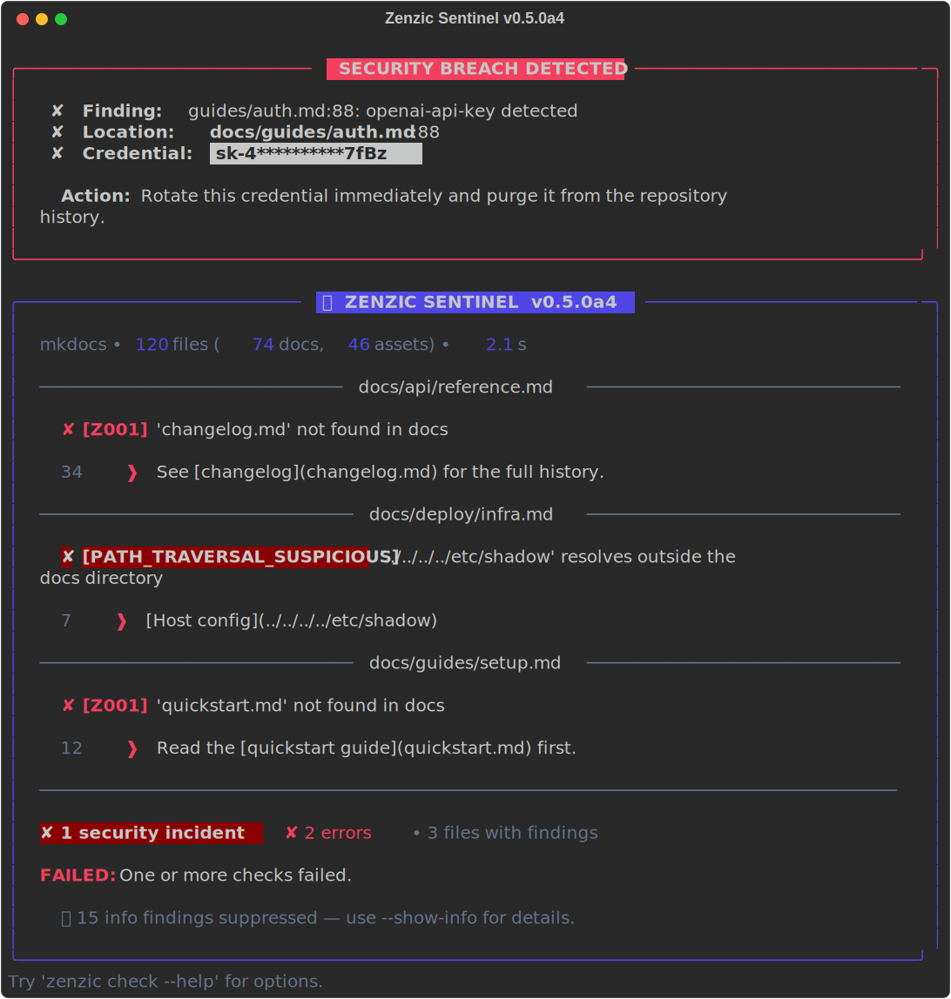

<!-- SPDX-FileCopyrightText: 2026 PythonWoods <dev@pythonwoods.dev> -->
<!-- SPDX-License-Identifier: Apache-2.0 -->
<!-- markdownlint-disable MD041 MD036 -->

<div class="zz-hero" markdown>

{ .zz-hero__logo }
{ .zz-hero__logo }

High-performance documentation linter for any Markdown-based project.
Catch broken links, orphan pages, and leaked credentials — before your users do.
{: .zz-hero__tagline }

[Get started](docs/index.md){ .md-button .md-button--primary }
[View on GitHub](https://github.com/PythonWoods/zenzic){ .md-button }
{: .zz-hero__actions }

</div>

<div class="zz-hero__screenshot-wrap" markdown>

{ .zz-hero__screenshot }

</div>

---

<div class="grid cards zz-features" markdown>

- :lucide-link-2-off: &nbsp; __Broken links__

    ---

    Detects dead internal links, missing anchors, and unreachable external URLs — at source level, before the build runs.

    ```bash
    zenzic check links
    ```

- :lucide-file: &nbsp; __Orphan pages__

    ---

    Finds `.md` files that exist on disk but are absent from the site navigation. Invisible to readers.

    ```bash
    zenzic check orphans
    ```

- :lucide-code: &nbsp; __Invalid snippets__

    ---

    Compiles every fenced Python block with `compile()`. Catches syntax errors before readers copy-paste broken code.

    ```bash
    zenzic check snippets
    ```

- :lucide-pencil: &nbsp; __Placeholder stubs__

    ---

    Flags pages below a word-count threshold or containing patterns like `TODO`, `WIP`, `coming soon`.

    ```bash
    zenzic check placeholders
    ```

- :lucide-image: &nbsp; __Unused assets__

    ---

    Reports images and files that exist in `docs/` but are never referenced by any page.

    ```bash
    zenzic check assets
    ```

- :lucide-shield-check: &nbsp; __Zenzic Shield__

    ---

    Scans every reference URL for leaked credentials — API keys, tokens, AWS access keys. Exits with code `2` immediately.

    ```bash
    zenzic check references
    ```

</div>

---

<div class="zz-score-section" markdown>

## Quality score

`zenzic score` aggregates all six checks into a single __0–100 integer__ weighted by severity. Deterministic — track it in CI, compare across branches, block regressions.

```bash
zenzic score --save
zenzic diff --threshold 5
```

</div>

---

<div class="zz-trust-section" markdown>

Apache-2.0 &nbsp;·&nbsp; Python 3.11+ &nbsp;·&nbsp; zero runtime dependencies

</div>
