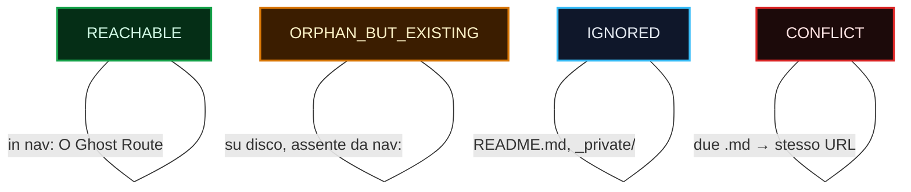
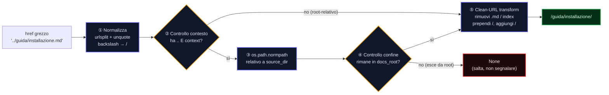

<!-- SPDX-FileCopyrightText: 2026 PythonWoods <dev@pythonwoods.dev> -->
<!-- SPDX-License-Identifier: Apache-2.0 -->

# Motore VSM — Architettura e Protocollo di Risoluzione

> *"La VSM non sa dove si trova un file. Sa dove un file andrà."*

Questo documento descrive il motore della Virtual Site Map (VSM), l'oggetto
`ResolutionContext` introdotto in v0.5.0a4 e l'**Anti-Pattern Context-Free** che
ha originato ZRT-004. Qualsiasi sviluppatore che scriva o revisioni regole
VSM-aware deve leggere questa pagina prima di aprire una PR.

---

## 1. Cos'è la VSM (e cosa non è)

La Virtual Site Map (VSM) è una proiezione puramente in-memory di ciò che il
motore di build servirà:

```python
VSM = dict[str, Route]   # URL canonico → Route
```

Una `Route` contiene:

| Campo | Tipo | Significato |
|-------|------|-------------|
| `url` | `str` | URL canonico, es. `/guida/installazione/` |
| `source` | `str` | Percorso sorgente relativo, es. `guida/installazione.md` |
| `status` | `str` | `REACHABLE` / `ORPHAN_BUT_EXISTING` / `IGNORED` / `CONFLICT` |
| `anchors` | `frozenset[str]` | Slug degli heading pre-calcolati dal sorgente |

La VSM **non** è una vista del filesystem. `Route.url` è l'indirizzo che un
browser richiederebbe, non quello che un `open()` del filesystem accetterebbe.
Un file può esistere su disco (`Path.exists() == True`) ed essere `IGNORED`
nella VSM. Un URL può essere `REACHABLE` nella VSM senza avere un file su disco
(Ghost Route).

**Corollario:** Qualsiasi codice che valida i link chiamando `Path.exists()`
all'interno di una regola è sbagliato per definizione. La VSM è l'oracolo; il
filesystem non lo è.

---

## 2. Riferimento agli Stati di Route



| Stato | Impostato da | Link a questo stato |
|-------|-------------|---------------------|
| `REACHABLE` | voce nav, Ghost Route, shadow locale | ✅ Valido |
| `ORPHAN_BUT_EXISTING` | file su disco, assente da nav | ⚠️ warning Z002 |
| `IGNORED` | README non in nav, pattern esclusi | ❌ errore Z001 |
| `CONFLICT` | due sorgenti → stesso URL canonico | ❌ errore Z001 |

---

## 3. Risoluzione URL: La Pipeline

Convertire un href Markdown grezzo (`../guida/installazione.md`) in un URL
canonico (`/guida/installazione/`) richiede tre trasformazioni applicate in
sequenza:



### Passo ①: Normalizza

Rimuovi query string e artefatti di percent-encoding:

```python
parsed = urlsplit(href)
path = unquote(parsed.path.replace("\\", "/")).rstrip("/")
```

### Passo ②–③: Risoluzione Relativa Context-Aware (v0.5.0a4+)

Se l'href contiene segmenti `..` **e** viene fornito un `ResolutionContext`,
il percorso viene risolto relativo alla directory del file sorgente:

```python
if source_dir is not None and docs_root is not None and ".." in path:
    raw_target = os.path.normpath(str(source_dir) + os.sep + path.replace("/", os.sep))
```

Senza contesto (percorso retrocompatibile), i segmenti `..` vengono portati
avanti così come sono. Questo è corretto per href che non attraversano verso
l'alto, ma sbagliato per file profondamente annidati (vedi ZRT-004 di seguito).

### Passo ④: Controllo del Confine

```python
def _to_canonical_url(href: str, source_dir=None, docs_root=None):
    ...
    root_str = str(docs_root)
    if not (raw_target == root_str or raw_target.startswith(root_str + os.sep)):
        return None   # il percorso esce da docs_root — confine Shield
```

Un percorso che esce da `docs_root` non è un link rotto — è un potenziale
attacco di path traversal. Restituisce `None`, ignorato silenziosamente dal
chiamante. Nessun finding Z001. Nessuna eccezione.

### Passo ⑤: Clean-URL Transform

```python
def _to_canonical_url(href: str, source_dir=None, docs_root=None):
    ...
    if path.endswith(".md"):
        path = path[:-3]

    parts = [p for p in path.split("/") if p]
    if parts and parts[-1] == "index":
        parts = parts[:-1]

    return "/" + "/".join(parts) + "/"
```

---

## 4. ResolutionContext — Il Protocollo di Contesto

### Definizione

```python
@dataclass(slots=True)
class ResolutionContext:
    """Contesto del file sorgente per le regole VSM-aware.

    Attributes:
        docs_root: Percorso assoluto alla directory docs/.
        source_file: Percorso assoluto del file Markdown in esame.
    """
    docs_root: Path
    source_file: Path
```

### Perché Esiste

Prima di v0.5.0a4, `VSMBrokenLinkRule._to_canonical_url()` era un
`@staticmethod`: riceveva solo `href: str`. Questo è l'**Anti-Pattern
Context-Free**.

Una funzione pura che converte un href relativo in un URL assoluto ha bisogno
di sapere due cose:

1. **Da dove parte l'href?** (la directory del file sorgente)
2. **Qual è il confine di contenimento?** (la docs root)

Un metodo statico non può avere questa conoscenza. Produceva quindi risultati
errati in modo silenzioso per qualsiasi file non alla radice dei docs.

### L'Anti-Pattern Context-Free

> **Definizione:** Un metodo che converte un percorso relativo in URL assoluto
> senza ricevere informazioni sull'origine di quel percorso relativo.

Esempi dell'anti-pattern:

```python
# ❌ ANTI-PATTERN: metodo statico, nessun contesto di origine
@staticmethod
def _to_canonical_url(href: str) -> str | None:
    path = href.rstrip("/")
    ...  # rispetto a quale directory è relativo href? Sconosciuto.

# ❌ ANTI-PATTERN: funzione a livello di modulo con solo l'href
def resolve_href(href: str) -> str | None:
    ...  # stesso problema

# ❌ ANTI-PATTERN: assumere che href sia relativo alla docs root
def check_vsm(self, file_path, text, vsm, anchors_cache):
    # file_path è docs/a/b/pagina.md
    # href è ../fratello.md
    # risultato è /fratello/, ma la risposta corretta è /a/fratello/
    url = self._to_canonical_url(href)
```

Il pattern corretto:

```python
# ✅ CORRETTO: metodo di istanza con contesto esplicito
def _to_canonical_url(
    self,
    href: str,
    source_dir: Path | None = None,    # da dove parte l'href
    docs_root: Path | None = None,     # confine di contenimento
) -> str | None:
    ...
```

### Come Passare il Contesto a check_vsm

Il motore passa il contesto quando `run_vsm` viene chiamato dal coordinatore:

```python
# In scan_docs_references() o nel plugin:
context = ResolutionContext(
    docs_root=Path(config.docs_dir),
    source_file=md_file,
)
rule_engine.run_vsm(md_file, text, vsm, anchors_cache, context=context)
```

All'interno di una regola che sovrascrive `check_vsm`:

```python
def check_vsm(
    self,
    file_path: Path,
    text: str,
    vsm: Mapping[str, Route],
    anchors_cache: dict[Path, set[str]],
    context: ResolutionContext | None = None,   # ← accetta sempre
) -> list[Violation]:
    for url, lineno, raw_line in _extract_inline_links_with_lines(text):
        target_url = self._to_canonical_url(
            url,
            source_dir=context.source_file.parent if context else None,
            docs_root=context.docs_root if context else None,
        )
```

### Retrocompatibilità

`context` ha default `None` sia in `BaseRule.check_vsm` che in
`AdaptiveRuleEngine.run_vsm`. Le regole esistenti che non accettano il
parametro riceveranno un `TypeError` incapsulato in un finding
`RULE-ENGINE-ERROR` — non crasheranno la scansione, ma non beneficeranno
della risoluzione contestuale.

**Checklist di migrazione per le regole VSM-aware esistenti:**

1. Aggiungi `context: "ResolutionContext | None" = None` alla firma di `check_vsm`.
2. Passa `source_dir` e `docs_root` da `context` a qualsiasi helper di risoluzione URL.
3. Aggiungi un caso di test con un href `../../`-relativo da un file annidato.

---

## 5. Esempi Pratici

### Esempio A: href relativo semplice (contesto non necessario)

```text
Sorgente:  docs/guida.md
href:      installazione.md
```

Passo ① → `installazione`
Passo ② → nessun `..`, salta contesto
Passo ⑤ → `/installazione/`
Lookup VSM → `vsm.get("/installazione/")`

Il contesto non fa differenza qui. L'href è già sicuro rispetto alla root.

---

### Esempio B: `..` singolo da una sottodirectory (contesto richiesto)

```text
Sorgente:  docs/api/riferimento.md
href:      ../guida/index.md
```

**Senza contesto (comportamento legacy):**

Passo ① → `../guida/index`
Passo ⑤ → `/../guida` → parti `['..', 'guida']` → `/guida/` ← *aritmetica sbagliata*

**Con `ResolutionContext(docs_root=/docs, source_file=/docs/api/riferimento.md)`:**

Passo ③ → `normpath("/docs/api" + "/../guida/index")` → `/docs/guida/index`
Passo ④ → `/docs/guida/index` inizia con `/docs/` ✅
Passo ⑤ → `relative_to(/docs)` → `guida/index` → rimuovi `index` → `/guida/`
Lookup VSM → `vsm.get("/guida/")` ✅ corretto

---

### Esempio C: Escape di traversal (bloccato al confine)

```text
Sorgente:  docs/api/riferimento.md
href:      ../../../../etc/passwd
```

Passo ③ → `normpath("/docs/api" + "/../../../../etc/passwd")` → `/etc/passwd`
Passo ④ → `/etc/passwd` **non** inizia con `/docs/` → restituisce `None`
Il chiamante riceve `None` → `continue` → zero finding emessi ← corretto

---

### Esempio D: Ghost Route (raggiungibile senza file)

```text
href:      /it/
```

Passo ① → percorso `/it`, non href relativo → il controllo esterno lo salta
(Le Ghost Route appaiono nella VSM come `REACHABLE`; la regola valida la
stringa URL direttamente contro la VSM — se l'URL è già canonico, nessuna
conversione è necessaria.)

---

## 6. Contratto delle Regole VSM-Aware

Ogni regola che sovrascrive `check_vsm` deve soddisfare questo contratto:

| Requisito | Razionale |
|-----------|-----------|
| Accettare `context: ResolutionContext \| None = None` | Retrocompat + forwarding del contesto |
| Non chiamare `Path.exists()` | La VSM è l'oracolo, non il filesystem |
| Non mutare `vsm` o `anchors_cache` | Condivisi tra le regole; la mutazione causa race condition in modalità parallela |
| Restituire `Violation`, non `RuleFinding` | `run_vsm` converte tramite `v.as_finding()` |
| Gestire `context=None` con eleganza | Il contesto può essere assente nei test o nei chiamanti vecchi |

---

## 7. Catalogo degli Anti-Pattern

I seguenti pattern sono **vietati** in `core/rules.py` e `core/validator.py`:

| Pattern | Perché vietato | Alternativa |
|---------|---------------|-------------|
| `@staticmethod def _to_canonical_url(href)` | Non può ricevere contesto di origine | Metodo di istanza con `source_dir`, `docs_root` |
| `Path.exists()` dentro `check_vsm` | Viola il contratto Zero I/O | `vsm.get(url) is not None` |
| `Path.resolve()` dentro una regola | Esegue I/O | `os.path.normpath()` (pura aritmetica di stringhe) |
| `open()` dentro una regola | Viola il contratto Zero I/O | Tutto il contenuto nell'argomento `text` |
| `vsm[url]` (subscript diretto) | Solleva `KeyError` su URL mancante | `vsm.get(url)` |

---

## 8. Testing delle Regole VSM-Aware

### Matrice di test minima

Ogni implementazione di `check_vsm` deve essere testata con:

| Caso | Descrizione |
|------|-------------|
| href a livello root | `guida.md` da `docs/index.md` |
| `..` singolo con contesto | `../fratello.md` da `docs/sottocartella/pagina.md` |
| `..` multi-livello con contesto | `../../c/t.md` da `docs/a/b/pagina.md` |
| Escape di traversal | `../../../../etc/passwd` da `docs/api/ref.md` |
| Assente dalla VSM | link a URL non in VSM → Z001 |
| `ORPHAN_BUT_EXISTING` | link a una route orfana → Z002 |
| `context=None` | tutte le asserzioni devono passare senza contesto |

### Pattern fixture di test

```python
def _make_vsm(*urls: str, status: str = "REACHABLE") -> dict[str, Route]:
    return {
        url: Route(url=url, source=f"{url.strip('/')}.md", status=status)
        for url in urls
    }

# Contesto per un file annidato due livelli in profondità
ctx = ResolutionContext(
    docs_root=Path("/docs"),
    source_file=Path("/docs/api/v2/riferimento.md"),
)

violations = rule.check_vsm(
    Path("/docs/api/v2/riferimento.md"),
    "[Guida](../../guida/index.md)",
    _make_vsm("/guida/"),
    {},
    ctx,
)
assert violations == []
```

---

*Stato documento: aggiornato a v0.5.0a4. Aggiornare quando `ResolutionContext`
acquisisce nuovi campi o la logica di controllo del confine cambia.*
