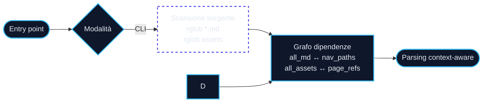
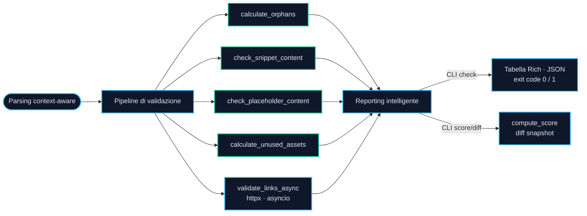
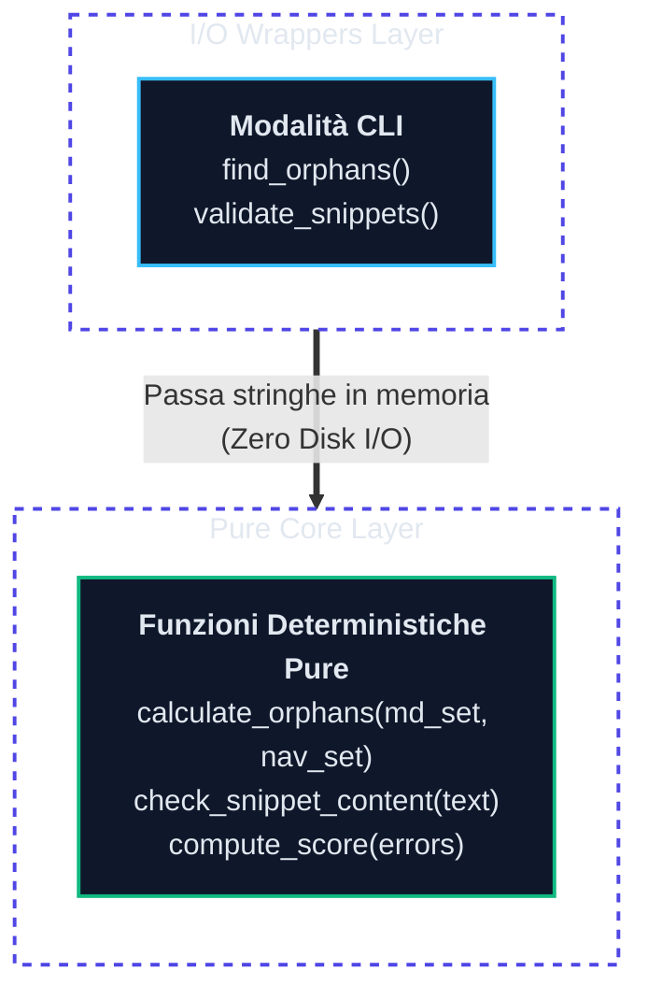
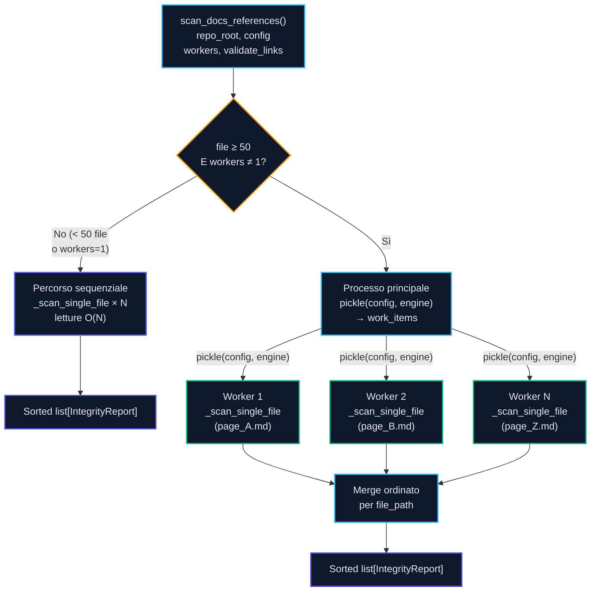
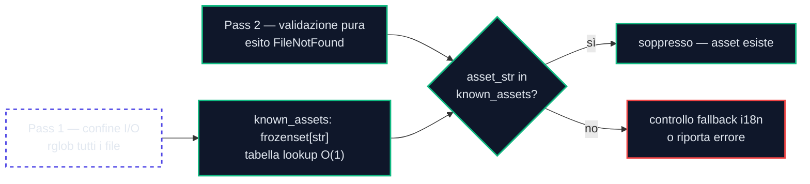

<!-- SPDX-FileCopyrightText: 2026 PythonWoods <dev@pythonwoods.dev> -->
<!-- SPDX-License-Identifier: Apache-2.0 -->

# Architettura

Zenzic è costruito attorno a un core I/O-agnostico che funziona in modalità CLI. Questa pagina descrive il flusso dati interno, il design a tre livelli, la state-machine usata per l'estrazione dei blocchi Python e la pipeline di estrazione e validazione dei link.

## I tre pilastri

Ogni decisione progettuale in Zenzic segue tre regole. In caso di dubbio su una scelta implementativa, queste sono i criteri decisivi.

**1. Analizza il sorgente con intelligenza Build-Aware.**
Zenzic analizza file Markdown grezzi sotto `docs/` e file di configurazione (`mkdocs.yml`). Non attende mai che venga generato un build HTML. L'analisi a livello sorgente è più rapida, agnostica rispetto al generatore e sempre riproducibile. Dove un motore di build definisce semantiche di risoluzione (es. fallback i18n), Zenzic legge la configurazione come YAML grezzo ed emula la semantica — senza importare né eseguire il motore.

**2. Nessun sottoprocesso nel core engine.**
La libreria core è puro Python. Non chiama mai `subprocess.run` per invocare strumenti esterni. La validazione dei link — storicamente delegata a `mkdocs build --strict` — è ora implementata nativamente con un estrattore di link Markdown e `httpx` per gli URL esterni. Questo rende Zenzic autonomo e testabile senza installare nessun generatore di documentazione.

**3. Funzioni pure prima di tutto.**
Tutta la logica di validazione risiede in funzioni pure: nessun I/O su file, nessun accesso alla rete, nessun output su terminale. L'I/O avviene solo ai margini — nei wrapper CLI che leggono file dal disco. Le funzioni pure sono banalmente testabili e possono essere composte liberamente.

---

## Panoramica del ciclo di vita



### Fase 2: Pipeline di validazione



---

Zenzic è progettato attorno a un principio unico: **separare I/O dalla logica**. Ogni controllo è implementato come funzione pura che opera su dati in memoria. La CLI è un thin wrapper che fornisce quei dati.

---

## Architettura a tre livelli



---

## Core I/O-agnostic

Le funzioni core in `zenzic.core.scanner` e `zenzic.core.validator` accettano stringhe e set come input e restituiscono risultati tipizzati. Non aprono mai un file, non navigano directory, non fanno chiamate a sottoprocessi.

```python
# Pura — nessun accesso al filesystem
def calculate_orphans(all_md: set[str], nav_paths: set[str]) -> list[str]:
    return sorted(all_md - nav_paths)

def check_snippet_content(
    text: str, file_path: Path | str, config: ZenzicConfig | None = None
) -> list[SnippetError]:
    # compila i blocchi Python in `text` — nessun I/O sul disco
    ...

def check_placeholder_content(
    text: str, file_path: Path | str, config: ZenzicConfig | None = None
) -> list[PlaceholderFinding]:
    # controlla conteggio parole e corrispondenze pattern in `text` — nessun I/O sul disco
    ...
```

Questo design ha tre conseguenze pratiche:

1. **Le funzioni pure sono banalmente testabili.** Non è necessario il mocking del filesystem. Passa una stringa, verifica il risultato.

---

## Wrapper CLI

I wrapper CLI (`find_orphans`, `validate_snippets`, `find_placeholders`, `find_unused_assets`) gestiscono tutta l'interazione con il filesystem:

```python
# Wrapper CLI — legge il disco, poi delega al core puro
def validate_snippets(repo_root: Path, config: ZenzicConfig | None = None) -> list[SnippetError]:
    docs_root = repo_root / config.docs_dir
    errors: list[SnippetError] = []
    for md_file in sorted(docs_root.rglob("*.md")):
        content = md_file.read_text(encoding="utf-8")
        errors.extend(check_snippet_content(content, rel_path, config))  # chiamata pura
    return errors
```

L'API pubblica di questi wrapper è invariata — le integrazioni esistenti che chiamano `find_orphans()` o `validate_snippets()` direttamente continuano a funzionare.

---

## Normalizzazione dei percorsi

I riferimenti agli asset in Markdown usano percorsi relativi al file di pagina (es., `../assets/logo.png` da `guide/install.md`). La CLI deve risolvere questi in una forma canonica relativa alla root dei docs per il confronto.

Zenzic usa `posixpath.normpath` per questa normalizzazione:

```python
import posixpath

def check_asset_references(text: str, page_dir: str = "") -> set[str]:
    for match in _MARKDOWN_ASSET_LINK_RE.finditer(text):
        clean_url = url.split("?")[0].split("#")[0]
        base = page_dir if page_dir else "."
        normalized = posixpath.normpath(posixpath.join(base, clean_url))
        if not normalized.startswith(".."):   # scarta i percorsi che escono dalla root docs
            referenced.add(normalized)
```

`posixpath` opera su stringhe di percorso POSIX senza toccare il filesystem, il che significa che la stessa funzione funziona correttamente sia su Linux che su Windows indipendentemente dal separatore di percorso nativo della piattaforma.

---

## Parsing a macchina a stati e falsi positivi da superfences

L'estrazione di blocchi di codice con regex è fragile. Zenzic evita questo con una **macchina a stati deterministica riga per riga** in `_extract_python_blocks`:

```python
for lineno, line in enumerate(text.splitlines(), start=1):
    stripped = line.strip()
    if not in_block:
        if stripped.startswith("```"):
            info = stripped[3:].strip()
            lang = info.split()[0].lower() if info else ""
            if lang in ("python", "py"):
                in_block = True          # entra nel blocco solo su una vera riga di fence
                fence_line_no = lineno
    else:
        if stripped.startswith("```") and not stripped.lstrip("`"):
            blocks.append(("\n".join(block_lines), fence_line_no))
            in_block = False             # chiude su una riga che è SOLO backtick
        else:
            block_lines.append(line)
```

Questo significa che Zenzic gestisce correttamente i documenti `pymdownx.superfences` dove Mermaid, PlantUML o altri fence personalizzati appaiono tra blocchi Python — nessuno di loro produce falsi positivi.

Proprietà chiave:

- **Il fence di apertura deve essere l'intero contenuto della riga** (dopo trim) che inizia con `` ``` ``. Un inline code span come `` ` ```python ` `` è circondato da singoli backtick, quindi `stripped` inizia con un singolo `` ` ``, non tre — non attiva mai `in_block = True`.
- **Il fence di chiusura è composto solo da backtick** (`stripped.lstrip("`") == ""`). Una riga di prosa che contiene tripli backtick nel mezzo non può chiudere il blocco prematuramente.
- **Nessun backtracking regex.** Ogni riga è elaborata in O(1); l'intero file è O(n) nel numero di righe indipendentemente dalla profondità di annidamento o dall'utilizzo di superfences.

---

## Hybrid Adaptive Engine (v0.5.0a1)

`scan_docs_references` è l'unico punto di ingresso unificato per tutte le
modalità di scansione. Non esiste più una funzione "parallela" separata — il
motore **si adatta automaticamente** in base alla dimensione del repository.



### Percorso sequenziale

Usato quando `workers=1` (default) o quando il repository ha meno di 50 file.
Zero overhead di avvio del processo. Supporta la validazione degli URL esterni
in un singolo pass O(N).

### Percorso parallelo

Attivato quando `workers != 1` e il numero di file è pari o superiore a
`ADAPTIVE_PARALLEL_THRESHOLD` (50). Ogni file viene inviato a un processo
worker indipendente tramite `ProcessPoolExecutor`.

**Architettura shared-nothing:** `config` e l'`AdaptiveRuleEngine` (incluse
tutte le regole registrate) vengono serializzati tramite `pickle` prima di
essere inviati a ciascun worker. Ogni worker opera su una copia indipendente —
nessuna memoria condivisa, nessun lock, nessuna race condition.

**Contratto di immutabilità:** i worker non devono mutare `config`. Le regole
che scrivono su stato globale mutabile (es. un contatore a livello di classe)
violano il Pilastro delle Funzioni Pure. In modalità parallela, ogni worker
tiene una copia indipendente di quello stato — le mutazioni sono locali e
vengono scartate, producendo risultati che divergono silenziosamente dalla
modalità sequenziale.

**Validazione pickle anticipata:** `AdaptiveRuleEngine` chiama `pickle.dumps()`
su ogni regola al momento della costruzione. Una regola non serializzabile
solleva `PluginContractError` immediatamente, prima che venga scansionato
qualsiasi file.

**Garanzia di determinismo:** i risultati vengono ordinati per `file_path`
dopo la raccolta, indipendentemente dall'ordine di scheduling dei worker.

---

## Riepilogo del flusso dati

### CLI

```text
disco → find_orphans() → calculate_orphans(set, set) → list[str]
disco → validate_snippets() → check_snippet_content(str, ...) → list[SnippetError]
disco → find_placeholders() → check_placeholder_content(str, ...) → list[PlaceholderFinding]
disco → find_unused_assets() → check_asset_references(str, ...) + calculate_unused_assets(set, set) → list[Path]
disco → validate_links_async():
  pass 1: leggi tutti i .md → dict md_contents + dict anchors_cache
  pass 2: extract_links(text) → risolvi percorsi interni → verifica ancore (puro, in-memoria)
  pass 3 (solo --strict): _check_external_links(entries) → httpx HEAD × N → list[str]
```

---

## Estrazione link e pipeline di validazione

`validate_links_async` in `zenzic.core.validator` opera in tre pass. Il pass 1 legge tutti i file `.md` in memoria e pre-calcola i set di ancore dalle intestazioni ATX. Il pass 2 percorre il contenuto in memoria, estrae i link e li classifica come interni o esterni. Il pass 3 — solo quando `--strict` è richiesto — esegue il ping degli URL esterni in modo concorrente tramite `httpx`.

### Layer di Enforcement della Portabilità

Prima che avvenga qualsiasi risoluzione di percorso, ogni URL estratto passa attraverso il
**Layer di Enforcement della Portabilità** — un singolo controllo che viene eseguito prima
che `InMemoryPathResolver` venga consultato.

```text
url estratto
    │
    ▼
┌─────────────────────────────────────┐
│  Layer di Enforcement Portabilità   │
│                                     │
│  url.startswith("/") ?              │
│    SÌ → AbsolutePathError + stop    │  ← bloccato qui
│    NO  → continua                   │
└─────────────────┬───────────────────┘
                  │
                  ▼
         InMemoryPathResolver
```

**Perché i percorsi assoluti vengono rifiutati.** Un link a `/assets/logo.png` presuppone
che il sito sia servito dalla root del dominio. Quando la documentazione è ospitata in una
sottocartella (es. `https://example.com/docs/`), il browser risolve `/assets/logo.png` in
`https://example.com/assets/logo.png` — un 404. I percorsi relativi (`../assets/logo.png`)
vengono risolti dal browser relativamente all'URL della pagina e sopravvivono a qualsiasi
cambio del percorso di hosting senza modifiche.

Il messaggio di errore include un suggerimento esplicito per la correzione:

```text
about/brand-kit.md:52: '/assets/brand-kit.zip' usa un percorso assoluto —
usa un percorso relativo (es. '../' o './') al suo posto; i percorsi assoluti
rompono la portabilità quando il sito è ospitato in una sottocartella
```

Gli URL esterni (`https://...`) vengono classificati prima di questo layer e non sono
interessati.

---

### i18n con Rilevamento dei Suffissi

Zenzic rileva i suffissi locale nativamente dai nomi dei file — non è richiesto nessun
plugin del motore di build. Un file chiamato `guide.it.md` viene identificato come
traduzione italiana di `guide.md` analizzando lo stem: `guide.it` → stem `guide`,
locale del suffisso `it`.

**Perché Suffix Mode, non Folder Mode.** In Folder Mode (`docs/it/guide.md`), i file
tradotti sono annidati un livello di directory più in profondità rispetto agli originali.
Un link relativo `../assets/logo.png` che si risolve correttamente da `docs/guide.md`
diventa non valido da `docs/it/guide.md` (richiede `../../assets/logo.png`). Questo
disallineamento di profondità è invisibile al momento della scrittura ma produce 404 nel
sito costruito. In Suffix Mode, `docs/guide.md` e `docs/guide.it.md` sono nella stessa
directory — tutti i percorsi relativi sono simmetrici tra le traduzioni.

```text
Folder Mode (fragile)          Suffix Mode (deterministico)
─────────────────────          ────────────────────────────
docs/
  guide.md          ← profondità 1  docs/
  it/                                 guide.md       ← profondità 1
    guide.md        ← profondità 2   guide.it.md    ← profondità 1 (uguale)
    assets/         ← profondità 2   assets/        ← profondità 1 (condiviso)

Link da guide.md:  ../assets/   Link: ../assets/   (uguale in entrambi i file ✓)
Link da it/guide.md: ../../assets/
```

Quando `mkdocs.yml` dichiara `fallback_to_default: true`, Zenzic sopprime
ulteriormente gli errori `FileNotFound` per le pagine non tradotte verificando se
esiste la controparte nel locale predefinito — indipendentemente dal fatto che sia
installato un plugin del motore di build.

**Strategia Base-link (consigliata).** I link dentro i file tradotti (`guide.it.md`)
devono puntare al file sorgente base (`index.md`), non al fratello tradotto
(`index.it.md`). Il motore di build decide al momento del rendering se servire la
versione tradotta o fare il fallback al locale predefinito. Scrivere `index.it.md`
crea un link rigido che si rompe se la traduzione viene rimossa. Zenzic valida che
il file base esista, garantendo l'integrità del grafo di navigazione indipendentemente
dai locali in fase di build.

---

## Adapter Pipeline

L'Adapter Pipeline è il confine architetturale tra il **Core agnostico** e qualsiasi
motore di build. È stato introdotto in v0.4.0 per eliminare gli ultimi frammenti di
logica engine-specifica da `scanner.py` e `validator.py`.

### Motivazione: 404 silenziosi da ambiguità dei percorsi

Prima dell'Adapter Pipeline, la logica engine-specifica era dispersa: il rilevamento delle
directory locale viveva in `scanner.py`, la risoluzione del fallback i18n viveva in
`validator.py` e il parsing della nav era duplicato in entrambi. Ogni aggiunta di motore
richiedeva modifiche a più file, e ogni nuova strategia locale rischiava di introdurre
comportamenti silenziosi — file esclusi silenziosamente dai controlli orphan, asset risolti
silenziosamente sul percorso sbagliato.

Il problema fondamentale è l'**ambiguità dei percorsi**: `docs/it/index.md` è un mirror
locale di `docs/index.md` in i18n folder-mode ma una pagina normale in un repo flat.
Lo stesso percorso ha due significati diversi a seconda del motore. Risolvere questo senza
conoscenza engine-specifica nel Core richiede un'interfaccia pulita.

### Design

```text
zenzic.toml
    │
    ▼
get_adapter(context, docs_root, repo_root)
    │
    ├─ engine = "zensical"  →  ZensicalAdapter   (legge zensical.toml, TOML puro)
    ├─ engine = "mkdocs"    →  MkDocsAdapter      (legge mkdocs.yml, YAML permissivo)
    └─ no config, no locale →  VanillaAdapter     (tutti no-op, orphan restituisce [])
    │
    ▼
Interfaccia BaseAdapter
    │
    ├─ is_locale_dir(part)              → bool
    ├─ resolve_asset(missing, root)     → Path | None
    ├─ is_shadow_of_nav_page(rel, nav)  → bool
    ├─ get_nav_paths()                  → frozenset[str]
    └─ get_ignored_patterns()           → set[str]
    │
    ▼
Scanner / Validator  (agnostici rispetto al motore)
```

`get_adapter` è l'unico punto di accesso pubblico. Carica tutti i file di configurazione
internamente — i chiamanti passano solo il contesto di build e i percorsi, mai i dict di
configurazione grezzi.

`scanner.py` non importa né `yaml` né `tomllib`. `validator.py` importa `yaml` per una
funzione specifica: `check_nav_contract()`, che valida i link `extra.alternate` contro la
virtual site map e deve leggere `mkdocs.yml` direttamente. Tutta la restante logica di
validazione in `validator.py` è engine-agnostica. Gli import `yaml` e `tomllib` per la
costruzione degli adapter vivono esclusivamente in `zenzic.core.adapter`.

### Native Enforcement

Quando in `zenzic.toml` è dichiarato `engine = "zensical"`, Zenzic impone che
`zensical.toml` esista nella root del repository prima di costruire l'adapter:

```python
if context.engine == "zensical":
    if find_zensical_config(repo_root) is None:
        raise ConfigurationError(
            "engine 'zensical' declared in zenzic.toml but zensical.toml is missing"
        )
```

Non esiste fallback su `mkdocs.yml`. Questo è intenzionale: un progetto che si dichiara
Zensical ma include solo un `mkdocs.yml` è in uno stato ambiguo. L'ambiguità è la fonte
dei 404 silenziosi. La regola di enforcement è: **l'identità del motore deve essere
dimostrabile dai file di configurazione presenti su disco**. Se non può essere dimostrata,
fallisci in modo chiaro e tempestivo.

### VanillaAdapter e repo zero-config

Quando non viene trovato alcun file di configurazione del motore e non sono dichiarati
locale, `get_adapter` restituisce un `VanillaAdapter`. Tutti e cinque i metodi sono no-op.
`find_orphans` restituisce `[]` immediatamente — senza una nav, non c'è un insieme di
riferimento con cui confrontarsi. Zenzic opera come un semplice linter Markdown: i
controlli snippet, placeholder e link vengono eseguiti normalmente; il rilevamento orphan
viene saltato.

Questo significa che Zenzic funziona out-of-the-box su repo Markdown bare e qualsiasi altro
sistema basato su Markdown — senza produrre falsi positivi da una nav assente.

---

### Layout del pacchetto (`zenzic.core.adapters`)

La logica degli adapter risiede nel pacchetto `zenzic.core.adapters`. Ogni file ha una
singola responsabilità:

| Modulo | Contenuto |
| :--- | :--- |
| `_base.py` | `BaseAdapter` — Protocol `@runtime_checkable` |
| `_mkdocs.py` | `MkDocsAdapter` + tutte le utility YAML (`_PermissiveYamlLoader`, `find_config_file`, `_extract_i18n_*`, `_collect_nav_paths`) |
| `_zensical.py` | `ZensicalAdapter` + utility TOML (`find_zensical_config`, `_load_zensical_config`) |
| `_vanilla.py` | `VanillaAdapter` |
| `_factory.py` | `get_adapter()` |
| `__init__.py` | Re-esporta l'intera API pubblica |

`zenzic.core.adapter` (singolare) è uno shim di retrocompatibilità che re-esporta tutti i
simboli dal pacchetto. Tutti gli import esistenti continuano a funzionare senza modifiche.

---

### Processo di estrazione in due fasi

L'estrazione dei link affronta la stessa ambiguità di parsing dell'estrazione dei blocchi Python: i link che appaiono all'interno di esempi di codice non devono essere trattati come destinazioni reali. `extract_links()` affronta questo con un processo in due fasi che garantisce che la regex dei link venga eseguita solo su testo "sicuro".

**Fase 1 — Isolamento.** Prima che la regex dei link venga eseguita, tutti i contesti di codice vengono identificati ed esclusi:

- *Blocchi di codice di fence* (`` ``` `` e `~~~`): tracciati con la stessa macchina a stati riga per riga usata per l'estrazione dei blocchi Python. Qualsiasi riga all'interno di un blocco di fence viene saltata completamente.
- *Span di codice inline* (delimitati da backtick): sostituiti carattere per carattere con spazi tramite `re.sub`. Questo preserva le posizioni delle colonne rendendo i pattern di link all'interno degli span di codice invisibili alla regex.

```python
for line in text.splitlines():
    stripped = line.strip()

    # Fase 1a — tracciamento blocchi di fence
    if not in_block:
        if stripped.startswith("```") or stripped.startswith("~~~"):
            in_block = True
            continue
    else:
        if stripped.startswith("```") or stripped.startswith("~~~"):
            in_block = False
        continue   # salta sempre le righe dentro un blocco di fence

    # Fase 1b — azzeramento codice inline
    clean = re.sub(r"`[^`]+`", lambda m: " " * len(m.group()), line)
```

**Fase 2 — Estrazione.** La regex dei link viene eseguita solo su `clean` — la riga sanificata con tutti i contesti di codice rimossi:

```python
for m in _MARKDOWN_LINK_RE.finditer(clean):
    ...
```

Qualsiasi pattern di link all'interno di uno span di codice diventa una sequenza di spazi nella Fase 1b e non viene mai trovato nella Fase 2. L'obiettivo di progettazione per la pipeline in due fasi è:

$$\text{Parsing Accuracy} = 1 - \frac{\text{False Positives (Code Blocks)}}{\text{Total Links Extracted}}$$

### Cosa cattura la regex

Nella versione attuale, `_MARKDOWN_LINK_RE` si concentra su **link inline e immagini** — la forma di link più comune nella documentazione MkDocs:

```python
_MARKDOWN_LINK_RE = re.compile(r"!?\[[^\[\]]*\]\(([^)]+)\)")
```

Questo copre `[testo](url)`, `` e link con titoli opzionali come `[testo](url "titolo")`. Gli autolink (`<url>`) non vengono estratti — esulano dall'ambito della validazione dei link interni.

I **link in stile riferimento** (`[testo][id]`) sono completamente supportati. `_build_ref_map()` estrae tutte le definizioni di riferimento dal contenuto del file prima che inizi la validazione; `extract_ref_links()` risolve poi ogni utilizzo `[testo][id]` contro quella mappa. Entrambe le funzioni sono pure (nessun I/O). L'URL risolto viene alimentato nella stessa pipeline `InMemoryPathResolver` dei link inline, incluso il fallback i18n.

Dopo un match, il contenuto grezzo all'interno delle parentesi viene privato di qualsiasi titolo finale:

```python
url = re.sub(r"""\s+["'].*$""", "", raw).strip()
```

### Risoluzione dei link interni

Per ogni link interno (percorso relativo o assoluto rispetto al sito):

1. Decodifica URL della parte del percorso (`unquote(parsed.path)`).
2. Risolvi rispetto alla directory padre del file corrente (percorsi relativi) o `docs_root` (percorsi che iniziano con `/`).
3. Chiama `target.resolve()` e rifiuta qualsiasi percorso che sfugge a `docs_root` tramite traversal `..`.
4. Accetta il percorso risolto così com'è, con `.md` aggiunto, o come `index.md` all'interno della directory di destinazione — qualunque esista in `md_contents`.
5. Se è presente un `#frammento`, cerca il set di ancore pre-calcolato del file di destinazione e segnala un errore se lo slug è assente.

Per gli asset non-Markdown (PDF, immagini), la ricerca in `md_contents` restituisce `FileNotFound`. `validate_links_async` gestisce questo caso usando il frozenset `known_assets` — una tabella di lookup O(1) costruita nel Pass 1. Nessuna chiamata al filesystem viene mai effettuata nel Pass 2. Vedi [Build-Aware Intelligence](#build-aware-intelligence) più avanti.

### Validazione esterna asincrona

Quando `--strict` è richiesto, `_check_external_links()` valida tutti gli URL esterni raccolti in modo concorrente:

- **Deduplicazione prima.** Ogni URL univoco viene pingato esattamente una volta, indipendentemente da quante pagine vi fanno riferimento. I risultati vengono mappati su ogni coppia `(file_label, lineno)`, in modo che tutte le occorrenze vengano riportate in un singolo pass.
- **Concorrenza limitata.** Un `asyncio.Semaphore(20)` limita le connessioni in uscita simultanee per evitare di esaurire i file descriptor del sistema operativo e di innescare rate-limit sui server di destinazione.
- **Degradazione controllata.** Le risposte HTTP 401, 403 e 429 sono trattate come "attive" — il server risponde ma limita l'accesso. Questo previene i falsi positivi da GitHub, StackOverflow e altri siti che rifiutano le richieste HEAD non autenticate.
- **HEAD con fallback GET.** I server che restituiscono 405 (Method Not Allowed) per HEAD vengono riprovati con GET.

---

## Build-Aware Intelligence

Zenzic estende la pipeline di validazione dei link con due capacità: validazione degli asset senza I/O e risoluzione con fallback i18n. Entrambe sono implementate come **livelli puri sopra il `InMemoryPathResolver` esistente** — il resolver non cambia, e le capacità si compongono senza accoppiamento.

### Validazione asset senza I/O — `known_assets`

Prima di questa implementazione, i link agli asset non-Markdown venivano validati chiamando `Path.exists()` per ogni link nel Pass 2 — una syscall nel percorso critico. Questo produceva risultati non deterministici negli ambienti CI dove lo stato del disco differisce tra le esecuzioni.

La soluzione: il Pass 1 ora costruisce `known_assets`, un `frozenset[str]` di stringhe di percorso assoluto normalizzate per ogni file non-`.md` sotto `docs/`:

```python
known_assets: frozenset[str] = frozenset(
    str(p.resolve()) for p in docs_root.rglob("*") if p.is_file() and p.suffix != ".md"
)
```

Il Pass 2 usa la membership O(1) del set — `asset_str in known_assets` — senza I/O su disco:



**Invariante:** `Path.exists()` non viene mai chiamato durante il Pass 2. Tutta la risoluzione degli asset usa il frozenset pre-costruito.

### Soppressione artifact build-time — `excluded_build_artifacts`

Alcuni asset (PDF generati da `to-pdf`, ZIP assemblati in CI) esistono solo dopo il completamento del build. Dichiarare i loro pattern glob in `zenzic.toml` sopprime gli errori per quei percorsi al momento del lint:

```toml
excluded_build_artifacts = ["pdf/*.pdf", "dist/*.zip"]
```

Il controllo viene eseguito solo quando `asset_str not in known_assets` — ovvero, dopo che il percorso veloce ha già confermato che il file non esiste su disco. La soppressione usa `fnmatch` (puro matching di stringhe, nessun I/O).

### Adapter i18n — `I18nFallbackConfig`

Zenzic legge i file di configurazione del motore di build **come YAML semplice** ed estrae la semantica di risoluzione dei locali da essi. Non importa né esegue mai il motore di build. Questa è **compatibilità di protocollo**, non accoppiamento al framework.

L'adapter è un singolo `NamedTuple` che codifica il contratto di fallback:

```python
class I18nFallbackConfig(NamedTuple):
    enabled: bool                    # è fallback_to_default: true?
    default_locale: str              # es. "en"
    locale_dirs: frozenset[str]      # es. frozenset({"it", "de"})
```

`_extract_i18n_fallback_config(doc_config)` legge questo dal dizionario YAML analizzato. Se `mkdocs.yml` è assente o il plugin i18n non è configurato, restituisce `_I18N_FALLBACK_DISABLED` — un singleton con `enabled=False`. Il resto della pipeline rimane inalterato.

**L'agnosticismo del motore è il comportamento predefinito.** Un progetto senza alcun file
di configurazione del motore viene servito da `VanillaAdapter` senza alcuna configurazione
aggiuntiva — nessun adapter necessario. Un adapter è necessario solo quando un motore
specifico introduce convenzioni che richiedono conoscenza specializzata: layout di directory
locale (i18n), formati di nav contract, dialetti Markdown specifici del motore o semantiche
di plugin nativi.

**Aggiungere un adapter per un nuovo motore di build** — se e quando le convenzioni del
motore lo richiedono — necessita solo di:

1. Una nuova classe che implementa il protocollo `BaseAdapter` (cinque metodi).
2. Un branch in `get_adapter()` per selezionarla.
3. Nessuna modifica a `InMemoryPathResolver`, `validate_links_async`, `scanner.py` o a qualsiasi fixture di test.

### Risoluzione fallback i18n — `_should_suppress_via_i18n_fallback`

Quando `InMemoryPathResolver` restituisce `FileNotFound` per un percorso all'interno di una sottodirectory locale, e `fallback_config.enabled` è `True`, Zenzic ritenta la risoluzione dalla posizione equivalente nell'albero del locale predefinito:

```text
Sorgente: docs/it/guide.md  →  link: api.md
Risolve:  docs/it/api.md    →  FileNotFound

Fallback:
  1. Il file sorgente è dentro una locale_dir? (docs/it/ → "it" ∈ locale_dirs) ✓
  2. Il target mancante è nello stesso albero locale? (docs/it/api.md inizia con docs/it/) ✓
  3. Rimuovi prefisso locale: docs/it/api.md → docs/api.md
  4. Ri-risolvi docs/api.md tramite InMemoryPathResolver: Resolved ✓
  5. Sopprimi il FileNotFound — il build servirà la versione del locale predefinito.
```

Se il target è assente sia dall'albero locale che dal locale predefinito, l'errore viene segnalato indipendentemente dalle impostazioni di fallback.

**Case sensitivity:** Tutte le ricerche di percorso sono case-sensitive. `docs/assets/Logo.png` ≠ `docs/assets/logo.png`. Questo corrisponde al comportamento dei server web Linux e previene la distribuzione silenziosa di asset errati.

---

---

## Two-Pass Reference Pipeline (v0.2.0)

### Da stateless a document-aware

Zenzic v0.1 era un linter **stateless**: ogni riga veniva valutata indipendentemente, senza memoria di ciò che era venuto prima o dopo. Questo era sufficiente per i link inline — `[testo](url)` — perché l'URL è autocontenuto.

I link in stile Reference rompono questa assunzione:

```markdown
Vedi [la guida][guide-link].          <!-- utilizzo: serve una mappa per risolvere "guide-link" -->

[guide-link]: https://example.com     <!-- definizione: appare più avanti nel file -->
```

Uno scanner stateless che legge dall'alto verso il basso segnalerebbe `[guide-link]` come **Dangling Reference** prima di raggiungere la sua definizione. La Two-Pass Pipeline esiste per eliminare completamente questa classe di **falsi positivi**.

| Capacità | v0.1 — Stateless | v0.2 — Document-Aware |
|---|---|---|
| Architettura | Singolo pass, riga per riga | Pipeline in tre fasi |
| Reference link | Non supportati | `ReferenceMap`, first-wins, case-insensitive |
| Forward references | ❌ Falsi errori DANGLING | ✅ Risolti (Pass 2 eseguito dopo harvest completo) |
| Sicurezza | — | Zenzic Shield: OpenAI / GitHub / AWS → Exit 2 |
| Deduplicazione URL | Un check per ogni occorrenza | Un check per URL unico tra tutti i file |
| Modello memoria | `.read()` per file | Generator — RAM costante per riga |
| Accessibilità | — | `WARNING` su immagini senza alt text |
| Metrica qualità | — | Reference Integrity = usate ÷ definite × 100 |

---

### Il ciclo di vita di un reference link

Un reference link attraversa quattro stadi prima che Zenzic possa validarlo.

```text
┌─────────────────────────────────────────────────────────────────────┐
│                         FILE SORGENTE (disco)                       │
│  Riga  5:  Vedi [la guida][guide-link].                             │
│  Riga 42:  [guide-link]: https://example.com                        │
└───────────────────────────┬─────────────────────────────────────────┘
                            │  _iter_content_lines() — generator,
                            │  legge una riga alla volta, salta
                            │  blocchi di codice di fence
                            ▼
┌─────────────────────────────────────────────────────────────────────┐
│                    PASS 1 — HARVESTING & SHIELD                     │
│                                                                     │
│  RE_REF_DEF matcha riga 42 ──► ReferenceMap.add_definition()       │
│    chiave  = "guide-link"  (normalizzato: .lower().strip())         │
│    valore = ("https://example.com", line_no=42)      ← metadati    │
│                                                                     │
│  Shield scansiona l'URL immediatamente:                             │
│    scan_url_for_secrets("https://example.com", ...) → nessun match  │
│    → yield (42, "DEF", ("guide-link", "https://example.com"))       │
│                                                                     │
│  RE_IMAGE_INLINE matcha qualsiasi `` su qualsiasi riga:       │
│    alt_text vuoto? → yield (n, "MISSING_ALT", url)   ← WARNING     │
│    alt_text presente? → yield (n, "IMG", (alt, url))                │
└───────────────────────────┬─────────────────────────────────────────┘
                            │  Dopo che il generator è esaurito,
                            │  la ReferenceMap è COMPLETA
                            ▼
┌─────────────────────────────────────────────────────────────────────┐
│                   PASS 2 — CROSS-CHECK & RISOLUZIONE                │
│                                                                     │
│  RE_REF_LINK matcha riga 5 ──► ReferenceMap.resolve("guide-link")  │
│    trovato  → segna "guide-link" come usato; nessun finding          │
│    assente → ReferenceFinding(issue="DANGLING")  ← Dangling Reference│
└───────────────────────────┬─────────────────────────────────────────┘
                            │  ref_map.used_ids ora è popolato
                            ▼
┌─────────────────────────────────────────────────────────────────────┐
│                   PASS 3 — CLEANUP & METRICHE                       │
│                                                                     │
│  integrity_score = len(used_ids) / len(definitions) × 100          │
│                                                                     │
│  orphan_definitions = definitions.keys() − used_ids                │
│    → ReferenceFinding(issue="DEAD_DEF")  ← Dead Definition        │
│                                                                     │
│  duplicate_ids → ReferenceFinding(issue="duplicate-def",            │
│                                   is_warning=True)                  │
└─────────────────────────────────────────────────────────────────────┘
```

---

### Perché il design a due pass è l'unica soluzione corretta

Considera un documento in cui una definizione appare dopo tutti i suoi utilizzi — un pattern di scrittura naturale quando l'autore mette i riferimenti in stile nota a piè di pagina in fondo alla pagina:

```markdown
## Panoramica
Leggi [la spec][spec] e [la guida][guide].

## Iniziare
Segui [la guida][guide] per l'installazione.

[spec]:  https://spec.example.com    <!-- riga 40 -->
[guide]: https://guide.example.com   <!-- riga 41 -->
```

Uno scanner single-pass elabora la riga 2 prima della riga 40. Alla riga 2, né `spec` né `guide` sono ancora definiti — quindi entrambi verrebbero segnalati come Dangling References. Questo è un **falso positivo**: le definizioni sono presenti e corrette, solo più avanti nel file.

La Two-Pass Pipeline previene questo per design:

1. **Pass 1** legge l'intero file e costruisce la `ReferenceMap` prima che venga tentata qualsiasi risoluzione. Alla fine del Pass 1, ogni definizione nel documento è registrata, indipendentemente dalla sua posizione.
2. **Pass 2** risolve poi ogni utilizzo contro una mappa *completa*. La riga 2 viene elaborata con piena conoscenza delle righe 40 e 41.

Questa è la stessa separazione delle responsabilità che usa un compilatore: il linker risolve i forward reference solo dopo che tutti i file oggetto sono stati scansionati.

!!! warning "Non unire i pass"
    Può essere allettante risolvere i link al volo durante il Pass 1 per risparmiare una seconda lettura del file. **Non farlo.** Il problema dei forward reference non è un caso limite — è un pattern Markdown comune e idiomatico. Unire i pass reintroduce esattamente il bug che la pipeline è stata progettata per eliminare.

---

### Streaming basato su generator

Zenzic non chiama mai `.read()` o `.readlines()` sui file di documentazione. Entrambi i metodi caricano l'intero file in memoria prima che inizi l'elaborazione — un problema quando i repository di documentazione contengono file Markdown che superano diversi megabyte.

Invece, ogni pass usa `_iter_content_lines()`, un generator che legge una riga alla volta:

```python
def _iter_content_lines(file_path: Path) -> Generator[tuple[int, str], None, None]:
    in_block = False
    with file_path.open(encoding="utf-8") as fh:
        for lineno, line in enumerate(fh, start=1):   # una riga alla volta
            stripped = line.strip()
            if not in_block:
                if stripped.startswith("```") or stripped.startswith("~~~"):
                    in_block = True
                    continue
            else:
                if stripped.startswith("```") or stripped.startswith("~~~"):
                    in_block = False
                continue  # salta sempre le righe dentro un blocco di fence
            yield lineno, line
```

Il consumo di memoria al picco è proporzionale alla dimensione della `ReferenceMap` (un dizionario di ID e URL), non alla dimensione del file. Un file Markdown da 100 MB con 500 definizioni di riferimento usa la stessa memoria di un file da 10 KB con 500 definizioni.

---

### Gestione dello stato `ReferenceMap` tra i pass

La `ReferenceMap` è la struttura dati centrale della pipeline. Viene creata nuova per ogni file — non esiste stato condiviso tra documenti a livello di mappa.

```python
@dataclass
class ReferenceMap:
    definitions: Dict[str, Tuple[str, int]]  # id_normalizzato → (url, line_no)
    used_ids:    Set[str]                    # popolato durante il Pass 2
    duplicate_ids: Set[str]                  # popolato durante il Pass 1
```

**Tra Pass 1 e Pass 2**, `definitions` è completo e `used_ids` è vuoto. Il Pass 2 riempie `used_ids` chiamando `resolve()` per ogni link che incontra. Dopo il Pass 2, la differenza `definitions.keys() − used_ids` è il set di **Dead Definitions** (codice: `issue="DEAD_DEF"`).

**Invarianti chiave imposti dalla mappa:**

- **Chiavi case-insensitive.** `[Guida]`, `[GUIDA]` e `[guida]` risolvono tutti alla stessa voce. La normalizzazione (`lower().strip()`) avviene dentro `add_definition()` e `resolve()`, non nel chiamante.
- **First-wins (CommonMark §4.7).** Quando lo stesso ID è definito più di una volta, vince la prima definizione nell'ordine del documento. Le definizioni successive vengono ignorate e registrate in `duplicate_ids` ai fini del warning. Questo corrisponde al comportamento di ogni renderer CommonMark-compliant.
- **Metadati di numero di riga.** Ogni definizione memorizza la riga sorgente accanto all'URL: `(url, line_no)`. Questi metadati vengono usati nel Pass 3 per produrre messaggi di errore che puntano direttamente alla riga problematica.

---

### Zenzic Shield — la sicurezza come firewall, non come filtro

Lo Shield viene eseguito **dentro il Pass 1**, non dopo. Ogni URL estratto da una definizione di riferimento viene scansionato per pattern di credenziali noti prima che la definizione venga emessa:

```text
# Dentro ReferenceScanner.harvest() — Pass 1
if accepted:
    yield (lineno, "DEF", (norm_id, url))

    for finding in scan_url_for_secrets(url, self.file_path, lineno):
        yield (lineno, "SECRET", finding)    # ← emesso immediatamente
```

I pattern sono pre-compilati al momento dell'import usando quantificatori a lunghezza esatta — non wildcard greedy — per eliminare il backtracking su righe lunghe:

| Tipo di credenziale | Pattern | Quantificatore |
|---|---|---|
| OpenAI API key | `sk-[a-zA-Z0-9]{48}` | `{48}` — esatto, O(1) |
| GitHub token | `gh[pousr]_[a-zA-Z0-9]{36}` | `{36}` — esatto, O(1) |
| AWS access key | `AKIA[0-9A-Z]{16}` | `{16}` — esatto, O(1) |

Quando la CLI riceve un evento `SECRET` esce immediatamente con **codice 2** — prima del Pass 2, prima di qualsiasi ping HTTP, prima di qualsiasi ulteriore analisi. Un file che espone credenziali non viene analizzato ulteriormente.

```text
SECRET trovato nel Pass 1
        │
        ▼
   EXIT CODE 2         ← build interrotta
   Pass 2: SALTATO     ← nessun ping HTTP emesso
   Pass 3: SALTATO     ← nessun integrity score calcolato
```

Questo comportamento è intenzionale. Eseguire la validazione dei link contro un URL che contiene una API key esposta autenticherebbe una richiesta reale con quella chiave — un incidente di sicurezza, non una diagnosi.

---

### Deduplicazione URL globale via `LinkValidator`

Quando `--links` viene passato a `zenzic check references`, gli URL esterni vengono validati con un singolo pass asincrono. La classe `LinkValidator` agisce come unico gatekeeper per il traffico HTTP sull'intero albero della documentazione.

```python
validator = LinkValidator()

# Dopo il Pass 1 per ogni file in docs/:
for scanner in all_scanners:
    if scanner_report.is_secure:                      # controllo Shield
        validator.register_from_map(scanner.ref_map, scanner.file_path)

# Una chiamata asincrona — ogni URL unico pingato esattamente una volta:
errors = validator.validate()
```

**La deduplicazione avviene al momento della registrazione**, non dentro il layer HTTP. Se 50 file definiscono tutti un riferimento a `https://docs.python.org`, `validator.unique_url_count` è 1 e viene emessa esattamente una richiesta HEAD.

```text
docs/a.md  →  [python]: https://docs.python.org  ─┐
docs/b.md  →  [py]:     https://docs.python.org  ─┤── LinkValidator
docs/c.md  →  [ref]:    https://docs.python.org  ─┘   ↓
                                                    1 HTTP HEAD
```

---

### Accessibilità: il gentle nudge

Quando Zenzic trova un'immagine senza alt text — `` o un tag HTML `` senza attributo `alt` — emette un evento `MISSING_ALT` durante il Pass 1 e registra un finding con `is_warning=True`.

Questo è un **warning, non un errore**. Non causerà l'uscita di `zenzic check references` con codice non-zero a meno che non venga passato `--strict`. L'intento è incoraggiare una documentazione migliore progressivamente — non bloccare i deploy per i team che stanno migrando attivamente verso contenuti accessibili.

```text
  ⚠  [missing-alt]  guide.md:15 — L'immagine 'architecture.png' non ha alt text.
```

Con `--strict`, tutti i warning diventano errori e il codice di uscita è 1.

---

### Riepilogo flusso dati (v0.2.0)

```text
disco ──► _iter_content_lines(file)              ← generator, una riga alla volta
              │
              ▼
         ReferenceScanner.harvest()             ← Pass 1 (Harvesting)
              ├── RE_REF_DEF match
              │     ├── ReferenceMap.add_definition(id, url, lineno)
              │     └── scan_url_for_secrets(url) ──► evento SECRET → Exit 2
              └── RE_IMAGE_INLINE match
                    └── alt_text vuoto? → warning MISSING_ALT
              │
              │   [ref_map.definitions completo]
              ▼
         ReferenceScanner.cross_check()         ← Pass 2 (Cross-Check)
              └── RE_REF_LINK match
                    ├── ReferenceMap.resolve(id) → successo → used_ids.add(id)
                    └── non trovato → errore DANGLING (Dangling Reference)
              │
              │   [ref_map.used_ids completo]
              ▼
         ReferenceScanner.get_integrity_report() ← Pass 3
              ├── integrity_score = |used_ids| / |definitions| × 100
              ├── orphan_definitions → warning DEAD_DEF (Dead Definition)
              └── duplicate_ids → warning duplicate-def
              │
              ▼  (opzionale, flag --links)
         LinkValidator.register_from_map()       ← dedup globale
              └── LinkValidator.validate()       ← un ping per URL unico
                    └── _check_external_links()  ← semaphore(20) · httpx
```

$$
Reference\ Integrity = \frac{Resolved\ References}{Total\ Reference\ Definitions}
$$

---

## API Reference

Per la documentazione API completa auto-generata vedi la pagina dedicata [API Reference][api-reference].

<!-- ─── Reference link definitions ──────────────────────────────────────────── -->

[api-reference]: reference/api.md
