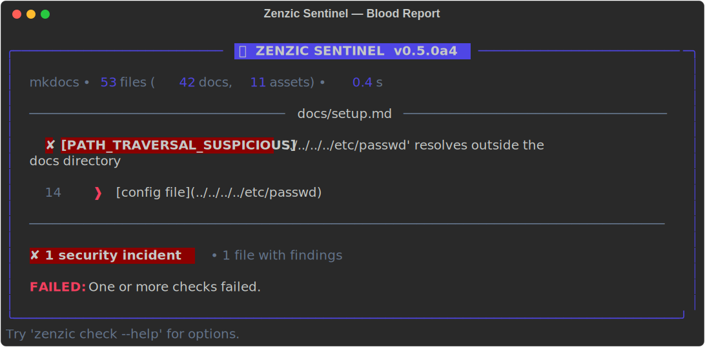
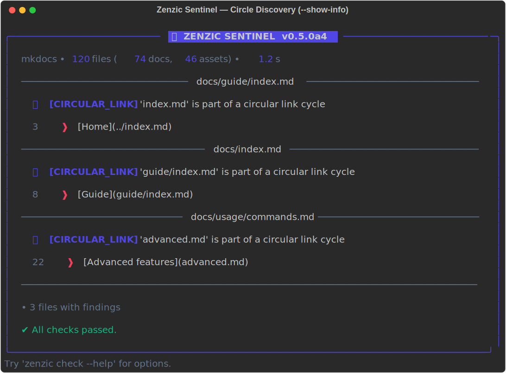

<!-- SPDX-FileCopyrightText: 2026 PythonWoods <dev@pythonwoods.dev> -->
<!-- SPDX-License-Identifier: Apache-2.0 -->

# Riferimento Controlli {#checks-reference}

Zenzic esegue sei controlli indipendenti. Ognuno affronta una categoria distinta di degrado della documentazione — la lenta deteriorazione che avviene quando un progetto cresce e la manutenzione della documentazione rimane indietro rispetto allo sviluppo.

<div class="grid cards" markdown>

- :lucide-link-2-off: &nbsp; __Link__

    Link interni non validi, ancore mancanti e URL esterni irraggiungibili.

    [`zenzic check links`](#links)

- :lucide-file: &nbsp; __Orfani__

    File `.md` presenti su disco ma assenti dalla navigazione del sito.

    [`zenzic check orphans`](#orphans)

- :lucide-code: &nbsp; __Snippet__

    Blocchi Python che non compilano — intercettati prima che i lettori li copino.

    [`zenzic check snippets`](#snippets)

- :lucide-pencil: &nbsp; __Placeholder__

    Pagine stub sotto la soglia di parole o con pattern vietati (es. `TODO`, `WIP`).

    [`zenzic check placeholders`](#placeholders)

- :lucide-image: &nbsp; __Asset__

    File media presenti su disco ma mai referenziati. __Supporta l'autofix.__

    [`zenzic check assets`](#assets)

- :lucide-shield-check: &nbsp; __Riferimenti__

    Riferimenti pendenti, definizioni morte e credenziali trapelate (exit code 2).

    [`zenzic check references`](#references)

</div>

---

## Link {#links}

__CLI:__ `zenzic check links [--strict]`

Il link rot è uno dei fallimenti della documentazione più comuni e più visibili. Uno sviluppatore rinomina una pagina, sposta una sezione o elimina un'ancora, e i link che la puntavano diventano silenziosamente vicoli ciechi.

`zenzic check links` usa un parser Python nativo — nessun sottoprocesso, nessuna dipendenza dal motore di build. Scannerizza ogni file `.md` in `docs/`, estrae tutti i link Markdown con una state machine che ignora i blocchi di codice, e li valida in due livelli.

__Livello 1 — link interni (sempre verificati):__

I percorsi relativi e site-absolute vengono risolti contro la directory `docs/` in memoria. Il file target deve esistere nell'insieme dei file scansionati. Vengono risolti anche i percorsi senza estensione (`setup`) e i percorsi directory-index (`setup/`). Se il link include un `#frammento`, Zenzic estrae le ancore dalle intestazioni del file target e verifica la corrispondenza.

- `[testo](pagina-mancante.md)` → file target non trovato
- `[testo](pagina.md#ancora-mancante)` → ancora non trovata nel target

Tutti i file `.md` vengono letti una volta; le ancore vengono pre-calcolate dalle intestazioni (`# Titolo` → `#titolo`). Nessun I/O aggiuntivo per link.

__Livello 2 — link esterni (solo `--strict`):__

Con `--strict`, ogni URL `http://` e `https://` nei docs viene validato tramite richieste HTTP HEAD concorrenti usando `httpx`. Fino a 20 connessioni simultanee. I server che rifiutano HEAD ricevono un fallback GET. Lo stesso URL referenziato in più pagine viene pingato esattamente una volta.

I server che restituiscono `401`, `403` o `429` sono trattati come raggiungibili — indicano restrizioni di accesso, non link non validi. Timeout (>10 s) ed errori di connessione vengono segnalati come fallimenti.

__Cosa NON viene mai validato:__

- Link all'interno di blocchi di codice o span inline — il parser li ignora
- Schemi `mailto:`, `data:`, `ftp:`, `tel:` e simili
- Ancore pure della stessa pagina (`#sezione`) — non validate per default; abilitare con
  `validate_same_page_anchors = true` in `zenzic.toml` (vedi nota sotto)

__Flag `--strict`:__ senza `--strict`, vengono controllati solo i link interni (veloce, nessuna rete). Con `--strict`, vengono validati anche i link HTTP/HTTPS esterni tramite richieste di rete concorrenti.

__Validazione ancore nella stessa pagina:__ per default, i link come `[testo](#sezione)` che
puntano a un'intestazione nella stessa pagina non vengono validati. Questo è intenzionale —
gli ID delle ancore possono essere generati anche da attributi HTML, plugin personalizzati o
macro a build-time non visibili durante la scansione del sorgente. Per abilitare la
validazione delle ancore same-page basata sulle intestazioni:

```toml
# zenzic.toml
validate_same_page_anchors = true
```

Quando abilitato, ogni ancora `#frammento` in un link same-page viene verificata rispetto
alle intestazioni estratte dal file sorgente. Un link a uno slug di intestazione inesistente
viene segnalato come non valido.

__Perché:__ L'analisi a livello sorgente fornisce output riproducibile indipendente dal motore di build.

!!! example "Sentinel Output — link non valido"

    ```text
    docs/index.md
      ✘ 12:    [FILE_NOT_FOUND]  'setup.md' not found in docs
        │
     12 │ Leggi la [guida di setup](setup.md) prima di continuare.
        │

      ✘ 1 error    • 1 file with findings
    ```

### Codici di violazione

Il controllo link utilizza la Virtual Site Map (VSM) per distinguere due categorie di fallimento:

| Codice | Severità | Significato |
| :--- | :---: | :--- |
| `Z001` | error | __Link rotto__ — il target non esiste nella VSM. Il file manca o l'URL è errato. |
| `Z002` | warning | __Link a orfano__ — il target esiste su disco ma non è nella navigazione del sito. I lettori non possono raggiungere la pagina tramite il nav. |

`Z001` blocca sempre la pipeline (exit code 1). `Z002` è un warning — appare nel report ma non fa fallire la CI a meno che non venga passato `--strict`. Questa distinzione permette ai team di intercettare subito le rotture reali, gestendo l'igiene della navigazione come preoccupazione separata.

__Perché i link ad orfani contano:__ un link a una pagina orfana _funziona_ a livello di filesystem — il file esiste e il motore di build potrebbe servirlo. Ma la pagina è invisibile nel nav tree, creando un'esperienza utente frammentata. I lettori che seguono il link atterrano su una pagina senza contesto nella sidebar e senza modo di navigare indietro. `Z002` intercetta questo anti-pattern.

!!! example "Sentinel Output — link a orfano"

    ```text
    docs/guide.md
      ⚠ 18:    [UNREACHABLE_LINK]  'bozze/esperimento.md' non è nella navigazione del sito
        │
     18 │ Vedi [l'esperimento](bozze/esperimento.md) per i dettagli.
        │

      ⚠ 1 warning    • 1 file with findings
    ```

### Sentinella di Sangue — attraversamento percorsi di sistema {#blood-sentinel-system-path-traversal}

Quando un attraversamento esce dal confine `docs/` __e__ l'href grezzo punta a una
directory di sistema del sistema operativo (`/etc/`, `/root/`, `/var/`, `/proc/`,
`/sys/`, `/usr/`), Zenzic lo classifica come un __attraversamento di percorso di
sistema__. Non è un link non valido — è una sonda intenzionale o accidentale del
sistema operativo host incorporata nel sorgente della documentazione.

| Codice | Severità | Exit code | Significato |
| :--- | :---: | :---: | :--- |
| `PATH_TRAVERSAL_SUSPICIOUS` | security_incident | __3__ | L'href punta a una directory di sistema del SO. Eseguire rotazione e audit immediatamente. |
| `PATH_TRAVERSAL` | error | 1 | L'href esce da `docs/` verso un percorso non di sistema (es. un repository adiacente). |

L'Exit Code 3 ha priorità sull'Exit Code 2 (violazione credenziali Shield). Non viene
mai soppresso da `--exit-zero`.

!!! danger "Exit Code 3 — Sentinella di Sangue"
    Un finding `PATH_TRAVERSAL_SUSPICIOUS` significa che un file sorgente della
    documentazione contiene un link il cui target risolto punta a `/etc/passwd`,
    `/root/`, o un altro percorso di sistema del SO. Questo può indicare una
    template injection, una toolchain della documentazione compromessa, o un errore
    dell'autore che rivela dettagli dell'infrastruttura interna. Va trattato come un
    incidente di sicurezza che blocca la build.

!!! example "Sentinel Output — attraversamento percorso di sistema"

    ```text
    docs/setup.md
      ✘ 14:    [PATH_TRAVERSAL_SUSPICIOUS]  '../../../../etc/passwd' resolves outside the docs directory
        │
     14 │ [file di configurazione](../../../../etc/passwd)
        │ ^^^^^^^^^^^^^^^^^^^^^^^^^^^^^^^^^^^^^^^^^^^^^^^^^

      ✘ 1 error  • 1 file with findings

    FAILED: One or more checks failed.
    ```
    Exit code: **3**



### Link circolari

Zenzic rileva i cicli di link tramite una ricerca depth-first iterativa sul grafo di
adiacenza dei link (Fase 1.5, Θ(V+E) — eseguita una sola volta dopo la costruzione
del resolver in memoria). Ogni verifica di Phase 2 sul registro dei cicli è poi O(1).

Un "ciclo" in un grafo di link della documentazione significa che la pagina A linka
alla pagina B e la pagina B linka di ritorno alla pagina A (direttamente o attraverso
una catena più lunga). I link di navigazione reciproca — ad esempio, una pagina Home
che linka a una pagina Funzionalità e la pagina Funzionalità che linka di ritorno a
Home — sono comuni, intenzionali, e non causano problemi di rendering per nessun
generatore di siti statici.

Per questo motivo, `CIRCULAR_LINK` viene segnalato con severità `info`. Appare nel
pannello Sentinel e contribuisce al conteggio "N file con findings", ma non influisce
mai sugli exit code in modalità normale o `--strict`. I team che vogliono applicare
una topologia DAG rigorosa possono esaminare i finding di tipo info come parte del
loro processo di revisione.

| Codice | Severità | Exit code | Significato |
| :--- | :---: | :---: | :--- |
| `CIRCULAR_LINK` | info | — | Il target risolto è membro di un ciclo di link. |

!!! example "Sentinel Output — link circolare"

    ```text
    docs/guide.md
      💡 3:     [CIRCULAR_LINK]  'index.md' is part of a circular link cycle

    docs/index.md
      💡 8:     [CIRCULAR_LINK]  'guide.md' is part of a circular link cycle

      • 2 files with findings

    ✔ All checks passed.
    ```

!!! note "Finding di livello info — soppresso per default"
    I finding `CIRCULAR_LINK` sono segnalati con severità `info` e __non vengono
    mostrati__ nell'output standard per evitare di intasare le scansioni di
    routine. I link di navigazione reciproca sono comuni e intenzionali nelle
    strutture di documentazione ipertestuale.

    Usa `--show-info` per visualizzarli:

    ```bash
    zenzic check all --show-info
    ```

    Non bloccano mai la build né influiscono sui codici di uscita in nessuna modalità.
    Per la motivazione alla base di questa scelta di severità, consulta
    [ADR 003 — Root Discovery Protocol](adr/003-discovery-logic.md).



---

## Orfani {#orphans}

__CLI:__ `zenzic check orphans`

Una pagina orfana esiste su disco ma non è elencata nella navigazione del sito. È invisibile ai lettori che seguono il nav — può essere raggiunta solo indovinando l'URL o trovando un link diretto. Le pagine orfane vengono tipicamente create quando una pagina viene aggiunta durante lo sviluppo ma la sua voce nav viene dimenticata, o quando una voce nav viene rimossa senza eliminare il file corrispondente.

__Comportamento CLI:__ scannerizza `docs_dir` per tutti i file `.md`, analizza la `nav` da `mkdocs.yml` o `zensical.toml`, e segnala la differenza tra insiemi. Le directory elencate in `excluded_dirs` (default: `includes`, `assets`, `stylesheets`, `overrides`, `hooks`) vengono saltate completamente. I symlink vengono ignorati.

__Cosa rileva:__

- Pagine create su disco ma mai aggiunte alla `nav`
- Pagine la cui voce `nav` è stata rimossa senza eliminare il file

!!! example "Sentinel Output"

    ```text
    api/experimental.md
      ⚠ –      [ORPHAN]  Physical file not listed in navigation.

    guide/bozza-tutorial.md
      ⚠ –      [ORPHAN]  Physical file not listed in navigation.

      ⚠ 2 warnings    • 2 files with findings
    ```

---

## Snippet {#snippets}

__CLI:__ `zenzic check snippets`

Gli esempi di codice nella documentazione vengono testati meno rigorosamente del codice in produzione. Un snippet che funzionava quando è stato scritto potrebbe avere un errore di sintassi introdotto da un refactoring, un errore di copia-incolla o una modifica manuale mai revisionata. I lettori che copiano codice rotto perdono tempo a fare debug di errori che non c'entrano nulla con il loro problema reale.

`zenzic check snippets` valida la sintassi dei blocchi di codice delimitati usando parser puri in Python — nessun sottoprocesso viene avviato per nessun linguaggio.

__Linguaggi supportati:__

| Tag linguaggio | Parser | Cosa viene controllato |
| :--- | :--- | :--- |
| `` python ``, `` py `` | `compile()` in modalità `exec` | Sintassi Python 3.11+ |
| `` yaml ``, `` yml `` | `yaml.safe_load()` | Struttura YAML 1.1 |
| `` json `` | `json.loads()` | Sintassi JSON |
| `` toml `` | `tomllib.loads()` (stdlib 3.11+) | Sintassi TOML v1.0 |

I blocchi con qualsiasi altro tag (`` bash ``, `` javascript ``, `` mermaid ``, ecc.) vengono trattati come testo semplice e non vengono controllati sintatticamente. Tuttavia, __ogni blocco delimitato viene comunque scansionato dallo Zenzic Shield__ per i pattern di credenziali — la validazione sintattica e la scansione di sicurezza sono indipendenti.

__Comportamento CLI:__ percorre `docs_dir`, legge ogni file `.md` e chiama `check_snippet_content(text, file_path, config)` sul contenuto grezzo.

__Estrazione dei blocchi:__ Zenzic usa una macchina a stati deterministica riga per riga invece di una regex per estrarre i blocchi di codice. Questo previene falsi positivi dagli inline code span (es., `` ` ```python ` `` nel testo) ed è robusto rispetto ai documenti `pymdownx.superfences` con fence Mermaid o altri fence personalizzati intercalati. Vedi [Architettura — Parsing a macchina a stati](architecture.md#state-machine-parsing-and-superfences-false-positives) per i dettagli.

__Cosa rileva:__

- Python: `SyntaxError` — due punti mancanti, parentesi non bilanciate, espressioni non valide; crash del parser (`MemoryError`, `RecursionError`)
- YAML: errori strutturali — sequenze non chiuse, mapping non validi, chiavi duplicate
- JSON: `JSONDecodeError` — virgole finali, virgolette mancanti, parentesi non bilanciate
- TOML: `TOMLDecodeError` — virgolette mancanti sui valori, sintassi chiave non valida, mismatch di tipo

__Cosa NON rileva:__

- Errori runtime (`NameError`, `TypeError`, `ImportError`, ecc.) — viene controllata solo la sintassi
- Snippet intenzionalmente incompleti — frammenti, stub con ellissi, pseudo-codice
- Bash, JavaScript o qualsiasi altro linguaggio senza un parser puro in Python

__Tuning:__ usa `snippet_min_lines` in `zenzic.toml` per saltare i blocchi brevi. Il default di `1` controlla tutto inclusi i blocchi su una singola riga. Impostalo a `3` o superiore per ignorare stub di import e one-liner che sono probabilmente illustrativi piuttosto che eseguibili.

!!! example "Sentinel Output"

    ```text
    docs/tutorial.md
      ✘ 48:    [SNIPPET]  SyntaxError in Python snippet — expected ':'
        │
     48 │ def calcola_totale(elementi)
        │

      ✘ 1 error    • 1 file with findings
    ```

---

## Placeholder {#placeholders}

__CLI:__ `zenzic check placeholders`

Le pagine placeholder sono pagine create come stub e mai completate. Appaiono nella nav e nei risultati di ricerca, ma non contengono nulla di utile.

`zenzic check placeholders` applica due segnali indipendenti per rilevare contenuto non completato.

__Segnale 1 — conteggio parole:__ le pagine con meno di `placeholder_max_words` parole (default: 50) vengono segnalate come `short-content`. Il conteggio parole è calcolato dividendo il sorgente Markdown grezzo sugli spazi bianchi e include intestazioni, testo dei link e contenuto dei blocchi di codice.

__Segnale 2 — corrispondenza pattern:__ le righe contenenti qualsiasi stringa da `placeholder_patterns` (case-insensitive, default: `coming soon`, `work in progress`, `wip`, `todo`, `to do`, `stub`, `placeholder`, `fixme`, `tbd`, `to be written`, `to be completed`, `to be added`, `under construction`, `not yet written`, `draft`, `da completare`, `in costruzione`, `in lavorazione`, `da scrivere`, `da aggiungere`, `bozza`, `prossimamente`) vengono segnalate come `placeholder-text`. La corrispondenza viene eseguita riga per riga sul sorgente Markdown grezzo.

Entrambi i segnali sono indipendenti. Una pagina può attivarne uno, entrambi, o nessuno.

__Comportamento CLI:__ legge ogni file `.md` e chiama `check_placeholder_content(text, file_path, config)`.

__Tuning:__

```text
# zenzic.toml

# Alza la soglia per progetti con pagine dense e concise
placeholder_max_words = 100

# Personalizza i pattern per le convenzioni del tuo team
placeholder_patterns = ["coming soon", "wip", "fixme", "tbd", "draft"]

# Disabilita il controllo del conteggio parole (il controllo pattern continua)
placeholder_max_words = 0

# Disabilita entrambi i controlli
placeholder_max_words = 0
placeholder_patterns = []
```

!!! example "Sentinel Output"

    ```text
    docs/guide/avanzato.md
      ⚠ 1:     [short-content]  Page has only 12 words (minimum 50).
        │
      1 │ # Guida Avanzata
        │

    docs/api/webhooks.md
      ⚠ 7:     [placeholder-text]  Found placeholder text: 'prossimamente'
        │
      7 │ Prossimamente – torna a controllare.
        │
      ⚠ 1:     [short-content]  Page has only 8 words (minimum 50).

      ⚠ 3 warnings    • 2 files with findings
    ```

---

## Asset {#assets}

__CLI:__

- `zenzic check assets` — Controlla la presenza di file non utilizzati.
- `zenzic clean assets` — Rimuove in modo sicuro gli asset non utilizzati.

!!! note "Autofix disponibile"
    Usa `zenzic clean assets` per eliminare automaticamente gli asset non utilizzati trovati da questo controllo. Ti verrà chiesto di confermare l'eliminazione (`[y/N]`), oppure puoi passare `-y` per saltare il prompt. Usa `--dry-run` per visualizzare i file che verrebbero eliminati senza cancellarli realmente. Zenzic non eliminerà mai i file che corrispondono ai pattern `excluded_assets`, `excluded_dirs` o `excluded_build_artifacts`.

Gli asset non utilizzati sono file che esistono nella directory sorgente della documentazione ma non sono mai referenziati da nessuna pagina. Tipicamente sono residui dopo che una pagina viene rinominata o un'immagine viene sostituita. Non causano errori visibili, ma si accumulano nel tempo e appesantiscono il sito compilato.

__Cosa conta come "usato":__ un asset è considerato usato se appare come link immagine Markdown (``) o tag HTML `` in qualsiasi file `.md`. I percorsi vengono normalizzati usando l'aritmetica dei percorsi POSIX in modo che i riferimenti relativi come `../assets/logo.png` da una sottodirectory si risolvano correttamente in `assets/logo.png` relativo alla root dei docs.

__Sempre esclusi dal controllo:__ i file `.css`, `.js`, `.yml` sono sempre considerati intenzionalmente presenti e non vengono mai segnalati come non utilizzati, anche se nessuna pagina li linka. Sono tipicamente override del tema o file di configurazione della build.

__Comportamento CLI:__

1. Raccoglie tutti i file non-`.md` e non-esclusi da `docs_dir` ricorsivamente
2. Legge ogni file `.md` ed estrae i percorsi degli asset referenziati tramite `check_asset_references(text, page_dir)`
3. Segnala `calculate_unused_assets(all_assets, used_assets)` — la differenza tra insiemi

__Cosa rileva:__

- Screenshot caricati ma mai incorporati in nessuna pagina
- Immagini rimaste dopo una riorganizzazione o rinomina di una pagina
- Allegati (PDF, file di dati) che erano linkati da una pagina che non esiste più

!!! example "Sentinel Output"

    ```text
    assets/vecchio-screenshot.png
      ⚠ –      [ASSET]  File not referenced in any documentation page.

    assets/diagramma-v1.svg
      ⚠ –      [ASSET]  File not referenced in any documentation page.

      ⚠ 2 warnings    • 2 files with findings
    ```

---

## Riferimenti {#references}

__CLI:__ `zenzic check references`

`zenzic check references` è il controllo di sicurezza e integrità dei link per i
[link in stile riferimento Markdown][ref-syntax]. È anche la superficie principale
per lo __Zenzic Shield__ — lo scanner integrato di credenziali che esamina ogni riga
di ogni file, indipendentemente dal tipo di contenuto.

[ref-syntax]: https://spec.commonmark.org/0.31.2/#link-reference-definitions

### Pipeline di riferimento in tre passi

Il motore processa ogni file in tre passi deliberati:

| Passo | Nome | Cosa avviene |
| :---: | :--- | :--- |
| 1 | __Harvest__ | Scansiona ogni riga; registra le definizioni `[id]: url`; esegue lo Shield su ogni URL e riga |
| 2 | __Cross-Check__ | Risolve ogni utilizzo `[testo][id]` rispetto alla `ReferenceMap` completa; segnala gli ID irrisolvibili |
| 3 | __Integrity Report__ | Calcola il punteggio di integrità per file; aggiunge avvisi Dead Definition e alt-text |

Il Passo 2 inizia solo quando il Passo 1 si completa senza finding Shield. Un file
contenente una credenziale trapelata non viene mai passato al resolver dei link.

### Codici di violazione

| Codice | Severità | Exit code | Significato |
| :--- | :---: | :---: | :--- |
| `DANGLING_REF` | error | 1 | `[testo][id]` — `id` non ha definizione nel file |
| `DEAD_DEF` | warning | 0 / 1 `--strict` | `[id]: url` definito ma mai referenziato |
| `DUPLICATE_DEF` | warning | 0 / 1 `--strict` | Stesso `id` definito due volte; vince il primo |
| `MISSING_ALT` | warning | 0 / 1 `--strict` | Immagine con alt text assente o vuoto |
| Pattern Shield | security_breach | __2__ | Credenziale rilevata in qualsiasi riga o URL |

### Zenzic Shield — rilevamento credenziali

Lo Shield scansiona __ogni riga di ogni file__ durante il Passo 1, incluse le righe
all'interno dei blocchi di codice delimitati. Una credenziale inserita in un esempio
`bash` è comunque una credenziale inserita nel repository.

__Famiglie di pattern rilevate:__

| Pattern | Cosa rileva |
| :--- | :--- |
| `openai-api-key` | Chiavi API OpenAI (`sk-…`) |
| `github-token` | Token personali / OAuth GitHub (`gh[pousr]_…`) |
| `aws-access-key` | ID chiave di accesso IAM AWS (`AKIA…`) |
| `stripe-live-key` | Chiavi segrete live Stripe (`sk_live_…`) |
| `slack-token` | Token bot / utente / app Slack (`xox[baprs]-…`) |
| `google-api-key` | Chiavi API Google Cloud / Maps (`AIza…`) |
| `private-key` | Chiavi private PEM (`-----BEGIN … PRIVATE KEY-----`) |
| `hex-encoded-payload` | Sequenze di byte hex-encoded (3+ escape `\xNN` consecutivi) |

L'__Exit Code 2__ è riservato esclusivamente agli eventi Shield. Non viene mai
soppresso da `--exit-zero` o da `exit_zero = true` in `zenzic.toml`.

!!! danger "Se ricevi l'exit code 2"
    Ruota immediatamente la credenziale esposta, poi rimuovi o sostituisci la riga
    incriminata. Non inserire il segreto nella storia del repository. Consulta
    [Comportamento Shield](usage/advanced.md#shield-behaviour) nel riferimento avanzato
    per il protocollo di contenimento completo.

!!! example "Sentinel Output — violazione Shield"

    ```text
    docs/setup.md
      🔴 [security_breach]  openai-api-key detected

    SECURITY BREACH DETECTED
    Credential: sk-4xAm****************************7fBz
    Action: Rotate this credential immediately and purge it from the repository history.
    ```
    Exit code: **2**

Per il riferimento completo che include la formula del punteggio di integrità, l'API
programmatica e i controlli alt-text, consulta
[Funzionalità Avanzate — Integrità dei riferimenti](usage/advanced.md#reference-integrity-v020).
