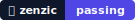

<!-- SPDX-FileCopyrightText: 2026 PythonWoods <dev@pythonwoods.dev> -->
<!-- SPDX-License-Identifier: Apache-2.0 -->

# Brand Ecosystem

The Zenzic Brand Ecosystem defines how Zenzic is represented across open-source communities, CI/CD integrations, and documentation landscapes.

## Official Badges

The two static SVG badges are included in the Brand Kit for offline or enterprise deployments
that cannot reach `img.shields.io`:

| Badge | Preview | Use |
|---|---|---|
| Audit Badge |  | Binary gate: passing / failing |
| Score |  | Quality metric: 0–100 |

For dynamic Shields.io variants and CI/CD wiring, see the [Badges guide](../how-to/add-badges.md).

## Color Palette

The Zenzic Brand System enforces WCAG 2.1 AA accessibility guidelines on all user interfaces. Accent and secondary text colors are dynamically calibrated to preserve legibility:

* **Secondary Text (Light Mode):** `zinc-600` (`#52525b`) is the official standard for all secondary copy, descriptions, captions, and metadata, yielding a contrast ratio of 7.8:1 on light/white surfaces.
* **Secondary Text (Dark Mode):** `zinc-400` (`#a1a1aa`) is the official standard for all dark mode secondary text, yielding a contrast ratio of 7.0:1 on Slate Lead (`#09090b`) backgrounds.

## Brand System Reference

The interactive Brand System document shows the full Color Palette, logomark variants,
social card, typography specimens, and usage laws in a single precision-formatted page:

[Open Brand System &rarr;](../assets/brand/zenzic-brand-system.html)

## Download

The complete Zenzic brand asset package (SVG + PNG) is attached to every GitHub release as `brand-kit.zip`.
Download from the stable [GitHub Releases](https://github.com/PythonWoods/zenzic/releases) page,
then open the latest release and fetch `brand-kit.zip` from its Assets section.

## Integration Protocols

If you are developing third-party integrations, CI/CD actions, or writing research papers incorporating Zenzic, you are part of our ecosystem.

1. **GitHub Actions & Badges:** Use our official Zenzic badges to demonstrate you are maintaining a 100% Quality Score on your repositories.
2. **Press & Media Coverage:** For inquiries regarding custom art assets, interviews on static analysis architecture, or technical deep-dives, route requests to `dev@pythonwoods.dev`.
3. **Endorsements:** Always ensure that any graphical association accurately implies integration, not exclusive ownership or dependency. Zenzic is and will permanently remain Open Source and universally adaptable.
